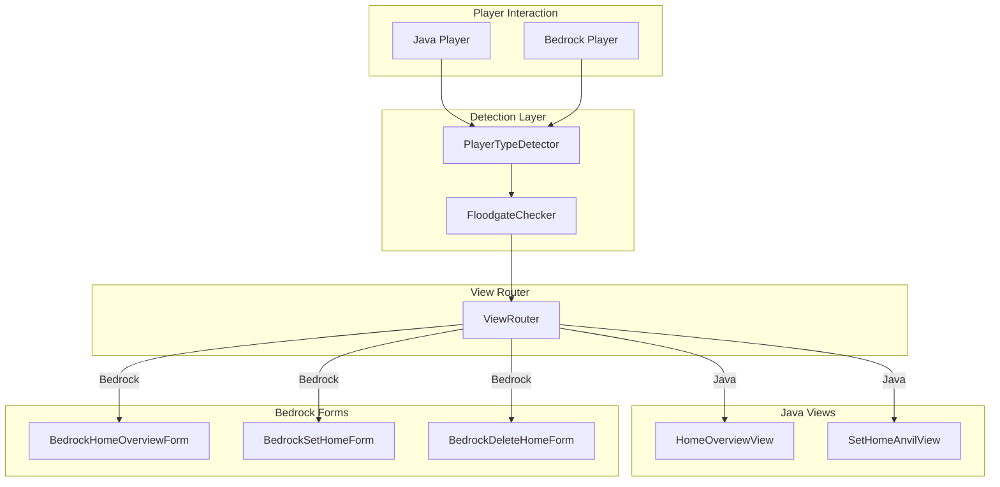

# Design Document

## Overview

This design document describes the architecture for adding Bedrock Edition player support to JExHome's GUI system. The solution uses the Floodgate API to detect Bedrock players and the Cumulus Forms API (bundled with Geyser/Floodgate) to display native Bedrock forms.

## Architecture



## Components and Interfaces

### 1. PlayerTypeDetector

Utility class that determines if a player is using Bedrock Edition.

```java
package de.jexcellence.home.utility;

public final class PlayerTypeDetector {
    
    private static boolean floodgateAvailable = false;
    
    public static void initialize() {
        try {
            Class.forName("org.geysermc.floodgate.api.FloodgateApi");
            floodgateAvailable = true;
        } catch (ClassNotFoundException e) {
            floodgateAvailable = false;
        }
    }
    
    public static boolean isBedrockPlayer(Player player) {
        if (!floodgateAvailable) return false;
        return FloodgateApi.getInstance().isFloodgatePlayer(player.getUniqueId());
    }
    
    public static boolean isFloodgateAvailable() {
        return floodgateAvailable;
    }
}
```

### 2. ViewRouter

Routes players to the appropriate view based on their client type.

```java
package de.jexcellence.home.view;

public class ViewRouter {
    
    private final JExHome plugin;
    private final ViewFrame viewFrame;
    
    public void openHomeOverview(Player player) {
        if (PlayerTypeDetector.isBedrockPlayer(player)) {
            BedrockHomeOverviewForm.show(player, plugin);
        } else {
            viewFrame.open(HomeOverviewView.class, player, Map.of("plugin", plugin));
        }
    }
    
    public void openSetHome(Player player) {
        if (PlayerTypeDetector.isBedrockPlayer(player)) {
            BedrockSetHomeForm.show(player, plugin);
        } else {
            viewFrame.open(SetHomeAnvilView.class, player, Map.of("plugin", plugin));
        }
    }
    
    public void openDeleteConfirmation(Player player, Home home) {
        if (PlayerTypeDetector.isBedrockPlayer(player)) {
            BedrockDeleteHomeForm.show(player, plugin, home);
        } else {
            // Use existing confirmation view
        }
    }
}
```

### 3. BedrockHomeOverviewForm

SimpleForm displaying the list of player homes.

```java
package de.jexcellence.home.view.bedrock;

public class BedrockHomeOverviewForm {
    
    public static void show(Player player, JExHome plugin) {
        plugin.getHomeService().getPlayerHomes(player.getUniqueId())
            .thenAccept(homes -> {
                SimpleForm.Builder builder = SimpleForm.builder()
                    .title("Your Homes")
                    .content("Select a home to teleport:");
                
                for (Home home : homes) {
                    String description = String.format(
                        "%s\n%s\nVisits: %d",
                        home.getWorldName(),
                        home.getFormattedLocation(),
                        home.getVisitCount()
                    );
                    builder.button(home.getHomeName(), description);
                }
                
                builder.button("+ Create New Home");
                
                builder.validResultHandler(response -> {
                    int index = response.clickedButtonId();
                    if (index < homes.size()) {
                        teleportToHome(player, homes.get(index), plugin);
                    } else {
                        BedrockSetHomeForm.show(player, plugin);
                    }
                });
                
                FloodgateApi.getInstance().sendForm(player.getUniqueId(), builder.build());
            });
    }
}
```

### 4. BedrockSetHomeForm

CustomForm with text input for home name.

```java
package de.jexcellence.home.view.bedrock;

public class BedrockSetHomeForm {
    
    public static void show(Player player, JExHome plugin) {
        CustomForm form = CustomForm.builder()
            .title("Create New Home")
            .input("Home Name", "Enter a name for your home", "home")
            .validResultHandler(response -> {
                String homeName = response.asInput();
                if (isValidHomeName(homeName)) {
                    createHome(player, homeName, plugin);
                } else {
                    player.sendMessage("Invalid home name. Use only letters, numbers, underscores, and hyphens.");
                }
            })
            .build();
        
        FloodgateApi.getInstance().sendForm(player.getUniqueId(), form);
    }
    
    private static boolean isValidHomeName(String name) {
        return name != null && name.matches("^[\\p{L}\\p{N}_-]{1,32}$");
    }
}
```

### 5. BedrockDeleteHomeForm

ModalForm for delete confirmation.

```java
package de.jexcellence.home.view.bedrock;

public class BedrockDeleteHomeForm {
    
    public static void show(Player player, JExHome plugin, Home home) {
        ModalForm form = ModalForm.builder()
            .title("Delete Home")
            .content("Are you sure you want to delete '" + home.getHomeName() + "'?\n\n" +
                    "Location: " + home.getFormattedLocation() + "\n" +
                    "World: " + home.getWorldName())
            .button1("Delete")
            .button2("Cancel")
            .validResultHandler(response -> {
                if (response.clickedFirst()) {
                    deleteHome(player, home, plugin);
                }
            })
            .build();
        
        FloodgateApi.getInstance().sendForm(player.getUniqueId(), form);
    }
}
```

## Data Models

No new data models are required. The existing `Home` entity is used for all operations.

## Error Handling

| Error Scenario | Handling Strategy |
|----------------|-------------------|
| Floodgate not installed | Log info message, use chest GUI for all players |
| Form send fails | Log warning, fall back to chat messages |
| Player disconnects during form | Silently ignore response |
| Invalid home name input | Show error message, re-display form |

## Testing Strategy

### Unit Tests
- `PlayerTypeDetector` detection logic with mocked Floodgate API
- Home name validation in `BedrockSetHomeForm`

### Integration Tests
- Form display with mock Floodgate player
- Fallback behavior when Floodgate unavailable

### Manual Testing
- Test with actual Bedrock client via Geyser
- Verify form appearance and button functionality
- Test edge cases (empty home list, max homes reached)

## Dependencies

```xml
<!-- Floodgate API (provided scope - runtime dependency) -->
<dependency>
    <groupId>org.geysermc.floodgate</groupId>
    <artifactId>api</artifactId>
    <version>2.2.2-SNAPSHOT</version>
    <scope>provided</scope>
</dependency>
```

## Configuration

Add to `home-system.yml`:

```yaml
bedrock:
  # Enable Bedrock Forms for Bedrock players
  enabled: true
  # Force all players to use chest GUI (ignores Bedrock detection)
  force-chest-gui: false
```
