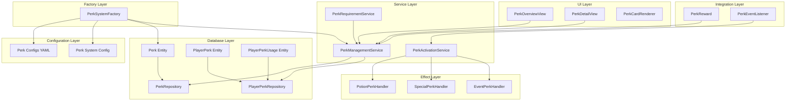

# Design Document

## Overview

The Enhanced Perk System provides a comprehensive framework for defining, unlocking, and managing gameplay perks in the RDQ plugin. The system integrates seamlessly with existing infrastructure including the requirement system, reward system, Hibernate database, and i18n translations.

### Key Design Principles

1. **Consistency**: Follow existing patterns from the rank system for configuration, database entities, and UI
2. **Modularity**: Separate concerns into distinct services (management, activation, configuration)
3. **Extensibility**: Support easy addition of new perk types and effects
4. **Performance**: Use caching and efficient database queries to minimize overhead
5. **Integration**: Leverage existing systems rather than duplicating functionality

## Architecture

### High-Level Component Diagram



### Component Responsibilities

#### Configuration Layer
- **Perk Configs YAML**: Individual perk definition files (e.g., `speed.yml`, `fly.yml`)
- **Perk System Config**: Global perk system settings (`perk-system.yml`)

#### Factory Layer
- **PerkSystemFactory**: Loads configurations, creates perk entities, initializes the system

#### Service Layer
- **PerkManagementService**: Manages perk ownership, enable/disable, limits
- **PerkActivationService**: Handles activation/deactivation of perk effects
- **PerkRequirementService**: Checks perk unlock requirements and progress

#### Database Layer
- **Perk Entity**: Stores perk definitions (identifier, type, category, config)
- **PlayerPerk Entity**: Stores player-perk associations (ownership, enabled, active)
- **PlayerPerkUsage Entity**: Tracks usage statistics (activations, cooldowns, usage time)
- **Repositories**: Hibernate repositories for database operations

#### Effect Layer
- **PotionPerkHandler**: Applies and manages potion effect perks
- **SpecialPerkHandler**: Handles special perks (fly, glow, no fall damage, etc.)
- **EventPerkHandler**: Manages event-triggered and percentage-based perks

#### UI Layer
- **PerkOverviewView**: Main perk browsing GUI (similar to RankPathOverview)
- **PerkDetailView**: Detailed perk information view (similar to RankRewardsDetailView)
- **PerkCardRenderer**: Renders perk cards in GUIs (similar to RequirementCardRenderer)

#### Integration Layer
- **PerkReward**: Reward type for granting perks through rank system
- **PerkEventListener**: Listens for game events to trigger perks

## Components and Interfaces

### 1. Database Entities

#### Perk Entity

```java
@Entity
@Table(name = "rdq_perks")
public class Perk {
    @Id
    @GeneratedValue(strategy = GenerationType.IDENTITY)
    private Long id;
    
    @Column(unique = true, nullable = false)
    private String identifier;
    
    @Enumerated(EnumType.STRING)
    @Column(nullable = false)
    private PerkType perkType;
    
    @Enumerated(EnumType.STRING)
    @Column(nullable = false)
    private PerkCategory category;
    
    @Column(nullable = false)
    private boolean enabled;
    
    @Column(nullable = false)
    private int displayOrder;
    
    // Icon configuration
    @Convert(converter = IconSectionConverter.class)
    @Column(columnDefinition = "TEXT")
    private IconSection icon;
    
    // Requirements for unlocking
    @OneToMany(mappedBy = "perk", cascade = CascadeType.ALL, orphanRemoval = true)
    private Set<PerkRequirement> requirements = new HashSet<>();
    
    // Rewards granted on unlock
    @OneToMany(mappedBy = "perk", cascade = CascadeType.ALL, orphanRemoval = true)
    private Set<PerkReward> unlockRewards = new HashSet<>();
    
    // Perk-specific configuration (JSON)
    @Column(columnDefinition = "TEXT")
    private String configJson;
    
    // Versioning for config updates
    @Version
    private int version;
    
    @CreationTimestamp
    private LocalDateTime createdAt;
    
    @UpdateTimestamp
    private LocalDateTime updatedAt;
}
```

#### PlayerPerk Entity

```java
@Entity
@Table(name = "rdq_player_perks", 
       uniqueConstraints = @UniqueConstraint(columnNames = {"player_id", "perk_id"}))
public class PlayerPerk {
    @Id
    @GeneratedValue(strategy = GenerationType.IDENTITY)
    private Long id;
    
    @ManyToOne(fetch = FetchType.LAZY)
    @JoinColumn(name = "player_id", nullable = false)
    private RDQPlayer player;
    
    @ManyToOne(fetch = FetchType.EAGER)
    @JoinColumn(name = "perk_id", nullable = false)
    private Perk perk;
    
    // Ownership state
    @Column(nullable = false)
    private boolean unlocked = false;
    
    // Enable/disable state
    @Column(nullable = false)
    private boolean enabled = false;
    
    // Active state (currently applying effects)
    @Column(nullable = false)
    private boolean active = false;
    
    // Cooldown tracking
    private LocalDateTime cooldownExpiresAt;
    
    // Usage statistics
    @Column(nullable = false)
    private int activationCount = 0;
    
    @Column(nullable = false)
    private long totalUsageTimeMillis = 0;
    
    private LocalDateTime lastActivated;
    private LocalDateTime lastDeactivated;
    
    @CreationTimestamp
    private LocalDateTime unlockedAt;
    
    @UpdateTimestamp
    private LocalDateTime updatedAt;
}
```

#### PerkRequirement Entity

```java
@Entity
@Table(name = "rdq_perk_requirements")
public class PerkRequirement {
    @Id
    @GeneratedValue(strategy = GenerationType.IDENTITY)
    private Long id;
    
    @ManyToOne(fetch = FetchType.LAZY)
    @JoinColumn(name = "perk_id", nullable = false)
    private Perk perk;
    
    @Column(nullable = false)
    private int displayOrder;
    
    // Requirement definition (JSON)
    @Convert(converter = RequirementConverter.class)
    @Column(columnDefinition = "TEXT", nullable = false)
    private AbstractRequirement requirement;
    
    // Icon for UI display
    @Convert(converter = IconSectionConverter.class)
    @Column(columnDefinition = "TEXT")
    private IconSection icon;
}
```

#### PerkUnlockReward Entity

```java
@Entity
@Table(name = "rdq_perk_unlock_rewards")
public class PerkUnlockReward {
    @Id
    @GeneratedValue(strategy = GenerationType.IDENTITY)
    private Long id;
    
    @ManyToOne(fetch = FetchType.LAZY)
    @JoinColumn(name = "perk_id", nullable = false)
    private Perk perk;
    
    @Column(nullable = false)
    private int displayOrder;
    
    // Reward definition (JSON)
    @Convert(converter = RewardConverter.class)
    @Column(columnDefinition = "TEXT", nullable = false)
    private AbstractReward reward;
    
    // Icon for UI display
    @Convert(converter = IconSectionConverter.class)
    @Column(columnDefinition = "TEXT")
    private IconSection icon;
}
```

### 2. Configuration Sections

#### PerkSection (YAML Configuration)

```java
@CSAlways
public class PerkSection extends AConfigSection {
    // Basic information
    private String identifier;
    private String perkType; // PASSIVE, EVENT_TRIGGERED, COOLDOWN_BASED, PERCENTAGE_BASED
    private String category; // COMBAT, MOVEMENT, UTILITY, etc.
    private Boolean enabled;
    private Integer displayOrder;
    
    // Icon configuration
    private IconSection icon;
    
    // Requirements for unlocking
    private Map<String, BaseRequirementSection> requirements;
    
    // Rewards granted on unlock
    private Map<String, RewardSection> unlockRewards;
    
    // Perk-specific configuration
    private PerkEffectSection effect;
}
```

#### PerkEffectSection

```java
@CSAlways
public class PerkEffectSection extends AConfigSection {
    // For potion effect perks
    private String potionEffectType;
    private Integer amplifier;
    private Integer durationTicks;
    private Boolean ambient;
    private Boolean particles;
    
    // For event-triggered perks
    private String triggerEvent;
    private Long cooldownMillis;
    private Double triggerChance; // For percentage-based (0.0-100.0)
    
    // For special perks
    private String specialType; // FLY, GLOW, NO_FALL_DAMAGE, KEEP_INVENTORY, KEEP_EXPERIENCE
    
    // For custom perks
    private String handlerClass;
    private Map<String, Object> customConfig;
}
```

#### PerkSystemSection (Global Configuration)

```java
@CSAlways
public class PerkSystemSection extends AConfigSection {
    // System settings
    private Boolean enabled;
    private Integer maxEnabledPerksPerPlayer;
    private Double cooldownMultiplier;
    
    // UI settings
    private Integer perksPerPage;
    private Boolean showLockedPerks;
    private Boolean showRequirementProgress;
    
    // Notification settings
    private NotificationSection unlockNotification;
    private NotificationSection activationNotification;
    private NotificationSection cooldownNotification;
    
    // Integration settings
    private Boolean enablePerkRewards;
    private Boolean enableAutoActivation;
}
```

### 3. Service Interfaces

#### PerkManagementService

```java
public class PerkManagementService {
    // Perk ownership
    CompletableFuture<PlayerPerk> grantPerk(RDQPlayer player, Perk perk);
    CompletableFuture<Boolean> revokePerk(RDQPlayer player, Perk perk);
    boolean hasUnlocked(RDQPlayer player, Perk perk);
    
    // Enable/disable
    CompletableFuture<Boolean> enablePerk(RDQPlayer player, Perk perk);
    CompletableFuture<Boolean> disablePerk(RDQPlayer player, Perk perk);
    CompletableFuture<Boolean> togglePerk(RDQPlayer player, Perk perk);
    
    // Queries
    List<PlayerPerk> getUnlockedPerks(RDQPlayer player);
    List<PlayerPerk> getEnabledPerks(RDQPlayer player);
    List<PlayerPerk> getActivePerks(RDQPlayer player);
    List<Perk> getAvailablePerks(PerkCategory category);
    
    // Limits
    boolean canEnableAnotherPerk(RDQPlayer player);
    int getEnabledPerkCount(RDQPlayer player);
    int getMaxEnabledPerks();
}
```

#### PerkActivationService

```java
public class PerkActivationService {
    // Activation/deactivation
    CompletableFuture<Boolean> activate(Player player, PlayerPerk playerPerk);
    CompletableFuture<Boolean> deactivate(Player player, PlayerPerk playerPerk);
    
    // Cooldown management
    boolean isOnCooldown(PlayerPerk playerPerk);
    long getRemainingCooldown(PlayerPerk playerPerk);
    void startCooldown(PlayerPerk playerPerk, long durationMillis);
    
    // Event handling
    void handleEvent(Player player, String eventType, Object... args);
    
    // Lifecycle
    void activateAllEnabledPerks(Player player);
    void deactivateAllActivePerks(Player player);
}
```

#### PerkRequirementService

```java
public class PerkRequirementService {
    // Requirement checking
    boolean canUnlock(Player player, Perk perk);
    Map<PerkRequirement, Boolean> checkRequirements(Player player, Perk perk);
    
    // Progress tracking
    Map<PerkRequirement, Double> getRequirementProgress(Player player, Perk perk);
    double getOverallProgress(Player player, Perk perk);
    
    // Unlocking
    CompletableFuture<Boolean> attemptUnlock(Player player, Perk perk);
}
```

### 4. Effect Handlers

#### PotionPerkHandler

```java
public class PotionPerkHandler {
    void applyPotionEffect(Player player, PlayerPerk playerPerk);
    void removePotionEffect(Player player, PlayerPerk playerPerk);
    void refreshPotionEffect(Player player, PlayerPerk playerPerk);
    
    // Scheduled task for continuous effects
    void startRefreshTask();
    void stopRefreshTask();
}
```

#### SpecialPerkHandler

```java
public class SpecialPerkHandler {
    // Fly
    void enableFly(Player player);
    void disableFly(Player player);
    
    // Glow
    void enableGlow(Player player);
    void disableGlow(Player player);
    
    // No fall damage
    void registerNoFallDamage(Player player);
    void unregisterNoFallDamage(Player player);
    
    // Keep inventory/experience
    void registerKeepInventory(Player player);
    void unregisterKeepInventory(Player player);
    void registerKeepExperience(Player player);
    void unregisterKeepExperience(Player player);
}
```

#### EventPerkHandler

```java
public class EventPerkHandler {
    // Event registration
    void registerEventPerk(PlayerPerk playerPerk);
    void unregisterEventPerk(PlayerPerk playerPerk);
    
    // Event processing
    void processEvent(Player player, String eventType, Object... args);
    boolean shouldTrigger(PlayerPerk playerPerk);
    
    // Cooldown integration
    boolean checkAndStartCooldown(PlayerPerk playerPerk);
}
```

### 5. UI Components

#### PerkOverviewView

```java
public class PerkOverviewView extends AbstractView {
    // Similar to RankPathOverview
    void renderCategoryTabs(RenderContext context, Player player);
    void renderPerkGrid(RenderContext context, Player player, PerkCategory category);
    void renderPerkCard(RenderContext context, Player player, Perk perk, int slot);
    void renderPagination(RenderContext context, int currentPage, int totalPages);
    
    // Interactions
    void handlePerkClick(Player player, Perk perk);
    void handleCategoryChange(Player player, PerkCategory category);
    void handlePageChange(Player player, int newPage);
}
```

#### PerkDetailView

```java
public class PerkDetailView extends AbstractView {
    // Similar to RankRewardsDetailView
    void renderPerkHeader(RenderContext context, Player player, Perk perk);
    void renderRequirements(RenderContext context, Player player, Perk perk);
    void renderUnlockRewards(RenderContext context, Player player, Perk perk);
    void renderPerkState(RenderContext context, Player player, PlayerPerk playerPerk);
    void renderActions(RenderContext context, Player player, PlayerPerk playerPerk);
    
    // Interactions
    void handleUnlockAttempt(Player player, Perk perk);
    void handleToggleEnable(Player player, PlayerPerk playerPerk);
    void handleBack(Player player);
}
```

#### PerkCardRenderer

```java
public class PerkCardRenderer {
    // Similar to RequirementCardRenderer and RewardCardRenderer
    ItemStack renderPerkCard(Player player, Perk perk, PlayerPerk playerPerk);
    List<Component> buildLore(Player player, Perk perk, PlayerPerk playerPerk);
    Component buildStateLine(Player player, PlayerPerk playerPerk);
    Component buildProgressLine(Player player, Perk perk);
    Component buildCooldownLine(PlayerPerk playerPerk);
}
```

### 6. Integration Components

#### PerkReward (Reward Type)

```java
public class PerkReward extends AbstractReward {
    private String perkIdentifier;
    private boolean autoEnable;
    
    @Override
    public CompletableFuture<Boolean> grant(Player player) {
        // Grant perk to player
        // Optionally auto-enable
        // Send notification
    }
    
    @Override
    public String getTypeId() {
        return "PERK";
    }
    
    @Override
    public double getEstimatedValue() {
        // Calculate based on perk rarity/power
    }
}
```

#### PerkEventListener

```java
public class PerkEventListener implements Listener {
    // Player lifecycle
    @EventHandler
    void onPlayerJoin(PlayerJoinEvent event);
    
    @EventHandler
    void onPlayerQuit(PlayerQuitEvent event);
    
    // Perk trigger events
    @EventHandler
    void onPlayerDeath(PlayerDeathEvent event);
    
    @EventHandler
    void onEntityDamage(EntityDamageEvent event);
    
    @EventHandler
    void onPlayerMove(PlayerMoveEvent event);
    
    // Add more event handlers as needed
}
```

## Data Models

### Perk Configuration Example (YAML)

```yaml
# perks/speed_boost.yml
identifier: "speed_boost"
perkType: "PASSIVE"
category: "MOVEMENT"
enabled: true
displayOrder: 1

icon:
  type: "FEATHER"
  displayNameKey: "perk.speed_boost.name"
  descriptionKey: "perk.speed_boost.description"
  enchanted: true

requirements:
  level_requirement:
    type: "EXPERIENCE_LEVEL"
    level: 10
    icon:
      type: "EXPERIENCE_BOTTLE"
  
  currency_requirement:
    type: "CURRENCY"
    currencyRequirement:
      currencyType: "coins"
      requiredCurrencies:
        coins: 1000.0
      consumeOnComplete: true
    icon:
      type: "GOLD_INGOT"

unlockRewards:
  welcome_message:
    type: "COMMAND"
    command: "tellraw {player} {\"text\":\"You unlocked Speed Boost!\",\"color\":\"gold\"}"
    executeAsPlayer: false

effect:
  potionEffectType: "SPEED"
  amplifier: 1
  durationTicks: 600  # 30 seconds (refreshed continuously)
  ambient: false
  particles: true
```

### Event-Triggered Perk Example

```yaml
# perks/combat_heal.yml
identifier: "combat_heal"
perkType: "EVENT_TRIGGERED"
category: "COMBAT"
enabled: true
displayOrder: 5

icon:
  type: "GOLDEN_APPLE"
  displayNameKey: "perk.combat_heal.name"
  descriptionKey: "perk.combat_heal.description"

requirements:
  rank_requirement:
    type: "PERMISSION"
    permissionRequirement:
      requiredPermission: "rdq.rank.warrior.veteran"

effect:
  triggerEvent: "ENTITY_DAMAGE_BY_ENTITY"
  cooldownMillis: 30000  # 30 seconds
  triggerChance: 25.0  # 25% chance
  customConfig:
    healAmount: 4.0  # 2 hearts
    playSound: true
    soundType: "ENTITY_PLAYER_LEVELUP"
```

### Special Perk Example

```yaml
# perks/flight.yml
identifier: "flight"
perkType: "PASSIVE"
category: "MOVEMENT"
enabled: true
displayOrder: 10

icon:
  type: "ELYTRA"
  displayNameKey: "perk.flight.name"
  descriptionKey: "perk.flight.description"
  enchanted: true

requirements:
  ultimate_requirement:
    type: "COMPOSITE"
    operator: "AND"
    requirements:
      - type: "EXPERIENCE_LEVEL"
        level: 50
      - type: "CURRENCY"
        currencyRequirement:
          currencyType: "coins"
          requiredCurrencies:
            coins: 10000.0
          consumeOnComplete: true

effect:
  specialType: "FLY"
```

### Global Configuration Example

```yaml
# perk-system.yml
enabled: true
maxEnabledPerksPerPlayer: 5
cooldownMultiplier: 1.0

ui:
  perksPerPage: 28
  showLockedPerks: true
  showRequirementProgress: true

notifications:
  unlockNotification:
    enabled: true
    showTitle: true
    showActionBar: true
    playSound: true
    soundType: "ENTITY_PLAYER_LEVELUP"
  
  activationNotification:
    enabled: true
    showActionBar: true
    playSound: false
  
  cooldownNotification:
    enabled: true
    showActionBar: true
    playSound: false

integration:
  enablePerkRewards: true
  enableAutoActivation: false
```

## Error Handling

### Configuration Errors

1. **Invalid Perk Type**: Log warning, skip perk, continue loading
2. **Missing Required Fields**: Use default values, log warning
3. **Invalid Requirement/Reward**: Skip that requirement/reward, log error
4. **Duplicate Identifier**: Use first occurrence, log warning

### Runtime Errors

1. **Database Connection Failure**: Retry with exponential backoff, cache operations
2. **Perk Activation Failure**: Log error, notify player, revert state
3. **Cooldown Calculation Error**: Use default cooldown, log warning
4. **Event Handler Exception**: Log error, continue processing other perks

### User Errors

1. **Perk Limit Reached**: Display error message with current limit
2. **Requirements Not Met**: Display progress and missing requirements
3. **Perk On Cooldown**: Display remaining cooldown time
4. **Perk Already Unlocked**: Display info message, skip grant

## Testing Strategy

### Unit Tests

1. **PerkManagementService**: Test grant, revoke, enable, disable, toggle operations
2. **PerkActivationService**: Test activation, deactivation, cooldown management
3. **PerkRequirementService**: Test requirement checking and progress calculation
4. **Effect Handlers**: Test each effect type (potion, special, event)
5. **Configuration Parsing**: Test YAML parsing and validation

### Integration Tests

1. **Database Operations**: Test CRUD operations with Hibernate
2. **Requirement Integration**: Test with existing requirement system
3. **Reward Integration**: Test PerkReward type with reward system
4. **Event Integration**: Test event-triggered perks with Bukkit events

### Manual Testing

1. **UI Testing**: Test all GUI interactions and visual feedback
2. **Performance Testing**: Test with many perks and players
3. **Cooldown Testing**: Verify cooldown timers work correctly
4. **Persistence Testing**: Test data persistence across server restarts

### Test Data

Create test perks covering all types:
- Passive potion effect perk
- Event-triggered perk with cooldown
- Percentage-based perk
- Special ability perk (fly, glow, etc.)
- Perk with complex requirements
- Perk with multiple unlock rewards

## Performance Considerations

### Caching Strategy

1. **Perk Definitions**: Cache all perk entities in memory (rarely change)
2. **Player Perks**: Cache active player perks per online player
3. **Requirement Progress**: Cache requirement check results (30 second TTL)
4. **Cooldown State**: Use in-memory map for active cooldowns

### Database Optimization

1. **Eager Loading**: Load perk with requirements/rewards in single query
2. **Batch Operations**: Batch insert/update player perks
3. **Indexes**: Add indexes on player_id, perk_id, enabled, active columns
4. **Connection Pooling**: Use Hibernate connection pool

### Event Handling Optimization

1. **Event Filtering**: Only register events for active event-triggered perks
2. **Async Processing**: Process perk effects asynchronously when possible
3. **Cooldown Checks**: Fast in-memory cooldown checks before database access
4. **Batch Notifications**: Batch notification messages to reduce chat spam

### Memory Management

1. **Weak References**: Use weak references for cached player data
2. **Cleanup Tasks**: Periodic cleanup of expired cooldowns and inactive data
3. **Lazy Loading**: Lazy load perk requirements/rewards when needed
4. **Object Pooling**: Pool frequently created objects (ItemStacks, Components)

## Migration Strategy

### Removing Old Perk System

1. **Backup**: Create database backup before migration
2. **Data Export**: Export any existing perk data to JSON
3. **Clean Deletion**: Delete old perk-related files:
   - `PerkSystemFactory.java` (commented out)
   - `RPerkManagementService.java` (commented out)
   - Old perk entity classes
   - Old perk configuration files
4. **Database Cleanup**: Drop old perk tables if they exist

### Implementing New System

1. **Phase 1**: Implement core entities and repositories
2. **Phase 2**: Implement services (management, activation, requirements)
3. **Phase 3**: Implement effect handlers
4. **Phase 4**: Implement UI components
5. **Phase 5**: Implement integration (rewards, events)
6. **Phase 6**: Testing and refinement

### Rollback Plan

1. **Keep Backups**: Maintain backups of old system for 30 days
2. **Feature Flag**: Use configuration flag to enable/disable new system
3. **Gradual Rollout**: Test on development server before production
4. **Monitoring**: Monitor logs and performance metrics closely

## Future Enhancements

### Potential Features

1. **Perk Presets**: Save and load perk configurations
2. **Perk Trading**: Allow players to trade unlocked perks
3. **Perk Upgrades**: Upgrade perks to higher tiers
4. **Perk Combinations**: Special effects when certain perks are active together
5. **Perk Challenges**: Special challenges to unlock rare perks
6. **Perk Statistics**: Detailed statistics dashboard
7. **Perk Leaderboards**: Rankings based on perk usage
8. **Custom Perk API**: API for other plugins to register custom perks

### Extensibility Points

1. **Custom Effect Handlers**: Interface for custom perk effect implementations
2. **Custom Requirement Types**: Extend requirement system for perk-specific requirements
3. **Custom Reward Types**: Additional reward types for perk unlocks
4. **Event Hooks**: Hooks for other plugins to interact with perk system
5. **Configuration Validators**: Custom validators for perk configurations
