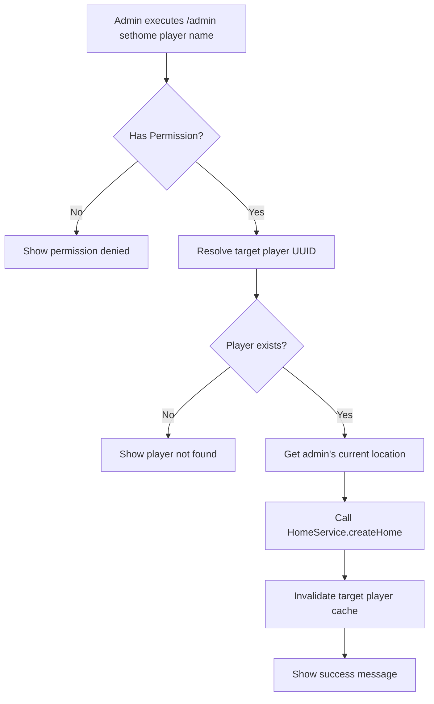

# Design Document: JExHome Admin Commands

## Overview

This design adds administrative commands to JExHome that allow server administrators to create and delete homes for other players, including offline players. The implementation follows the existing command patterns in JExHome while extending the HomeFactory and IHomeService to support operations on behalf of other players.

## Architecture

The admin commands will be implemented as a new command package following the existing structure:

```
JExHome/jexhome-common/src/main/java/de/jexcellence/home/command/
├── admin/
│   ├── PAdminHome.java           # Main admin command handler
│   ├── PAdminHomeSection.java    # Command configuration section
│   └── EPAdminHomePermission.java # Permission enum
├── delhome/
├── home/
└── sethome/
```



## Components and Interfaces

### 1. PAdminHome Command Handler

The main command handler that processes `/admin sethome` and `/admin delhome` subcommands.

```java
@Command
public class PAdminHome extends PlayerCommand {
    
    private final JExHome jexHome;
    
    @Override
    protected void onPlayerInvocation(@NotNull Player player, @NotNull String label, @NotNull String[] args) {
        // args[0] = subcommand (sethome/delhome)
        // args[1] = target player name
        // args[2] = home name
    }
    
    private void handleSetHome(Player admin, String targetName, String homeName) {
        // 1. Resolve target player UUID (online or offline)
        // 2. Create home at admin's location for target player
        // 3. Send confirmation message
    }
    
    private void handleDelHome(Player admin, String targetName, String homeName) {
        // 1. Resolve target player UUID (online or offline)
        // 2. Delete the specified home
        // 3. Send confirmation message
    }
}
```

### 2. Player Resolution Utility

A utility method to resolve player UUIDs from names, supporting both online and offline players:

```java
private CompletableFuture<Optional<UUID>> resolvePlayerUuid(String playerName) {
    // 1. Check online players first (case-insensitive)
    Player online = Bukkit.getPlayerExact(playerName);
    if (online != null) {
        return CompletableFuture.completedFuture(Optional.of(online.getUniqueId()));
    }
    
    // 2. Check offline player cache
    @SuppressWarnings("deprecation")
    OfflinePlayer offline = Bukkit.getOfflinePlayer(playerName);
    if (offline.hasPlayedBefore() || offline.isOnline()) {
        return CompletableFuture.completedFuture(Optional.of(offline.getUniqueId()));
    }
    
    return CompletableFuture.completedFuture(Optional.empty());
}
```

### 3. HomeFactory Extension

Add a method to create homes for other players at a specified location:

```java
public @NotNull CompletableFuture<Home> createHomeForPlayer(
    @NotNull UUID targetPlayerId, 
    @NotNull String name, 
    @NotNull Location location
) {
    return homeService.createHome(targetPlayerId, name, location)
        .thenApply(home -> {
            invalidateCache(targetPlayerId);
            LOGGER.fine("Admin created home '" + name + "' for player " + targetPlayerId);
            return home;
        });
}
```

### 4. Permission Enum

```java
@Getter
public enum EPAdminHomePermission implements IPermissionNode {
    ADMIN_SETHOME("adminSethome", "jexhome.admin.sethome"),
    ADMIN_DELHOME("adminDelhome", "jexhome.admin.delhome");
    
    private final String internalName;
    private final String fallbackNode;
}
```

### 5. Command Configuration (YAML)

```yaml
commands:
  admin:
    name: 'admin'
    description: 'Administrative home management commands'
    aliases:
      - homeadmin
      - hadmin
    usage: 'admin <sethome|delhome> <player> <name>'
    permissions:
      nodes:
        adminSethome: 'jexhome.admin.sethome'
        adminDelhome: 'jexhome.admin.delhome'
```

## Data Models

No new data models are required. The existing `Home` entity will be used with the target player's UUID instead of the executing player's UUID.

## Error Handling

| Error Condition | Message Key | Description |
|----------------|-------------|-------------|
| Player not found | `admin.player_not_found` | Target player has never joined the server |
| Home not found | `admin.home_not_found` | Specified home doesn't exist for target |
| No permission | `admin.no_permission` | Admin lacks required permission |
| Internal error | `home.error.internal` | Database or system error |

### Translation Keys

```yaml
admin:
  sethome:
    success: "<green>✓</green> Home '<primary>{home_name}</primary>' created for <secondary>{player_name}</secondary>"
    overwritten: "<green>✓</green> Home '<primary>{home_name}</primary>' updated for <secondary>{player_name}</secondary>"
  delhome:
    success: "<green>✓</green> Home '<primary>{home_name}</primary>' deleted for <secondary>{player_name}</secondary>"
  player_not_found: "<red>✗</red> Player '<secondary>{player_name}</secondary>' not found"
  home_not_found: "<red>✗</red> Home '<secondary>{home_name}</secondary>' not found for player '<secondary>{player_name}</secondary>'"
  no_permission: "<red>✗</red> You don't have permission to manage other players' homes"
  usage:
    sethome: "<gray>Usage: /admin sethome <player> <name></gray>"
    delhome: "<gray>Usage: /admin delhome <player> <name></gray>"
```

## Testing Strategy

### Unit Tests
- Test player UUID resolution for online players
- Test player UUID resolution for offline players
- Test permission checking logic
- Test home creation with different player UUIDs

### Integration Tests
- Test full command flow for sethome
- Test full command flow for delhome
- Test tab completion suggestions
- Test error handling for invalid inputs

### Manual Testing
- Verify commands work with online players
- Verify commands work with offline players
- Verify tab completion works correctly
- Verify permission system integration
