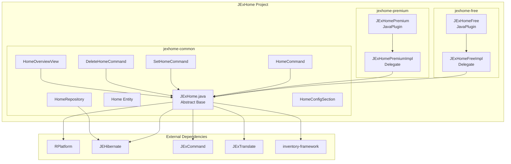

# Design Document

## Overview

JExHome is a home teleportation plugin for Minecraft servers following the JExcellence ecosystem patterns established by JExEconomy and RDQ. The project uses a multi-module Gradle structure with shared common code and separate free/premium editions. It leverages RPlatform for platform abstraction, JEHibernate for database operations, JExCommand for command handling, JExTranslate for internationalization, and inventory-framework for GUIs.

## Architecture



## Components and Interfaces

### Project Structure

```
JExHome/
├── build.gradle.kts              # Root build with buildAll/publishLocal tasks
├── gradle/
│   └── libs.versions.toml        # References root catalog
├── jexhome-common/
│   ├── build.gradle.kts          # raindrop.library-conventions
│   └── src/main/
│       ├── java/de/jexcellence/home/
│       │   ├── JExHome.java
│       │   ├── command/
│       │   │   ├── home/
│       │   │   │   ├── PHome.java
│       │   │   │   ├── PHomeSection.java
│       │   │   │   └── EPHomePermission.java
│       │   │   ├── sethome/
│       │   │   │   ├── PSetHome.java
│       │   │   │   ├── PSetHomeSection.java
│       │   │   │   └── EPSetHomePermission.java
│       │   │   └── delhome/
│       │   │       ├── PDelHome.java
│       │   │       ├── PDelHomeSection.java
│       │   │       └── EPDelHomePermission.java
│       │   ├── config/
│       │   │   └── HomeSystemConfig.java
│       │   ├── database/
│       │   │   ├── entity/
│       │   │   │   └── Home.java
│       │   │   └── repository/
│       │   │       └── HomeRepository.java
│       │   └── view/
│       │       └── HomeOverviewView.java
│       └── resources/
│           ├── commands/
│           │   ├── home.yml
│           │   ├── sethome.yml
│           │   └── delhome.yml
│           ├── configs/
│           │   └── home-system.yml
│           ├── database/
│           │   └── database.yml
│           └── translations/
│               ├── en_US.yml
│               └── de_DE.yml
├── jexhome-free/
│   ├── build.gradle.kts          # raindrop.shadow-conventions
│   └── src/main/
│       ├── java/de/jexcellence/home/
│       │   ├── JExHomeFree.java
│       │   └── JExHomeFreeImpl.java
│       └── resources/
│           ├── plugin.yml
│           └── paper-plugin.yml
└── jexhome-premium/
    ├── build.gradle.kts          # raindrop.shadow-conventions
    └── src/main/
        ├── java/de/jexcellence/home/
        │   ├── JExHomePremium.java
        │   └── JExHomePremiumImpl.java
        └── resources/
            ├── plugin.yml
            └── paper-plugin.yml
```

### Main Plugin Class (JExHome.java)

The abstract base class following the RDQ pattern:

```java
package de.jexcellence.home;

@Getter
public abstract class JExHome {
    private final JavaPlugin plugin;
    private final String edition;
    private final ExecutorService executor;
    private final RPlatform platform;
    
    private volatile CompletableFuture<Void> onEnableFuture;
    private boolean disabling;
    private boolean postEnableCompleted;
    
    private ViewFrame viewFrame;
    
    @InjectRepository
    private HomeRepository homeRepository;
    
    // Abstract methods for edition-specific behavior
    protected abstract String getStartupMessage();
    protected abstract int getMetricsId();
    protected abstract ViewFrame registerViews(ViewFrame viewFrame);
}
```

### Command Classes

Following the RDQ PRQ pattern with @Command annotation:

```java
package de.jexcellence.home.command.home;

@Command
public class PHome extends PlayerCommand {
    private final JExHome jexHome;
    
    public PHome(PHomeSection section, JExHome jexHome) {
        super(section);
        this.jexHome = jexHome;
    }
    
    @Override
    protected void onPlayerInvocation(Player player, String label, String[] args) {
        if (hasNoPermission(player, EPHomePermission.HOME)) return;
        
        if (args.length == 0) {
            // Open home overview GUI
            jexHome.getViewFrame().open(HomeOverviewView.class, player, Map.of("plugin", jexHome));
            return;
        }
        
        var homeName = stringParameter(args, 0);
        // Teleport to named home
    }
}
```

### Database Entity (Home.java)

```java
package de.jexcellence.home.database.entity;

@Entity
@Table(name = "jexhome_home")
public class Home extends BaseEntity {
    
    @Column(name = "home_name", nullable = false)
    private String homeName;
    
    @Column(name = "player_uuid", nullable = false)
    private UUID playerUuid;
    
    @Column(name = "world_name", nullable = false)
    private String worldName;
    
    @Column(name = "x", nullable = false)
    private double x;
    
    @Column(name = "y", nullable = false)
    private double y;
    
    @Column(name = "z", nullable = false)
    private double z;
    
    @Column(name = "yaw", nullable = false)
    private float yaw;
    
    @Column(name = "pitch", nullable = false)
    private float pitch;
    
    protected Home() {}
    
    public Home(@NotNull String homeName, @NotNull Player player) {
        this.homeName = homeName;
        this.playerUuid = player.getUniqueId();
        setLocation(player.getLocation());
    }
    
    public void setLocation(@NotNull Location location) {
        this.worldName = location.getWorld().getName();
        this.x = location.getX();
        this.y = location.getY();
        this.z = location.getZ();
        this.yaw = location.getYaw();
        this.pitch = location.getPitch();
    }
    
    public @Nullable Location toLocation() {
        var world = Bukkit.getWorld(worldName);
        if (world == null) return null;
        return new Location(world, x, y, z, yaw, pitch);
    }
}
```

### Repository (HomeRepository.java)

```java
package de.jexcellence.home.database.repository;

public class HomeRepository extends CachedRepository<Home, Long, Long> {
    
    public HomeRepository(
        @NotNull ExecutorService executor,
        @NotNull EntityManagerFactory emf,
        @NotNull Class<Home> entityClass,
        @NotNull Function<Home, Long> keyExtractor
    ) {
        super(executor, emf, entityClass, keyExtractor);
    }
    
    public CompletableFuture<List<Home>> findByPlayerUuid(@NotNull UUID playerUuid) {
        return findAllByFieldAsync("playerUuid", playerUuid);
    }
    
    public CompletableFuture<Optional<Home>> findByPlayerAndName(
        @NotNull UUID playerUuid, 
        @NotNull String homeName
    ) {
        return CompletableFuture.supplyAsync(() -> {
            try (var em = createEntityManager()) {
                var query = em.createQuery(
                    "SELECT h FROM Home h WHERE h.playerUuid = :uuid AND h.homeName = :name",
                    Home.class
                );
                query.setParameter("uuid", playerUuid);
                query.setParameter("name", homeName);
                return Optional.ofNullable(query.getSingleResultOrNull());
            }
        }, getExecutor());
    }
}
```

## Data Models

### Home Entity Schema

| Column | Type | Constraints | Description |
|--------|------|-------------|-------------|
| id | BIGINT | PK, AUTO_INCREMENT | Primary key |
| home_name | VARCHAR(64) | NOT NULL | Name of the home |
| player_uuid | UUID | NOT NULL, INDEX | Owner's UUID |
| world_name | VARCHAR(64) | NOT NULL | World name |
| x | DOUBLE | NOT NULL | X coordinate |
| y | DOUBLE | NOT NULL | Y coordinate |
| z | DOUBLE | NOT NULL | Z coordinate |
| yaw | FLOAT | NOT NULL | Yaw rotation |
| pitch | FLOAT | NOT NULL | Pitch rotation |
| created_at | TIMESTAMP | NOT NULL | Creation timestamp |
| updated_at | TIMESTAMP | NOT NULL | Last update timestamp |

### Configuration Schema (home-system.yml)

```yaml
# Home limits by permission
homeLimits:
  jexhome.limit.iron: 1
  jexhome.limit.bronze: 2
  jexhome.limit.silver: 4
  jexhome.limit.gold: 6
  jexhome.limit.platinum: 8
  jexhome.limit.diamond: 10
  jexhome.limit.unlimited: -1

# Teleport settings
teleport:
  delay: 3
  cancelOnMove: true
  cancelOnDamage: true
```

## Error Handling

### Database Errors
- Repository operations return CompletableFuture for async error handling
- Exceptions are logged via CentralLogger
- User receives generic error message via I18n

### Command Errors
- Permission checks use hasNoPermission() pattern
- Invalid arguments handled via command section error messages
- Home not found returns translated message

### Teleport Errors
- World not loaded: Returns null location, shows error message
- Player moved during delay: Cancels teleport, shows message

## Testing Strategy

### Unit Tests
- Home entity location conversion
- HomeRepository query methods (with H2 in-memory database)
- Configuration section parsing

### Integration Tests
- Command execution flow
- Repository CRUD operations
- View rendering

### Manual Testing
- Plugin load/unload cycle
- Command tab completion
- GUI navigation
- Multi-language support
