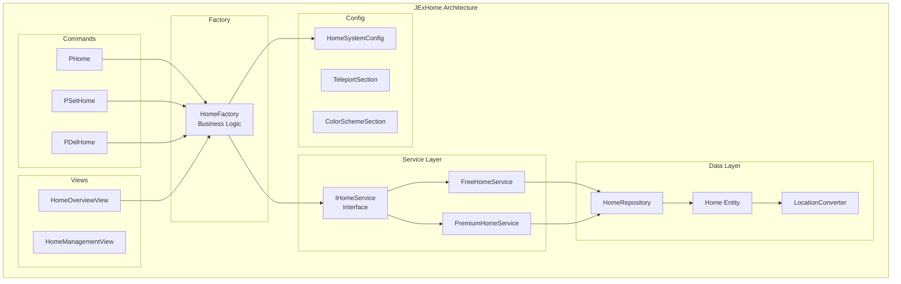

# Design Document

## Overview

This design document details the refactoring of JExHome to align with RDQ patterns. The refactor introduces a service layer (IHomeService), factory pattern (HomeFactory), enhanced entity with metadata, and a blue-orange gradient GUI theme. All patterns directly mirror RDQ's IBountyService, BountyFactory, and view implementations.

## Architecture



## Components and Interfaces

### IHomeService Interface

```java
package de.jexcellence.home.service;

public interface IHomeService {
    
    // Core CRUD operations
    CompletableFuture<Home> createHome(@NotNull UUID playerId, @NotNull String name, @NotNull Location location);
    CompletableFuture<Boolean> deleteHome(@NotNull UUID playerId, @NotNull String name);
    CompletableFuture<Optional<Home>> findHome(@NotNull UUID playerId, @NotNull String name);
    CompletableFuture<List<Home>> getPlayerHomes(@NotNull UUID playerId);
    
    // Teleportation
    CompletableFuture<Boolean> teleportToHome(@NotNull Player player, @NotNull String homeName);
    
    // Validation & limits
    boolean canCreateHome(@NotNull Player player);
    int getMaxHomesForPlayer(@NotNull Player player);
    CompletableFuture<Long> getHomeCount(@NotNull UUID playerId);
    
    // Premium features
    boolean isPremium();
    CompletableFuture<List<Home>> getHomesByCategory(@NotNull UUID playerId, @NotNull String category);
    CompletableFuture<List<Home>> getFavoriteHomes(@NotNull UUID playerId);
    CompletableFuture<Boolean> setHomeCategory(@NotNull UUID playerId, @NotNull String homeName, @NotNull String category);
    CompletableFuture<Boolean> toggleFavorite(@NotNull UUID playerId, @NotNull String homeName);
}
```

### HomeFactory (Singleton)

```java
package de.jexcellence.home.factory;

public class HomeFactory {
    
    private static HomeFactory instance;
    private final IHomeService homeService;
    private final HomeSystemConfig config;
    private final Map<UUID, List<Home>> homeCache = new ConcurrentHashMap<>();
    
    public static HomeFactory getInstance() {
        if (instance == null) {
            throw new IllegalStateException("HomeFactory not initialized");
        }
        return instance;
    }
    
    public static HomeFactory initialize(@NotNull IHomeService service, @NotNull HomeSystemConfig config) {
        instance = new HomeFactory(service, config);
        return instance;
    }
    
    // Business logic methods
    public CompletableFuture<Home> createHome(@NotNull Player player, @NotNull String name) {
        if (!homeService.canCreateHome(player)) {
            return CompletableFuture.failedFuture(
                new HomeLimitReachedException(homeService.getMaxHomesForPlayer(player))
            );
        }
        return homeService.createHome(player.getUniqueId(), name, player.getLocation())
            .thenApply(home -> {
                invalidateCache(player.getUniqueId());
                return home;
            });
    }
    
    public void teleportWithWarmup(@NotNull Player player, @NotNull Home home, @NotNull Runnable onComplete) {
        var delay = config.getTeleportDelay();
        if (delay <= 0) {
            executeTeleport(player, home, onComplete);
            return;
        }
        
        var task = new TeleportWarmupTask(player, home, config, onComplete);
        task.start(delay);
    }
}
```

### Enhanced Home Entity

```java
package de.jexcellence.home.database.entity;

@Entity
@Table(name = "jexhome_home", indexes = {
    @Index(name = "idx_home_player", columnList = "player_uuid"),
    @Index(name = "idx_home_player_name", columnList = "player_uuid, home_name"),
    @Index(name = "idx_home_category", columnList = "player_uuid, category")
})
public class Home extends BaseEntity {

    @Column(name = "home_name", nullable = false, length = 64)
    private String homeName;

    @Column(name = "player_uuid", nullable = false)
    private UUID playerUuid;

    @Column(name = "location", nullable = false, columnDefinition = "TEXT")
    @Convert(converter = LocationConverter.class)
    private Location location;
    
    // Enhanced metadata fields
    @Column(name = "category", length = 32)
    private String category = "default";
    
    @Column(name = "favorite")
    private boolean favorite = false;
    
    @Column(name = "description", length = 255)
    private String description;
    
    @Column(name = "icon", length = 32)
    private String icon = "PLAYER_HEAD";
    
    @Column(name = "visit_count")
    private int visitCount = 0;
    
    @Column(name = "last_visited")
    private LocalDateTime lastVisited;
    
    @Column(name = "created_at", nullable = false)
    private LocalDateTime createdAt = LocalDateTime.now();
    
    // Record a visit
    public void recordVisit() {
        this.visitCount++;
        this.lastVisited = LocalDateTime.now();
    }
    
    // Formatted location string
    public String getFormattedLocation() {
        if (location == null) return "Unknown";
        return String.format("%.0f, %.0f, %.0f", location.getX(), location.getY(), location.getZ());
    }
}
```

### Configuration Sections

```java
package de.jexcellence.home.config;

@CSAlways
public class HomeSystemConfig extends AConfigSection {
    
    private Map<String, Integer> homeLimits;
    private TeleportSection teleport;
    private GuiSection gui;
    private ColorSchemeSection colors;
    
    // Getters with defaults following BountySection pattern
    public @NotNull Map<String, Integer> getHomeLimits() {
        return homeLimits != null ? homeLimits : Map.of(
            "jexhome.limit.basic", 3,
            "jexhome.limit.vip", 10,
            "jexhome.limit.unlimited", -1
        );
    }
    
    public @NotNull TeleportSection getTeleport() {
        return teleport != null ? teleport : new TeleportSection(getBaseEnvironment());
    }
    
    public @NotNull ColorSchemeSection getColors() {
        return colors != null ? colors : new ColorSchemeSection(getBaseEnvironment());
    }
}

@CSAlways
public class TeleportSection extends AConfigSection {
    private Integer delay = 3;
    private Boolean cancelOnMove = true;
    private Boolean cancelOnDamage = true;
    private Boolean showCountdown = true;
    private Boolean playSounds = true;
    private Boolean showParticles = true;
    
    public int getDelay() { return delay != null ? delay : 3; }
    public boolean isCancelOnMove() { return cancelOnMove == null || cancelOnMove; }
    public boolean isCancelOnDamage() { return cancelOnDamage == null || cancelOnDamage; }
    public boolean isShowCountdown() { return showCountdown == null || showCountdown; }
    public boolean isPlaySounds() { return playSounds == null || playSounds; }
    public boolean isShowParticles() { return showParticles == null || showParticles; }
}

@CSAlways
public class ColorSchemeSection extends AConfigSection {
    private String primaryGradient = "#1e3a8a:#60a5fa";
    private String secondaryGradient = "#ea580c:#fb923c";
    private String successGradient = "#059669:#10b981";
    private String errorGradient = "#dc2626:#ef4444";
    private String warningGradient = "#d97706:#f59e0b";
    
    public String formatPrimary(String text) {
        return "<gradient:" + getPrimaryGradient() + ">" + text + "</gradient>";
    }
    
    public String formatSecondary(String text) {
        return "<gradient:" + getSecondaryGradient() + ">" + text + "</gradient>";
    }
}
```

### HomeOverviewView (Enhanced)

```java
package de.jexcellence.home.view;

public class HomeOverviewView extends APaginatedView<Home> {
    
    private final State<JExHome> jexHome = initialState("plugin");
    private final State<String> filterMode = initialState("filter", "all");
    private final State<String> sortMode = initialState("sort", "name");
    
    @Override
    protected @NotNull String getKey() {
        return "home_overview_ui";
    }
    
    @Override
    protected @NotNull String[] getLayout() {
        return new String[]{
            "FFFFFFFFF",  // Filter buttons row
            " XXXXXXX ",  // Home items
            " XXXXXXX ",  // Home items
            " XXXXXXX ",  // Home items
            "S  <P>  C",  // Sort, Pagination, Create
            "         "
        };
    }
    
    @Override
    protected @NotNull CompletableFuture<List<Home>> getAsyncPaginationSource(@NotNull Context context) {
        var player = context.getPlayer();
        var plugin = jexHome.get(context);
        var filter = filterMode.get(context);
        var sort = sortMode.get(context);
        
        return plugin.getHomeService().getPlayerHomes(player.getUniqueId())
            .thenApply(homes -> {
                var stream = homes.stream();
                
                // Apply filter
                stream = switch (filter) {
                    case "favorites" -> stream.filter(Home::isFavorite);
                    case "category" -> stream.filter(h -> "default".equals(h.getCategory()));
                    default -> stream;
                };
                
                // Apply sort
                stream = switch (sort) {
                    case "created" -> stream.sorted(Comparator.comparing(Home::getCreatedAt).reversed());
                    case "visited" -> stream.sorted(Comparator.comparing(
                        Home::getLastVisited, Comparator.nullsLast(Comparator.reverseOrder())));
                    default -> stream.sorted(Comparator.comparing(Home::getHomeName));
                };
                
                return stream.toList();
            });
    }
    
    @Override
    protected void renderEntry(@NotNull Context context, @NotNull BukkitItemComponentBuilder builder, 
                               int index, @NotNull Home home) {
        var player = context.getPlayer();
        var colors = jexHome.get(context).getHomeConfig().getColors();
        
        var material = Material.valueOf(home.getIcon().toUpperCase());
        var displayName = colors.formatPrimary(home.getHomeName());
        
        builder.withItem(
            UnifiedBuilderFactory.item(material)
                .setName(MiniMessage.miniMessage().deserialize(displayName))
                .setLore(buildHomeLore(home, player, colors))
                .addItemFlags(ItemFlag.HIDE_ATTRIBUTES)
                .build()
        ).onClick(click -> handleHomeClick(click, home));
    }
    
    private List<Component> buildHomeLore(Home home, Player player, ColorSchemeSection colors) {
        var mm = MiniMessage.miniMessage();
        return List.of(
            mm.deserialize("<gray>World:</gray> " + colors.formatSecondary(home.getWorldName())),
            mm.deserialize("<gray>Location:</gray> " + colors.formatSecondary(home.getFormattedLocation())),
            Component.empty(),
            mm.deserialize("<gray>Visits:</gray> " + colors.formatPrimary(String.valueOf(home.getVisitCount()))),
            mm.deserialize("<gray>Last visited:</gray> " + formatLastVisited(home.getLastVisited())),
            Component.empty(),
            mm.deserialize(colors.formatPrimary("Left-click") + " <gray>to teleport</gray>"),
            mm.deserialize(colors.formatSecondary("Right-click") + " <gray>for options</gray>")
        );
    }
    
    @Override
    protected void onPaginatedRender(@NotNull RenderContext render, @NotNull Player player) {
        renderFilterButtons(render, player);
        renderSortButton(render, player);
        renderCreateButton(render, player);
    }
    
    private void renderFilterButtons(RenderContext render, Player player) {
        var colors = jexHome.get(render).getHomeConfig().getColors();
        
        // All homes filter
        render.layoutSlot('F', UnifiedBuilderFactory.item(Material.COMPASS)
            .setName(MiniMessage.miniMessage().deserialize(colors.formatPrimary("All Homes")))
            .build()
        ).onClick(ctx -> {
            filterMode.set("all", ctx);
            ctx.update();
        });
    }
    
    private void renderSortButton(RenderContext render, Player player) {
        render.layoutSlot('S', UnifiedBuilderFactory.item(Material.HOPPER)
            .setName(MiniMessage.miniMessage().deserialize("<gray>Sort by: </gray><gold>" + sortMode.get(render)))
            .build()
        ).onClick(ctx -> {
            var current = sortMode.get(ctx);
            var next = switch (current) {
                case "name" -> "created";
                case "created" -> "visited";
                default -> "name";
            };
            sortMode.set(next, ctx);
            ctx.update();
        });
    }
    
    private void renderCreateButton(RenderContext render, Player player) {
        var colors = jexHome.get(render).getHomeConfig().getColors();
        
        render.layoutSlot('C', UnifiedBuilderFactory.item(Material.EMERALD)
            .setName(MiniMessage.miniMessage().deserialize(colors.formatPrimary("Create New Home")))
            .setLore(List.of(MiniMessage.miniMessage().deserialize("<gray>Click to create a home at your location</gray>")))
            .build()
        ).onClick(ctx -> {
            ctx.closeForPlayer();
            // Open anvil input for home name
        });
    }
}
```

## Data Models

### Home Entity Schema

| Column | Type | Constraints | Description |
|--------|------|-------------|-------------|
| id | BIGINT | PK, AUTO_INCREMENT | Primary key |
| home_name | VARCHAR(64) | NOT NULL | Name of the home |
| player_uuid | UUID | NOT NULL, INDEX | Owner's UUID |
| location | TEXT | NOT NULL | JSON-serialized Location |
| category | VARCHAR(32) | DEFAULT 'default' | Organization category |
| favorite | BOOLEAN | DEFAULT false | Favorite flag |
| description | VARCHAR(255) | NULLABLE | Optional description |
| icon | VARCHAR(32) | DEFAULT 'PLAYER_HEAD' | Material for GUI |
| visit_count | INT | DEFAULT 0 | Number of visits |
| last_visited | TIMESTAMP | NULLABLE | Last visit timestamp |
| created_at | TIMESTAMP | NOT NULL | Creation timestamp |
| updated_at | TIMESTAMP | NOT NULL | Last update timestamp |

### Translation Keys Structure

```yaml
# home_overview_ui
home_overview_ui:
  title: '<gradient:#1e3a8a:#60a5fa>Your Homes</gradient> <dark_gray>({home_count}/{max_homes})</dark_gray>'

# Home display
home:
  name: '<gradient:#1e3a8a:#60a5fa>{home_name}</gradient>'
  lore:
    - '<gray>World:</gray> <gradient:#ea580c:#fb923c>{world}</gradient>'
    - '<gray>Location:</gray> <gradient:#ea580c:#fb923c>{location}</gradient>'
    - ''
    - '<gray>Visits:</gray> <gradient:#1e3a8a:#60a5fa>{visit_count}</gradient>'
    - '<gray>Last visited:</gray> <gray>{last_visited}</gray>'
    - ''
    - '<gradient:#1e3a8a:#60a5fa>Left-click</gradient> <gray>to teleport</gray>'
    - '<gradient:#ea580c:#fb923c>Right-click</gradient> <gray>for options</gray>'
  teleported: '<gradient:#059669:#10b981>Teleported to</gradient> <gradient:#1e3a8a:#60a5fa>{home_name}</gradient>'
  does_not_exist: '<gradient:#dc2626:#ef4444>Home</gradient> <gradient:#1e3a8a:#60a5fa>{home_name}</gradient> <gradient:#dc2626:#ef4444>does not exist</gradient>'
  world_not_loaded: '<gradient:#d97706:#f59e0b>World {world} is not loaded</gradient>'
  error:
    internal: '<gradient:#dc2626:#ef4444>An internal error occurred. Please try again later.</gradient>'

# SetHome
sethome:
  usage: '<gray>Usage:</gray> <gradient:#1e3a8a:#60a5fa>/sethome <name></gradient>'
  created: '<gradient:#059669:#10b981>Home</gradient> <gradient:#1e3a8a:#60a5fa>{home_name}</gradient> <gradient:#059669:#10b981>created successfully</gradient>'
  home_overwritten: '<gradient:#d97706:#f59e0b>Home</gradient> <gradient:#1e3a8a:#60a5fa>{home_name}</gradient> <gradient:#d97706:#f59e0b>location updated</gradient>'
  home_limit_reached: '<gradient:#dc2626:#ef4444>You have reached your home limit</gradient> <gray>({current}/{max})</gray>'

# DelHome
delhome:
  usage: '<gray>Usage:</gray> <gradient:#1e3a8a:#60a5fa>/delhome <name></gradient>'
  deleted: '<gradient:#059669:#10b981>Home</gradient> <gradient:#1e3a8a:#60a5fa>{home_name}</gradient> <gradient:#059669:#10b981>deleted successfully</gradient>'
  does_not_exist: '<gradient:#dc2626:#ef4444>Home</gradient> <gradient:#1e3a8a:#60a5fa>{home_name}</gradient> <gradient:#dc2626:#ef4444>does not exist</gradient>'

# Teleport
teleport:
  warmup: '<gradient:#d97706:#f59e0b>Teleporting in {seconds}...</gradient>'
  cancelled:
    moved: '<gradient:#dc2626:#ef4444>Teleport cancelled - you moved!</gradient>'
    damaged: '<gradient:#dc2626:#ef4444>Teleport cancelled - you took damage!</gradient>'
```

## Error Handling

### Service Layer Errors
- All service methods return CompletableFuture
- Exceptions wrapped in CompletableFuture.failedFuture()
- Custom exceptions: HomeLimitReachedException, HomeNotFoundException, WorldNotLoadedException

### Command Error Flow
```java
homeFactory.createHome(player, homeName)
    .thenAccept(home -> {
        i18n("sethome.created", player)
            .withPlaceholder("home_name", home.getHomeName())
            .includePrefix()
            .build()
            .sendMessage();
    })
    .exceptionally(throwable -> {
        if (throwable.getCause() instanceof HomeLimitReachedException ex) {
            i18n("sethome.home_limit_reached", player)
                .withPlaceholders(Map.of("current", ex.getCurrent(), "max", ex.getMax()))
                .includePrefix()
                .build()
                .sendMessage();
        } else {
            LOGGER.log(Level.SEVERE, "Failed to create home", throwable);
            i18n("home.error.internal", player).includePrefix().build().sendMessage();
        }
        return null;
    });
```

## Testing Strategy

### Unit Tests
- HomeFactory business logic
- IHomeService implementations
- Configuration section parsing
- Home entity methods

### Integration Tests
- Repository CRUD operations with H2
- Command execution flow
- View rendering and interactions

### Manual Testing Checklist
- [ ] /sethome creates home successfully
- [ ] /sethome updates existing home
- [ ] /home teleports to named home
- [ ] /home opens GUI when no args
- [ ] /delhome removes home
- [ ] GUI displays homes with gradient colors
- [ ] Pagination works correctly
- [ ] Filter and sort buttons work
- [ ] All messages display with correct colors
- [ ] Free version limits work
- [ ] Premium version has full features
