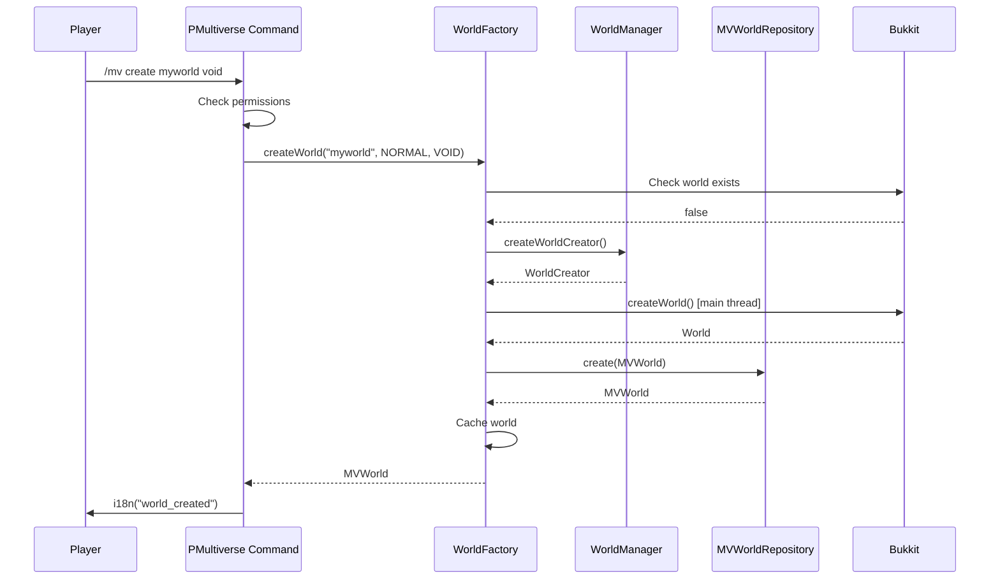
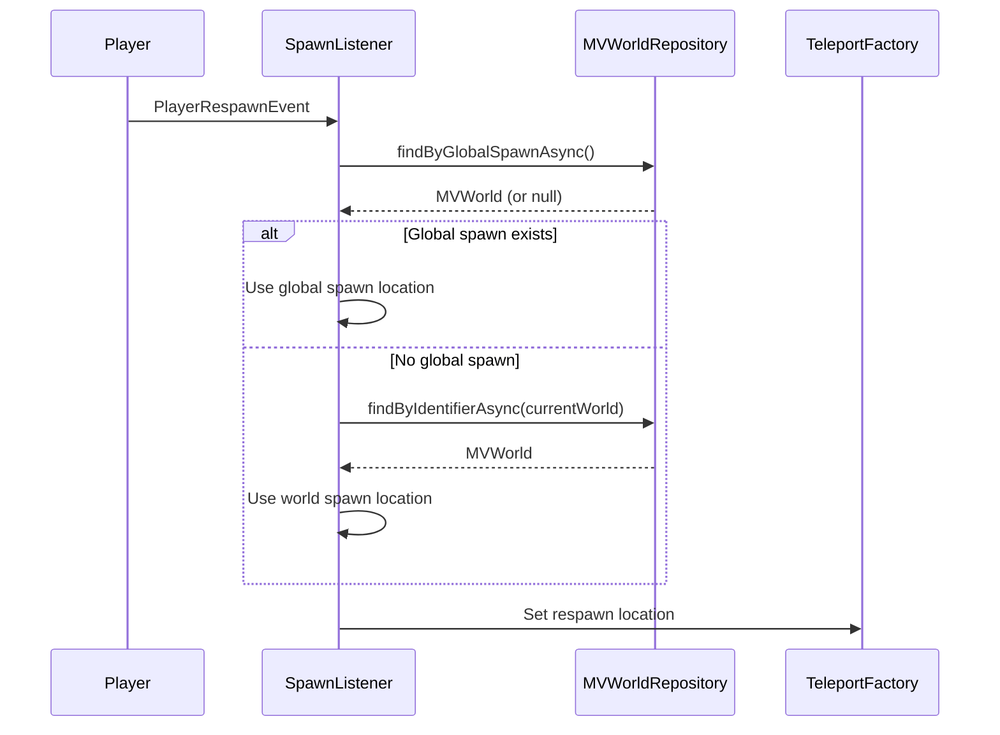

# Design Document

## Overview

JExMultiverse is a multiverse world management plugin following the RDQ/RPlatform architecture. It provides world creation, deletion, teleportation, spawn management, and custom world generators through a modular design with common, free, and premium editions.

## Architecture

```mermaid
graph TB
    subgraph "JExMultiverse Plugin"
        subgraph "jexmultiverse-common"
            JExMultiverse[JExMultiverse Abstract Class]
            
            subgraph "API Layer"
                IMultiverseService[IMultiverseService]
                IMultiverseAdapter[IMultiverseAdapter]
                MultiverseAdapter[MultiverseAdapter]
            end
            
            subgraph "Database Layer"
                MVWorld[MVWorld Entity]
                MVWorldRepository[MVWorldRepository]
                LocationConverter[LocationConverter]
            end
            
            subgraph "Service Layer"
                WorldManager[WorldManager]
                WorldFactory[WorldFactory]
            end
            
            subgraph "Command Layer"
                PMultiverse[PMultiverse Command]
                PSpawn[PSpawn Command]
            end
            
            subgraph "View Layer"
                MultiverseEditorView[MultiverseEditorView]
            end
            
            subgraph "Generator Layer"
                VoidChunkGenerator[VoidChunkGenerator]
                PlotChunkGenerator[PlotChunkGenerator]
            end
            
            subgraph "Listener Layer"
                SpawnListener[SpawnListener]
            end
        end
        
        subgraph "jexmultiverse-free"
            FreeJExMultiverse[FreeJExMultiverse]
            FreeMultiverseService[FreeMultiverseService]
        end
        
        subgraph "jexmultiverse-premium"
            PremiumJExMultiverse[PremiumJExMultiverse]
            PremiumMultiverseService[PremiumMultiverseService]
        end
    end
    
    subgraph "External Dependencies"
        RPlatform[RPlatform]
        Hibernate[Hibernate/JPA]
        InventoryFramework[InventoryFramework]
        I18n[JExTranslate I18n]
    end
    
    JExMultiverse --> RPlatform
    JExMultiverse --> IMultiverseService
    MVWorldRepository --> Hibernate
    MultiverseEditorView --> InventoryFramework
    PMultiverse --> I18n
    
    FreeJExMultiverse --> JExMultiverse
    PremiumJExMultiverse --> JExMultiverse
    FreeMultiverseService --> IMultiverseService
    PremiumMultiverseService --> IMultiverseService
```



## Components and Interfaces

### Main Plugin Class

```java
package de.jexcellence.multiverse;

public abstract class JExMultiverse {
    private final JavaPlugin plugin;
    private final String edition;
    private final ExecutorService executor;
    private final RPlatform platform;
    
    private ViewFrame viewFrame;
    private WorldFactory worldFactory;
    
    @InjectRepository
    private MVWorldRepository worldRepository;
    
    private IMultiverseService multiverseService;
    private IMultiverseAdapter multiverseAdapter;
    
    // Lifecycle methods
    public void onEnable();
    public void onDisable();
    
    // Abstract methods for edition-specific implementations
    protected abstract String getStartupMessage();
    protected abstract int getMetricsId();
    protected abstract ViewFrame registerViews(ViewFrame viewFrame);
    protected abstract IMultiverseService createMultiverseService();
}
```

### Service Interface

```java
package de.jexcellence.multiverse.service;

public interface IMultiverseService {
    boolean isPremium();
    
    // World limits
    int getMaxWorlds();
    int getMaxWorldTypes();
    
    // World operations
    CompletableFuture<MVWorld> createWorld(String identifier, World.Environment env, MVWorldType type, Player creator);
    CompletableFuture<Boolean> deleteWorld(String identifier, Player deleter);
    CompletableFuture<MVWorld> getWorld(String identifier);
    CompletableFuture<List<MVWorld>> getAllWorlds();
    
    // Spawn operations
    CompletableFuture<Boolean> setSpawn(MVWorld world, Location location);
    CompletableFuture<Boolean> setGlobalSpawn(MVWorld world, boolean global);
    CompletableFuture<Location> getSpawnLocation(Player player);
}
```

### API Adapter Interface

```java
package de.jexcellence.multiverse.api;

public interface IMultiverseAdapter {
    CompletableFuture<MVWorld> getGlobalMVWorld();
    CompletableFuture<MVWorld> getMVWorld(String worldName);
    CompletableFuture<Boolean> hasMultiverseSpawn(String worldName);
    CompletableFuture<Boolean> spawn(Player player, String messageKey);
}
```

### World Factory

```java
package de.jexcellence.multiverse.factory;

public class WorldFactory {
    private final JExMultiverse plugin;
    private final Map<String, MVWorld> worldCache;
    
    public CompletableFuture<World> createBukkitWorld(String identifier, World.Environment env, MVWorldType type);
    public void loadAllWorlds();
    public void unloadWorld(String identifier);
    public MVWorld getCachedWorld(String identifier);
    public void refreshCache();
}
```

## Data Models

### MVWorld Entity

```java
package de.jexcellence.multiverse.database.entity;

@Entity
@Table(name = "mv_world")
public class MVWorld extends BaseEntity {
    
    @Column(name = "world_name", nullable = false, unique = true)
    private String identifier;
    
    @Enumerated(EnumType.STRING)
    @Column(name = "world_type", nullable = false)
    private MVWorldType type;
    
    @Enumerated(EnumType.STRING)
    @Column(name = "world_environment", nullable = false)
    private World.Environment environment;
    
    @Convert(converter = LocationConverter.class)
    @Column(name = "spawn_location", nullable = false, columnDefinition = "LONGTEXT")
    private Location spawnLocation;
    
    @Column(name = "is_globalized_spawn", nullable = false)
    private boolean globalizedSpawn;
    
    @Column(name = "is_pvp_enabled", nullable = false)
    private boolean pvpEnabled;
    
    @Column(name = "enter_permission")
    private String enterPermission;
    
    // Builder pattern for construction
    public static class Builder { ... }
}
```

### MVWorldType Enum

```java
package de.jexcellence.multiverse.type;

public enum MVWorldType {
    DEFAULT,  // Vanilla world generation
    VOID,     // Empty void world
    PLOT      // Grid-based plot world
}
```

### LocationConverter

```java
package de.jexcellence.multiverse.database.converter;

@Converter
public class LocationConverter implements AttributeConverter<Location, String> {
    private static final ObjectMapper MAPPER = new ObjectMapper();
    
    @Override
    public String convertToDatabaseColumn(Location location);
    
    @Override
    public Location convertToEntityAttribute(String json);
}
```

## Error Handling

### World Creation Errors

| Error Condition | Response |
|----------------|----------|
| World already exists | Send i18n message "multiverse.world_already_exists" with world_name placeholder |
| Invalid world identifier | Send i18n message "multiverse.invalid_identifier" |
| World creation failed | Send i18n message "multiverse.world_creation_failed" with exception placeholder, cleanup partial resources |
| Database save failed | Log error, attempt rollback, notify player |

### World Deletion Errors

| Error Condition | Response |
|----------------|----------|
| World doesn't exist | Send i18n message "multiverse.world_does_not_exist" |
| World has players | Send i18n message "multiverse.world_contains_players" |
| File deletion failed | Log warning, continue with database cleanup |

### Spawn Errors

| Error Condition | Response |
|----------------|----------|
| No spawn configured | Fall back to world spawn location |
| World not loaded | Send i18n message "multiverse.world_not_loaded" |

## Testing Strategy

### Unit Tests

1. **MVWorld Entity Tests**
   - Test builder pattern creates valid entities
   - Test field validation

2. **LocationConverter Tests**
   - Test serialization/deserialization roundtrip
   - Test null handling

3. **WorldFactory Tests**
   - Test cache operations
   - Test world type selection

### Integration Tests

1. **Repository Tests**
   - Test CRUD operations with in-memory database
   - Test cache invalidation

2. **Command Tests**
   - Test permission checks
   - Test argument parsing

## Package Structure

```
de.jexcellence.multiverse/
├── JExMultiverse.java                    # Abstract main class
├── api/
│   ├── IMultiverseAdapter.java           # External API interface
│   └── MultiverseAdapter.java            # API implementation
├── command/
│   ├── multiverse/
│   │   ├── PMultiverse.java              # Main command handler
│   │   ├── PMultiverseSection.java       # Command config section
│   │   ├── EMultiverseAction.java        # Command actions enum
│   │   └── EMultiversePermission.java    # Permission nodes enum
│   └── spawn/
│       ├── PSpawn.java                   # Spawn command handler
│       ├── PSpawnSection.java            # Command config section
│       └── ESpawnPermission.java         # Permission nodes enum
├── database/
│   ├── converter/
│   │   └── LocationConverter.java        # JPA converter
│   ├── entity/
│   │   └── MVWorld.java                  # World entity
│   └── repository/
│       └── MVWorldRepository.java        # World repository
├── factory/
│   └── WorldFactory.java                 # World creation factory
├── generator/
│   ├── void/
│   │   ├── VoidChunkGenerator.java
│   │   ├── VoidBiomeProvider.java
│   │   └── VoidBlockPopulator.java
│   └── plot/
│       ├── PlotChunkGenerator.java
│       ├── PlotBiomeProvider.java
│       ├── PlotBlockPopulator.java
│       └── PlotLayer.java
├── listener/
│   └── SpawnListener.java                # Spawn/respawn events
├── service/
│   └── IMultiverseService.java           # Service interface
├── type/
│   └── MVWorldType.java                  # World type enum
└── view/
    └── MultiverseEditorView.java         # World editor GUI
```

## Resource Files

### Command Configuration (commands/pmultiverse.yml)

```yaml
commands:
  pmultiverse:
    name: 'pmultiverse'
    description: 'Manage multiverse worlds'
    aliases: [mv, multiverse]
    usage: 'multiverse <action> <world-name> [type]'
    permissions:
      nodes:
        command: multiverse.command
        commandCreate: multiverse.command.create
        commandDelete: multiverse.command.delete
        commandEdit: multiverse.command.edit
        commandTeleport: multiverse.command.teleport
        commandLoad: multiverse.command.load
```

### Translation File Structure (translations/en_US.yml)

```yaml
prefix:
  - "<gradient:#ff7f50:#ff4500>✦ Multiverse ✦</gradient> <dark_gray>|</dark_gray> "

multiverse:
  world_already_exists: "The world %world_name% already exists."
  preparing_world: "Creating world %world_name%..."
  world_created: "World %world_name% created successfully."
  world_does_not_exist: "The world %world_name% does not exist."
  # ... additional keys

multiverse_editor_ui:
  title: "Edit World"
  spawn_location:
    name: "Set Spawn Point"
    lore:
      - "Current: %spawn_location%"
      - "Click to set spawn"
  # ... additional keys

spawn:
  teleporting_to_spawn: "Teleporting to spawn..."
  spawn_not_found: "No spawn location configured."
```

## Sequence Diagrams

### World Creation Flow



### Spawn Teleport Flow


