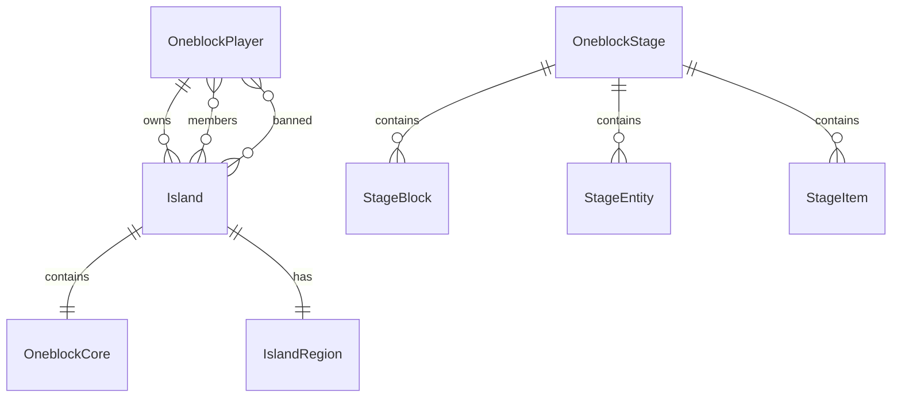

# Design Document

## Overview

The JExOneblock entity modernization involves refactoring existing entity classes to follow current naming conventions, improve JPA relationships, and enhance the overall architecture. The system will maintain backward compatibility while providing a cleaner, more maintainable codebase that aligns with the RDQ-common patterns.

## Architecture

### Entity Hierarchy

```
BaseEntity (from platform)
├── OneblockPlayer
├── Island
└── OneblockStage (abstract)
    ├── CustomOneblockStage (for user-created stages)
    └── PredefinedOneblockStage (for system stages like ZeusStage)

Embeddable Classes:
├── IslandRegion
└── OneblockCore

Stage Content Entities:
├── StageBlock
├── StageEntity
└── StageItem
```

### Package Structure

```
com.jexcellence.oneblock.database.entity/
├── player/
│   └── OneblockPlayer.java
├── island/
│   ├── Island.java
│   ├── IslandRegion.java
│   └── OneblockCore.java
├── stage/
│   ├── OneblockStage.java (abstract)
│   ├── CustomOneblockStage.java
│   ├── PredefinedOneblockStage.java
│   ├── StageBlock.java
│   ├── StageEntity.java
│   └── StageItem.java
└── converter/
    ├── LocationConverter.java
    ├── WorldConverter.java
    ├── ItemStackListConverter.java
    └── MaterialListConverter.java
```

## Components and Interfaces

### Core Entity Classes

#### OneblockPlayer
- Replaces JEPlayer
- Extends BaseEntity
- Contains UUID and player name
- Follows RDQ-common pattern for player entities
- Uses UUID reference instead of direct entity relationships

#### Island
- Replaces JEIsland
- Main entity for island management
- Contains embedded OneblockCore and IslandRegion
- Manages members and banned players through many-to-many relationships
- Tracks island properties (size, level, experience, coins)

#### OneblockCore
- Replaces JEIslandOneblock
- Embeddable class representing the central oneblock
- Tracks stage progression, prestige, and experience
- Contains location of the oneblock

#### IslandRegion
- Replaces JEIslandRegion
- Embeddable class defining island boundaries
- Contains spawn locations for owners and visitors
- Provides utility methods for region checks

### Stage System

#### OneblockStage (Abstract)
- Base class for all stage types
- Contains common stage properties (name, level, experience requirements)
- Manages relationships with stage content entities
- Provides methods for content retrieval by rarity

#### CustomOneblockStage
- Extends OneblockStage
- For user-created/editable stages
- Supports dynamic configuration

#### PredefinedOneblockStage
- Extends OneblockStage
- For system-defined stages (like ZeusStage)
- Contains hardcoded configurations

#### Stage Content Entities
- **StageBlock**: Manages block materials by rarity
- **StageEntity**: Manages entity spawn eggs by rarity
- **StageItem**: Manages item drops by rarity

## Data Models

### Entity Relationships



### Key Attributes

#### Island Entity
- `id`: Primary key (inherited from BaseEntity)
- `owner`: OneblockPlayer reference (OneToOne)
- `currentSize`: Current island size
- `maximalSize`: Maximum allowed size
- `level`: Island level
- `experience`: Island experience points
- `islandName`: Display name
- `islandDescription`: Description text
- `privacy`: Privacy setting
- `islandCoins`: Island currency
- `islandCenter`: Location of island center
- `region`: Embedded IslandRegion
- `oneblock`: Embedded OneblockCore
- `members`: Set of member players
- `bannedPlayers`: Set of banned players

#### OneblockCore (Embeddable)
- `stage`: Current stage number
- `prestige`: Prestige level
- `experience`: Oneblock experience
- `location`: Block location

#### OneblockStage Entity
- `stageName`: Unique stage identifier
- `level`: Stage level/order
- `experienceToPass`: Experience required to advance
- `showcase`: Material for display
- `isDisabled`: Whether stage is active
- `stageBlocks`: List of block configurations
- `stageEntities`: List of entity configurations
- `stageItems`: List of item configurations

## Error Handling

### Validation Strategy
- Use JPA validation annotations (@NotNull, @Column constraints)
- Implement custom validation in entity constructors
- Provide meaningful error messages for constraint violations

### Data Integrity
- Use appropriate cascade types to maintain referential integrity
- Implement proper orphan removal for dependent entities
- Use database constraints for critical relationships

### Migration Considerations
- Provide database migration scripts for table renames
- Ensure backward compatibility during transition period
- Plan for data migration from old entity structure

## Testing Strategy

### Unit Testing
- Test entity creation and validation
- Test relationship mappings
- Test embedded object behavior
- Test converter functionality

### Integration Testing
- Test JPA repository operations
- Test cascade operations
- Test query performance with new structure

### Migration Testing
- Test data migration scripts
- Verify data integrity after migration
- Test backward compatibility scenarios

## Performance Considerations

### Fetch Strategies
- Use LAZY loading for large collections where appropriate
- Use EAGER loading for frequently accessed relationships
- Optimize queries to avoid N+1 problems

### Indexing Strategy
- Index frequently queried columns (UUID, island names)
- Consider composite indexes for complex queries
- Monitor query performance and adjust as needed

### Caching
- Leverage second-level cache for frequently accessed entities
- Consider query result caching for expensive operations
- Implement proper cache invalidation strategies