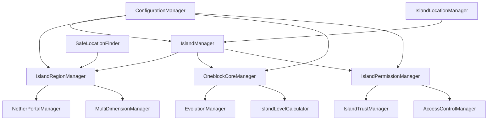

# Design Document

## Overview

The JExOneblock Manager Refactoring involves modernizing all manager classes to follow current project standards, fixing evolution system integration issues, and implementing optimized configuration management. The design focuses on creating a clean, maintainable, and performant manager layer that handles all aspects of oneblock island functionality.

## Architecture

### Manager Layer Structure

```
de.jexcellence.oneblock.manager/
├── core/
│   ├── IslandManager.java
│   ├── OneblockCoreManager.java
│   └── IslandLifecycleManager.java
├── region/
│   ├── IslandRegionManager.java
│   ├── NetherPortalManager.java
│   └── MultiDimensionManager.java
├── permission/
│   ├── IslandPermissionManager.java
│   ├── IslandTrustManager.java
│   └── AccessControlManager.java
├── calculation/
│   ├── IslandLevelCalculator.java
│   ├── ExperienceCalculator.java
│   └── BlockValueProvider.java
├── location/
│   ├── IslandLocationManager.java
│   ├── SafeLocationFinder.java
│   └── SpiralPlacementCalculator.java
├── config/
│   ├── ConfigurationManager.java
│   ├── YamlConfigLoader.java
│   └── ConfigurationCache.java
└── evolution/
    ├── EvolutionManager.java
    ├── CustomEvolutionBuilder.java
    └── EvolutionIntegrationService.java
```

### Manager Hierarchy and Dependencies



## Components and Interfaces

### Core Manager Interfaces

```java
public interface IIslandManager {
    CompletableFuture<Island> createIsland(OneblockPlayer player, Location location);
    CompletableFuture<Boolean> deleteIsland(Island island);
    CompletableFuture<Void> resetIsland(Island island);
    Optional<Island> getIslandAt(Location location);
    List<Island> getPlayerIslands(UUID playerId);
}

public interface IOneblockCoreManager {
    void initializeOneblock(Island island, Location location);
    CompletableFuture<Void> processBlockBreak(Island island, Location location);
    CompletableFuture<Material> getNextBlockType(Island island);
    void setEvolution(Island island, int evolutionLevel);
    boolean isActive(Island island);
}

public interface IIslandRegionManager {
    void createRegion(Island island, Location center, int size);
    CompletableFuture<Void> expandRegion(Island island, int additionalSize);
    boolean contains(Island island, Location location);
    List<Player> getPlayersInRegion(Island island);
    BoundingBox getBoundingBox(Island island, String dimension);
}
```

### Evolution System Integration

```java
public class CustomEvolutionBuilder {
    private String evolutionName;
    private int level;
    private double experienceRequired;
    private Map<Material, Double> blockWeights;
    private List<EntityType> entities;
    private List<ItemStack> items;
    
    public CustomEvolutionBuilder evolutionName(String name) {
        this.evolutionName = name;
        return this;
    }
    
    public CustomEvolutionBuilder level(int level) {
        this.level = level;
        return this;
    }
    
    public CustomEvolutionBuilder experienceRequired(double experience) {
        this.experienceRequired = experience;
        return this;
    }
    
    public CustomEvolutionBuilder addBlock(Material material, double weight) {
        this.blockWeights.put(material, weight);
        return this;
    }
    
    public Supplier<OneblockEvolution> build() {
        return () -> new OneblockEvolution(
            evolutionName, 
            level, 
            experienceRequired, 
            blockWeights, 
            entities, 
            items
        );
    }
}
```

### Configuration Management System

```java
public class ConfigurationManager {
    private final Map<String, ConfigurationCache> configCaches;
    private final YamlConfigLoader configLoader;
    private final ScheduledExecutorService reloadScheduler;
    
    public <T> T getConfiguration(String configName, Class<T> configClass) {
        return configCaches.computeIfAbsent(configName, 
            k -> new ConfigurationCache(configLoader.load(k, configClass)))
            .getConfiguration();
    }
    
    public void reloadConfiguration(String configName) {
        ConfigurationCache cache = configCaches.get(configName);
        if (cache != null) {
            cache.invalidate();
        }
    }
    
    public void enableAutoReload(String configName, Duration interval) {
        reloadScheduler.scheduleAtFixedRate(
            () -> reloadConfiguration(configName),
            interval.toMillis(),
            interval.toMillis(),
            TimeUnit.MILLISECONDS
        );
    }
}
```

## Data Models

### Enhanced Manager Configuration

```java
@Data
@Builder
@NoArgsConstructor
@AllArgsConstructor
public class ManagerConfiguration {
    private IslandConfiguration islandConfig;
    private RegionConfiguration regionConfig;
    private CalculationConfiguration calculationConfig;
    private EvolutionConfiguration evolutionConfig;
    private PerformanceConfiguration performanceConfig;
}

@Data
@ConfigurationProperties("island")
public class IslandConfiguration {
    private int defaultSize = 50;
    private int maxSize = 200;
    private int spaceBetweenIslands = 100;
    private boolean enableNether = true;
    private boolean enableEnd = true;
    private String defaultBiome = "PLAINS";
}

@Data
@ConfigurationProperties("calculation")
public class CalculationConfiguration {
    private boolean useParallelProcessing = true;
    private int batchSize = 1000;
    private int maxConcurrentCalculations = 2;
    private Duration cacheExpiration = Duration.ofMinutes(5);
    private Map<Material, Double> blockValues = new HashMap<>();
}
```

### Manager State Management

```java
public class ManagerState {
    private final AtomicBoolean initialized = new AtomicBoolean(false);
    private final AtomicBoolean running = new AtomicBoolean(false);
    private final Map<String, Object> stateData = new ConcurrentHashMap<>();
    private final List<ManagerStateListener> listeners = new CopyOnWriteArrayList<>();
    
    public void initialize() {
        if (initialized.compareAndSet(false, true)) {
            notifyListeners(ManagerStateEvent.INITIALIZED);
        }
    }
    
    public void start() {
        if (running.compareAndSet(false, true)) {
            notifyListeners(ManagerStateEvent.STARTED);
        }
    }
    
    public void shutdown() {
        if (running.compareAndSet(true, false)) {
            notifyListeners(ManagerStateEvent.SHUTDOWN);
        }
    }
}
```

## Error Handling

### Centralized Error Management

```java
public class ManagerErrorHandler {
    private static final Logger logger = LoggerFactory.getLogger(ManagerErrorHandler.class);
    
    public static <T> CompletableFuture<T> handleAsync(Supplier<T> operation, String context) {
        return CompletableFuture.supplyAsync(() -> {
            try {
                return operation.get();
            } catch (Exception e) {
                logger.error("Error in {}: {}", context, e.getMessage(), e);
                throw new ManagerException("Operation failed in " + context, e);
            }
        });
    }
    
    public static <T> Optional<T> handleOptional(Supplier<T> operation, String context) {
        try {
            return Optional.ofNullable(operation.get());
        } catch (Exception e) {
            logger.warn("Optional operation failed in {}: {}", context, e.getMessage());
            return Optional.empty();
        }
    }
}

public class ManagerException extends RuntimeException {
    private final String context;
    private final ErrorCode errorCode;
    
    public ManagerException(String message, String context, ErrorCode errorCode) {
        super(message);
        this.context = context;
        this.errorCode = errorCode;
    }
    
    public ManagerException(String message, Throwable cause) {
        super(message, cause);
        this.context = "Unknown";
        this.errorCode = ErrorCode.GENERAL_ERROR;
    }
}
```

## Testing Strategy

### Manager Testing Framework

```java
@ExtendWith(MockitoExtension.class)
public abstract class BaseManagerTest {
    @Mock protected JEOneblock plugin;
    @Mock protected ConfigurationManager configManager;
    @Mock protected RepositoryManager repositoryManager;
    
    protected TestIslandBuilder islandBuilder;
    protected TestPlayerBuilder playerBuilder;
    
    @BeforeEach
    void setUp() {
        islandBuilder = new TestIslandBuilder();
        playerBuilder = new TestPlayerBuilder();
        setupMocks();
    }
    
    protected abstract void setupMocks();
    
    protected Island createTestIsland() {
        return islandBuilder.build();
    }
    
    protected OneblockPlayer createTestPlayer() {
        return playerBuilder.build();
    }
}

public class IslandManagerTest extends BaseManagerTest {
    @InjectMocks
    private IslandManager islandManager;
    
    @Test
    void shouldCreateIslandSuccessfully() {
        // Given
        OneblockPlayer player = createTestPlayer();
        Location location = new Location(mock(World.class), 0, 64, 0);
        
        // When
        CompletableFuture<Island> result = islandManager.createIsland(player, location);
        
        // Then
        assertThat(result).succeedsWithin(Duration.ofSeconds(5));
        Island island = result.join();
        assertThat(island.getOwner()).isEqualTo(player);
        assertThat(island.getCenterLocation()).isEqualTo(location);
    }
}
```

### Integration Testing

```java
@SpringBootTest
@TestPropertySource(locations = "classpath:test-application.yml")
public class ManagerIntegrationTest {
    @Autowired private IslandManager islandManager;
    @Autowired private IslandRegionManager regionManager;
    @Autowired private OneblockCoreManager oneblockManager;
    
    @Test
    void shouldIntegrateManagersCorrectly() {
        // Test full island creation workflow
        OneblockPlayer player = createTestPlayer();
        Location location = createTestLocation();
        
        // Create island
        Island island = islandManager.createIsland(player, location).join();
        
        // Verify region creation
        assertThat(regionManager.contains(island, location)).isTrue();
        
        // Verify oneblock initialization
        assertThat(oneblockManager.isActive(island)).isTrue();
    }
}
```

## Performance Optimization

### Async Operation Management

```java
public class AsyncOperationManager {
    private final ExecutorService executorService;
    private final Semaphore operationSemaphore;
    private final Map<String, CompletableFuture<?>> activeOperations;
    
    public <T> CompletableFuture<T> executeAsync(String operationId, Supplier<T> operation) {
        return CompletableFuture.supplyAsync(() -> {
            try {
                operationSemaphore.acquire();
                return operation.get();
            } catch (InterruptedException e) {
                Thread.currentThread().interrupt();
                throw new RuntimeException("Operation interrupted", e);
            } finally {
                operationSemaphore.release();
                activeOperations.remove(operationId);
            }
        }, executorService);
    }
    
    public void cancelOperation(String operationId) {
        CompletableFuture<?> operation = activeOperations.get(operationId);
        if (operation != null) {
            operation.cancel(true);
        }
    }
}
```

### Caching Strategy

```java
public class ManagerCache {
    private final Cache<String, Object> cache;
    private final Map<String, Duration> expirationPolicies;
    
    public ManagerCache(Duration defaultExpiration) {
        this.cache = Caffeine.newBuilder()
            .maximumSize(1000)
            .expireAfterWrite(defaultExpiration)
            .recordStats()
            .build();
        this.expirationPolicies = new ConcurrentHashMap<>();
    }
    
    @SuppressWarnings("unchecked")
    public <T> Optional<T> get(String key, Class<T> type) {
        Object value = cache.getIfPresent(key);
        return value != null && type.isInstance(value) 
            ? Optional.of((T) value) 
            : Optional.empty();
    }
    
    public <T> T computeIfAbsent(String key, Function<String, T> supplier) {
        return (T) cache.get(key, k -> supplier.apply(k));
    }
}
```

## Migration Strategy

### Gradual Migration Plan

1. **Phase 1**: Create new manager interfaces and base implementations
2. **Phase 2**: Migrate core managers (IslandManager, OneblockCoreManager)
3. **Phase 3**: Migrate region and permission managers
4. **Phase 4**: Migrate calculation and location managers
5. **Phase 5**: Update configuration management and evolution integration
6. **Phase 6**: Remove old manager classes and update references

### Backward Compatibility

```java
@Deprecated
public class TrustManager {
    private final IslandTrustManager newTrustManager;
    
    public TrustManager(IslandTrustManager newTrustManager) {
        this.newTrustManager = newTrustManager;
    }
    
    @Deprecated
    public boolean isTrusted(UUID playerId, JEIsland island) {
        // Delegate to new implementation with proper conversion
        return newTrustManager.isTrusted(playerId, convertIsland(island));
    }
    
    private Island convertIsland(JEIsland oldIsland) {
        // Convert old entity to new entity
        return IslandConverter.convert(oldIsland);
    }
}
```

This design provides a comprehensive solution for refactoring all JExOneblock managers while maintaining functionality, improving performance, and fixing the evolution system integration issues.