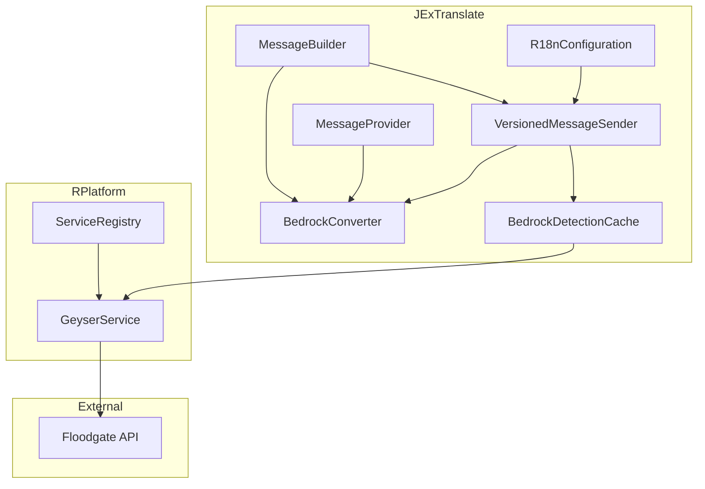

# Design Document: JExTranslate Bedrock Support

## Overview

This design document describes the architecture for adding Bedrock Edition player support to JExTranslate. The solution integrates with RPlatform's GeyserService for player detection and provides automatic message format conversion for Bedrock clients, which only support legacy color codes (§ codes) rather than MiniMessage or Adventure Components.

## Architecture

The Bedrock support feature follows the existing JExTranslate architecture patterns:



### Key Design Decisions

1. **Lazy GeyserService Integration**: JExTranslate will attempt to obtain GeyserService from ServiceRegistry only when needed, avoiding hard dependencies on RPlatform.

2. **Converter Pattern**: A dedicated `BedrockConverter` utility class handles all format conversions, keeping the logic isolated and testable.

3. **Session-Based Caching**: Bedrock status is cached per-player using a `Map<UUID, Boolean>` with automatic cleanup on player quit events.

4. **Graceful Degradation**: If GeyserService is unavailable, all players are treated as Java Edition with no errors.

## Components and Interfaces

### BedrockConverter

A utility class that converts Adventure Components and MiniMessage strings to Bedrock-compatible legacy format.

```java
package de.jexcellence.jextranslate.bedrock;

public final class BedrockConverter {
    
    /**
     * Converts an Adventure Component to a Bedrock-compatible legacy string.
     * Strips unsupported features (click events, hover events, gradients).
     */
    @NotNull
    public static String toLegacyString(@NotNull Component component);
    
    /**
     * Converts a MiniMessage string to a Bedrock-compatible legacy string.
     */
    @NotNull
    public static String fromMiniMessage(@NotNull String miniMessage);
    
    /**
     * Converts a hex color to the nearest legacy color code.
     */
    @NotNull
    public static String hexToNearestLegacy(@NotNull String hexColor);
    
    /**
     * Strips all unsupported Bedrock formatting from a component.
     */
    @NotNull
    public static Component stripUnsupportedFormatting(@NotNull Component component);
}
```

### BedrockDetectionCache

Manages caching of Bedrock player detection results for performance.

```java
package de.jexcellence.jextranslate.bedrock;

public final class BedrockDetectionCache implements Listener {
    
    /**
     * Checks if a player is a Bedrock player, using cache if available.
     */
    public boolean isBedrockPlayer(@NotNull Player player);
    
    /**
     * Clears the cache entry for a specific player.
     */
    public void invalidate(@NotNull UUID playerId);
    
    /**
     * Clears all cached entries.
     */
    public void invalidateAll();
    
    /**
     * Event handler to clean up cache on player quit.
     */
    @EventHandler
    public void onPlayerQuit(PlayerQuitEvent event);
}
```

### Updated MessageBuilder Methods

New methods added to MessageBuilder for Bedrock-specific string retrieval:

```java
// In MessageBuilder.java

/**
 * Converts the message to a Bedrock-compatible legacy string.
 * Automatically strips unsupported formatting.
 */
@NotNull
public String toBedrockString(@Nullable Player player);

/**
 * Converts the message to multiple Bedrock-compatible legacy strings.
 */
@NotNull
public List<String> toBedrockStrings(@Nullable Player player);

/**
 * Checks if the target player is a Bedrock player.
 */
public boolean isBedrockPlayer(@Nullable Player player);
```

### Updated VersionedMessageSender

Enhanced to automatically detect Bedrock players and convert messages:

```java
// In VersionedMessageSender.java

/**
 * Sends a message to a player, automatically converting for Bedrock if needed.
 */
public void sendMessage(@NotNull Player player, @NotNull Component component) {
    if (bedrockDetectionCache.isBedrockPlayer(player)) {
        String legacyMessage = BedrockConverter.toLegacyString(component);
        player.sendMessage(legacyMessage);
    } else {
        // Existing Java Edition logic
    }
}
```

### R18nConfiguration Updates

New configuration options for Bedrock support:

```java
// New fields in R18nConfiguration record
boolean bedrockSupportEnabled,          // Default: true
HexColorFallback hexColorFallback,      // Default: NEAREST_LEGACY
BedrockFormatMode bedrockFormatMode     // Default: CONSERVATIVE

public enum HexColorFallback {
    STRIP,           // Remove hex colors entirely
    NEAREST_LEGACY,  // Convert to nearest legacy color
    GRAYSCALE        // Convert to grayscale (white/gray/dark_gray)
}

public enum BedrockFormatMode {
    CONSERVATIVE,  // Maximum compatibility - convert to legacy § codes only
    MODERN         // Preserve hex colors for newer Bedrock clients via Geyser
}
```

## Data Models

### Bedrock Status Cache Entry

Simple in-memory cache using `ConcurrentHashMap`:

```java
private final Map<UUID, Boolean> bedrockStatusCache = new ConcurrentHashMap<>();
```

No persistence required - cache is rebuilt on player join and cleared on quit.

### Legacy Color Mapping

Static mapping for hex-to-legacy color conversion:

```java
private static final Map<TextColor, NamedTextColor> HEX_TO_LEGACY = Map.of(
    // Mapping of common hex colors to nearest legacy equivalents
);
```

## Error Handling

| Scenario | Handling |
|----------|----------|
| GeyserService unavailable | Log info message once, treat all players as Java Edition |
| ServiceRegistry unavailable | Same as above, graceful degradation |
| Floodgate API throws exception | Catch, log warning, return false (assume Java Edition) |
| Invalid MiniMessage syntax | Use MiniMessage's lenient parser, preserve raw text on failure |
| Null player in detection | Return false (assume Java Edition for console/null) |

## Testing Strategy

### Unit Tests

1. **BedrockConverterTest**
   - Test Component to legacy string conversion
   - Test MiniMessage to legacy conversion
   - Test hex color to nearest legacy mapping
   - Test stripping of unsupported formatting (click events, hover events)
   - Test gradient handling

2. **BedrockDetectionCacheTest**
   - Test cache hit/miss behavior
   - Test invalidation on player quit
   - Test manual cache clearing

3. **R18nConfigurationTest**
   - Test new Bedrock configuration options
   - Test default values

### Integration Tests

1. **MessageBuilder Bedrock Methods**
   - Test `toBedrockString()` output format
   - Test `toBedrockStrings()` for multi-line messages
   - Test `isBedrockPlayer()` integration

## Implementation Notes

### Color Conversion Algorithm

For hex-to-legacy conversion, use color distance calculation:

```java
private static NamedTextColor findNearestLegacy(TextColor hex) {
    return LEGACY_COLORS.stream()
        .min(Comparator.comparingDouble(legacy -> colorDistance(hex, legacy)))
        .orElse(NamedTextColor.WHITE);
}

private static double colorDistance(TextColor c1, TextColor c2) {
    int dr = c1.red() - c2.red();
    int dg = c1.green() - c2.green();
    int db = c1.blue() - c2.blue();
    return Math.sqrt(dr * dr + dg * dg + db * db);
}
```

### Supported Bedrock Formatting

Bedrock Edition supports these formatting codes:
- Colors: §0-§9, §a-§f (16 colors)
- Bold: §l
- Italic: §o
- Underline: §n (limited support)
- Strikethrough: §m (limited support)
- Obfuscated: §k
- Reset: §r

### Unsupported Features (to be stripped)

- Click events (not supported in Bedrock chat)
- Hover events (not supported in Bedrock chat)
- Fonts (not supported)
- Insertion text (not supported)

### Potentially Supported Features (configurable)

Recent Bedrock versions and certain proxy setups (Floodgate/Geyser) may support:
- **Hex colors**: Some implementations report hex colors working via JSON text or specific APIs
- **Gradients**: May work through character-by-character coloring with hex codes

The `BedrockConverter` will include a configuration option to:
1. **Conservative mode** (default): Convert hex/gradients to legacy for maximum compatibility
2. **Modern mode**: Preserve hex colors and attempt gradient rendering for newer Bedrock clients

```java
public enum BedrockFormatMode {
    CONSERVATIVE,  // Convert everything to legacy § codes
    MODERN         // Preserve hex colors, attempt gradients
}
```
