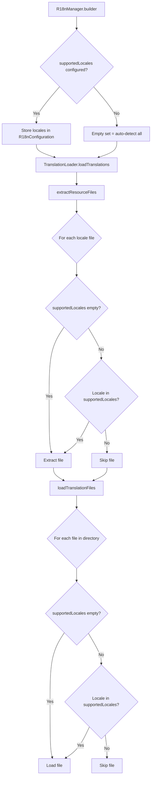

# Design Document: JExTranslate Locale Filtering

## Overview

This design adds configuration options to JExTranslate that control which translation files are extracted and loaded. The implementation modifies the `TranslationLoader` to respect the `supportedLocales` configuration, only extracting and loading files for explicitly configured locales while maintaining backward compatibility when no locales are specified.

## Architecture

The locale filtering is implemented at the `TranslationLoader` level, with configuration passed through `R18nConfiguration`. The filtering applies to both extraction (from JAR to data folder) and loading (from data folder to memory).



## Components and Interfaces

### 1. R18nConfiguration Changes

The `R18nConfiguration` record already has `supportedLocales` field. The key change is in how empty vs populated sets are interpreted:

- **Empty Set (`Set.of()`)**: Auto-detect mode - extract and load ALL translation files
- **Populated Set**: Explicit mode - only extract and load files for specified locales

```java
// Current behavior (already exists)
public record R18nConfiguration(
    @NotNull String defaultLocale,
    @NotNull Set<String> supportedLocales,  // Empty = auto-detect, populated = filter
    // ... other fields
) {
    // Validation ensures defaultLocale is in supportedLocales when populated
}
```

### 2. R18nManager.Builder Enhancement

The builder already supports `supportedLocales()`. No changes needed to the API, but documentation should clarify the filtering behavior:

```java
// Example usage - only extract de_DE and en_US
R18nManager.builder(plugin)
    .defaultLocale("en_US")
    .supportedLocales("en_US", "de_DE")  // Only these will be extracted
    .build();

// Example usage - extract all available (current default behavior)
R18nManager.builder(plugin)
    .defaultLocale("en_US")
    .autoDetectLocales()  // Extract all available files
    .build();
```

### 3. TranslationLoader Modifications

#### 3.1 Extraction Filtering

Modify `extractUsingBukkitSaveResource` to check supported locales:

```java
private void extractUsingBukkitSaveResource(@NotNull File translationDir, @NotNull String translationPath) {
    Set<String> supportedLocales = configuration.supportedLocales();
    boolean filterEnabled = !supportedLocales.isEmpty();
    
    String[] commonLocales = { /* existing list */ };
    
    for (String locale : commonLocales) {
        // Skip if filtering is enabled and locale not in supported list
        if (filterEnabled && !supportedLocales.contains(locale)) {
            if (configuration.debugMode()) {
                LOGGER.fine("Skipping extraction of unsupported locale: " + locale);
            }
            continue;
        }
        
        // Existing extraction logic...
    }
}
```

Modify `extractUsingJarScanning` similarly:

```java
private void extractUsingJarScanning(@NotNull File translationDir, @NotNull String translationPath) {
    Set<String> supportedLocales = configuration.supportedLocales();
    boolean filterEnabled = !supportedLocales.isEmpty();
    
    while (entries.hasMoreElements()) {
        // Extract locale from filename
        String locale = extractLocaleFromFilename(fileName);
        
        // Skip if filtering is enabled and locale not in supported list
        if (filterEnabled && !supportedLocales.contains(locale)) {
            if (configuration.debugMode()) {
                LOGGER.fine("Skipping JAR extraction of unsupported locale: " + locale);
            }
            continue;
        }
        
        // Existing extraction logic...
    }
}
```

#### 3.2 Loading Filtering

The loading methods (`loadYamlFile`, `loadJsonFile`) already have filtering logic but it's inverted. Update to match the new semantics:

```java
private void loadYamlFile(@NotNull Path filePath) {
    String locale = extractLocaleFromPath(filePath);
    Set<String> supportedLocales = configuration.supportedLocales();
    
    // Only filter if supportedLocales is explicitly configured (non-empty)
    if (!supportedLocales.isEmpty() && !supportedLocales.contains(locale)) {
        if (configuration.debugMode()) {
            LOGGER.info("Skipping unsupported locale: " + locale);
        }
        return;
    }
    
    // Existing loading logic...
}
```

### 4. Helper Method

Add a utility method to extract locale from filename:

```java
/**
 * Extracts the locale code from a translation filename.
 * 
 * @param fileName the filename (e.g., "en_US.yml", "de_DE.json")
 * @return the locale code (e.g., "en_US", "de_DE")
 */
private String extractLocaleFromFilename(@NotNull String fileName) {
    int lastDot = fileName.lastIndexOf('.');
    return lastDot > 0 ? fileName.substring(0, lastDot) : fileName;
}
```

## Data Models

No new data models required. The existing `R18nConfiguration` record handles all configuration.

## Error Handling

| Scenario | Behavior |
|----------|----------|
| Default locale not in supportedLocales | Validation error at configuration time (already implemented) |
| No translation files for supported locale | Warning logged, fallback to default locale |
| Empty supportedLocales set | Auto-detect mode, all files extracted/loaded |

## Testing Strategy

### Unit Tests
- Test extraction filtering with populated supportedLocales
- Test extraction with empty supportedLocales (auto-detect)
- Test loading filtering with populated supportedLocales
- Test loading with empty supportedLocales (auto-detect)
- Test that default locale is always included

### Integration Tests
- Test full initialization with filtered locales
- Test that only specified locale files appear in data folder
- Test backward compatibility with existing configurations

### Manual Testing
- Verify only configured locales are extracted to translations folder
- Verify debug logging shows skipped locales
- Verify existing plugins without locale config still work
