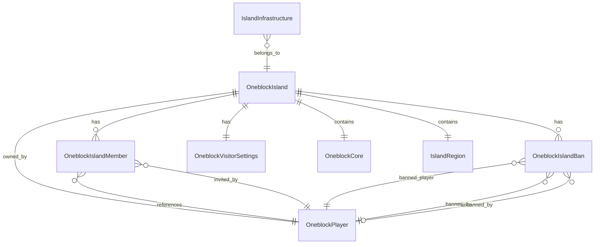
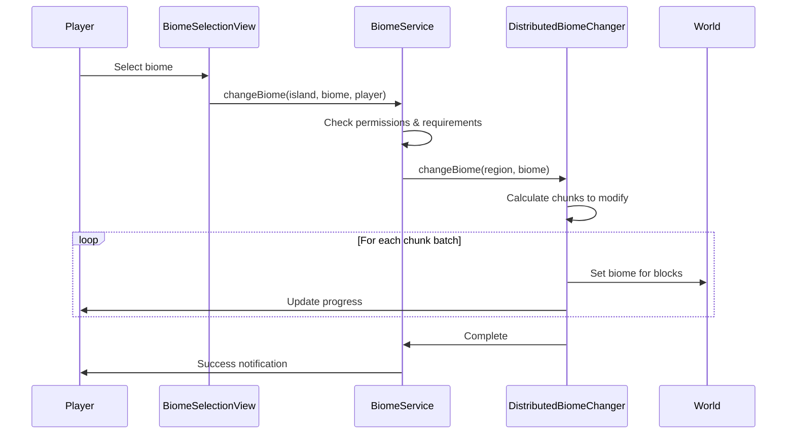
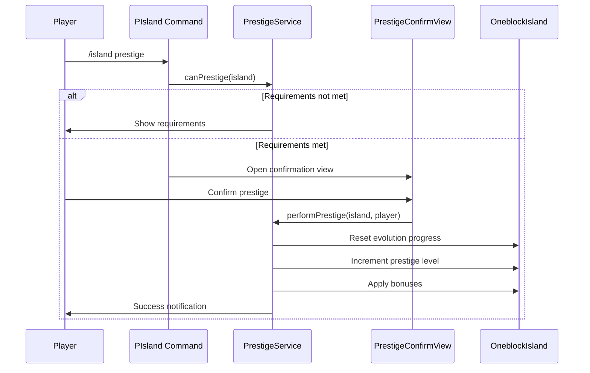

# Design Document

## Overview

This document describes the technical design for the JExOneblock comprehensive island management system. The system provides a full-featured island management experience through:

1. **Working IInfrastructureService implementation** - Bridges InfrastructureManager with the service layer
2. **PIsland command** - Unified command for all island operations with subcommands
3. **Island GUI views** - Main view, evolution browser, member management, settings, biome selection, upgrades
4. **Member management** - Invite, kick, ban, unban, role management
5. **Visitor settings** - Granular permission control for non-members
6. **Evolution system** - Progress tracking, evolution browser, prestige integration
7. **Biome management** - Async biome changing using DistributedBiomeChanger
8. **Island upgrades** - Size expansion, member slots, storage capacity

## Architecture

The system follows a layered architecture consistent with the existing JExOneblock codebase:

```
┌─────────────────────────────────────────────────────────────────┐
│                      Command Layer                               │
│  PIsland (player command with comprehensive subcommands)        │
└─────────────────────────────────────────────────────────────────┘
                              │
                              ▼
┌─────────────────────────────────────────────────────────────────┐
│                       View Layer                                 │
│  IslandMainView, EvolutionOverviewView, EvolutionBrowserView,   │
│  OneblockCoreView, VisitorSettingsView, MemberPermissionView,   │
│  IslandSettingsView, BannedPlayersView, MembersListView,        │
│  BiomeSelectionView, IslandUpgradesView, PrestigeConfirmView    │
└─────────────────────────────────────────────────────────────────┘
                              │
                              ▼
┌─────────────────────────────────────────────────────────────────┐
│                      Service Layer                               │
│  InfrastructureServiceImpl, IOneblockService                    │
│  IslandMemberService, IslandBanService, IslandInviteService     │
│  BiomeService, UpgradeService, PrestigeService                  │
└─────────────────────────────────────────────────────────────────┘
                              │
                              ▼
┌─────────────────────────────────────────────────────────────────┐
│                     Repository Layer                             │
│  OneblockIslandRepository, OneblockIslandMemberRepository,      │
│  OneblockIslandBanRepository, OneblockVisitorSettingsRepository │
│  IslandInfrastructureRepository, OneblockEvolutionRepository    │
└─────────────────────────────────────────────────────────────────┘
                              │
                              ▼
┌─────────────────────────────────────────────────────────────────┐
│                      Entity Layer                                │
│  OneblockIsland, OneblockIslandMember, OneblockIslandBan,       │
│  OneblockVisitorSettings, IslandInfrastructure, OneblockCore    │
└─────────────────────────────────────────────────────────────────┘
```

## Components and Interfaces

### 1. IInfrastructureService Implementation

The existing `IInfrastructureService` interface will be implemented by a new `InfrastructureServiceImpl` class:

```java
public class InfrastructureServiceImpl implements IInfrastructureService {
    private final InfrastructureManager manager;
    private final InfrastructureTickProcessor tickProcessor;
    private final IslandInfrastructureRepository repository;
    private final Map<Long, IslandInfrastructure> cache;
    
    @Override
    public IslandInfrastructure getInfrastructure(Long islandId, UUID playerId) {
        return cache.computeIfAbsent(islandId, id -> 
            manager.getInfrastructure(id, playerId));
    }
    
    @Override
    public CompletableFuture<Optional<IslandInfrastructure>> getInfrastructureAsync(Long islandId) {
        return repository.findByIslandIdAsync(islandId);
    }
    
    @Override
    public InfrastructureManager getManager() { return manager; }
    
    @Override
    public InfrastructureTickProcessor getTickProcessor() { return tickProcessor; }
}
```

Key responsibilities:
- Manage infrastructure lifecycle for islands
- Provide synchronous and asynchronous access to infrastructure data
- Coordinate with InfrastructureManager for operations
- Handle caching and persistence
- Start/stop tick processor on plugin enable/disable

Plugin lifecycle integration:
```java
// In JExOneblock.onEnable()
this.infrastructureService = new InfrastructureServiceImpl(plugin, repository);
this.infrastructureService.initialize(); // Starts tick processor

// In JExOneblock.onDisable()
this.infrastructureService.shutdown(); // Stops tick processor, saves data
```

### 2. PIsland Command

Located at: `command/player/island/PIsland.java`

```java
@Command
public class PIsland extends PlayerCommand {
    // Comprehensive subcommand actions
    public enum EIslandAction {
        // Main views
        MAIN, INFO, STATS, LEVEL, TOP,
        // Evolution & progression
        EVOLUTION, ONEBLOCK, PRESTIGE,
        // Teleportation
        HOME, TP, SETHOME,
        // Member management
        MEMBERS, INVITE, KICK, BAN, UNBAN, LEAVE,
        // Settings & configuration
        SETTINGS, VISITORS, BIOME, UPGRADES,
        // Island lifecycle
        CREATE, DELETE,
        // Help
        HELP
    }
}
```

Supporting classes:
- `EIslandAction` - Enum of available actions
- `EIslandPermission` - Permission nodes for each action (pattern: `jexoneblock.island.<action>`)
- `PIslandSection` - Command configuration section

### 3. View Components

All views extend the InventoryFramework pattern used in existing infrastructure views.

#### IslandMainView
```java
public class IslandMainView extends View {
    // 54-slot chest (6 rows)
    // Row 1: Island info (name, level, evolution, owner head)
    // Row 2: Quick stats (members, visitors, blocks broken, coins)
    // Row 3-4: Navigation buttons (evolution, members, settings, visitors, biome, upgrades)
    // Row 5: OneBlock core info, infrastructure access
    // Row 6: Close button, help
}
```

#### EvolutionOverviewView
```java
public class EvolutionOverviewView extends View {
    // 54-slot chest
    // Shows current evolution, progress bar, next evolution preview
    // Displays blocks/items/entities available in current evolution
    // Navigation to full evolution browser
}
```

#### EvolutionBrowserView
```java
public class EvolutionBrowserView extends View {
    // 54-slot chest with pagination
    // All evolutions displayed with lock/unlock status
    // Current evolution highlighted
    // Click to view evolution details (blocks, items, entities by rarity)
    // Filter by category, search by name
}
```

#### OneblockCoreView
```java
public class OneblockCoreView extends View {
    // 54-slot chest
    // Current evolution name, level, experience progress bar
    // Blocks broken count, prestige level
    // Block drop rates by rarity tier
    // Entity spawn chances, item drop chances
    // Navigation to evolution browser
}
```

#### VisitorSettingsView
```java
public class VisitorSettingsView extends View {
    // 54-slot chest
    // Toggle items for each permission from OneblockVisitorSettings:
    // - canVisit, canInteractWithBlocks, canInteractWithEntities
    // - canUseItems, canPlaceBlocks, canBreakBlocks
    // - canOpenChests, canUseFurnaces, canUseCraftingTables
    // - canUseRedstone, canUseButtonsAndLevers
    // - canHurtAnimals, canBreedAnimals, canTameAnimals
    // - canHarvestCrops, canPlantCrops, canUseBoneMeal
    // - canUseAnvils, canUseEnchantingTables, canUseBrewingStands
    // - canPickupItems, canDropItems
    // Preset buttons (Allow All, Deny All, Basic, Trusted)
    // Visual indicators for enabled/disabled (green/red wool or dye)
}
```

#### MemberPermissionView
```java
public class MemberPermissionView extends View {
    // 54-slot chest
    // List of members with role indicators
    // Click to open role selection
    // Pagination support
    // Shows join date, invited by, activity status
}
```

#### IslandSettingsView
```java
public class IslandSettingsView extends View {
    // 54-slot chest
    // Name editor (anvil input), description editor
    // Privacy toggle (public/private)
    // Reset island button with confirmation
}
```

#### BannedPlayersView
```java
public class BannedPlayersView extends View {
    // 54-slot chest
    // Paginated list of banned players
    // Shows reason, date, expiration (if temporary)
    // Visual distinction between permanent/temporary bans
    // Click to unban or view details
}
```

#### MembersListView
```java
public class MembersListView extends View {
    // 54-slot chest
    // Owner at top with crown indicator
    // Members sorted by role
    // Online status indicators (green/red)
    // Click for management options (if permitted)
    // Shows join date, last activity
}
```

#### BiomeSelectionView
```java
public class BiomeSelectionView extends View {
    // 54-slot chest with categories
    // Biomes organized: Plains, Forest, Desert, Ocean, Nether, End, etc.
    // Locked biomes show requirements
    // Progress indicator during biome change
    // Uses DistributedBiomeChanger for async operation
}
```

#### IslandUpgradesView
```java
public class IslandUpgradesView extends View {
    // 54-slot chest
    // Upgrade categories: Size, Members, Storage, Biomes
    // Current level, next level benefits, resource requirements
    // Click to purchase if requirements met
    // Visual progress indicators
}
```

#### PrestigeConfirmView
```java
public class PrestigeConfirmView extends View {
    // 54-slot chest
    // Current prestige level, next level rewards
    // What will be reset vs preserved
    // Experience multiplier bonus, drop rate bonus
    // Confirm/Cancel buttons
}
```

### 4. Service Components

#### IslandMemberService
```java
public class IslandMemberService {
    CompletableFuture<Boolean> addMember(OneblockIsland island, OneblockPlayer player, 
                                         MemberRole role, OneblockPlayer invitedBy);
    CompletableFuture<Boolean> removeMember(OneblockIsland island, OneblockPlayer player);
    CompletableFuture<Boolean> updateRole(OneblockIslandMember member, MemberRole newRole);
    CompletableFuture<List<OneblockIslandMember>> getMembers(OneblockIsland island);
    CompletableFuture<List<OneblockIslandMember>> getActiveMembers(OneblockIsland island);
    Optional<MemberRole> getMemberRole(OneblockIsland island, OneblockPlayer player);
}
```

#### IslandBanService
```java
public class IslandBanService {
    CompletableFuture<Boolean> banPlayer(OneblockIsland island, OneblockPlayer target,
                                         OneblockPlayer bannedBy, String reason, Duration duration);
    CompletableFuture<Boolean> unbanPlayer(OneblockIsland island, OneblockPlayer target,
                                           OneblockPlayer unbannedBy);
    CompletableFuture<List<OneblockIslandBan>> getActiveBans(OneblockIsland island);
    boolean isBanned(OneblockIsland island, OneblockPlayer player);
    void cleanupExpiredBans(); // Called periodically
}
```

#### IslandInviteService
```java
public class IslandInviteService {
    CompletableFuture<Boolean> sendInvite(OneblockIsland island, OneblockPlayer target,
                                          OneblockPlayer invitedBy, MemberRole role);
    CompletableFuture<Boolean> acceptInvite(OneblockIslandMember invite);
    CompletableFuture<Boolean> declineInvite(OneblockIslandMember invite);
    CompletableFuture<List<OneblockIslandMember>> getPendingInvites(OneblockPlayer player);
    void cleanupExpiredInvites(); // Called periodically
    
    // Configurable expiration (default: 5 minutes)
    Duration getInviteExpiration();
}
```

#### BiomeService
```java
public class BiomeService {
    private final DistributedBiomeChanger biomeChanger;
    
    CompletableFuture<Boolean> changeBiome(OneblockIsland island, Biome biome, Player player);
    List<Biome> getAvailableBiomes(OneblockIsland island);
    boolean canUseBiome(OneblockIsland island, Biome biome);
    Map<String, List<Biome>> getBiomesByCategory();
}
```

#### UpgradeService
```java
public class UpgradeService {
    CompletableFuture<Boolean> purchaseUpgrade(OneblockIsland island, UpgradeType type, Player player);
    int getCurrentLevel(OneblockIsland island, UpgradeType type);
    UpgradeRequirements getNextLevelRequirements(OneblockIsland island, UpgradeType type);
    boolean canAffordUpgrade(OneblockIsland island, UpgradeType type, Player player);
    
    enum UpgradeType {
        SIZE_EXPANSION, MEMBER_SLOTS, STORAGE_CAPACITY, BIOME_TIER
    }
}
```

#### PrestigeService
```java
public class PrestigeService {
    boolean canPrestige(OneblockIsland island);
    PrestigeRequirements getRequirements(int currentPrestige);
    PrestigeRewards getRewards(int prestigeLevel);
    CompletableFuture<Boolean> performPrestige(OneblockIsland island, Player player);
    
    record PrestigeRequirements(int requiredEvolutionLevel, long requiredBlocksBroken, 
                                Map<Material, Integer> requiredItems);
    record PrestigeRewards(double xpMultiplier, double dropMultiplier, 
                          List<String> unlockedFeatures);
}
```

## Data Models

### Existing Entities (No Changes Required)

The following entities already exist and support the required functionality:
- `OneblockIsland` - Core island entity with member/ban management methods
- `OneblockIslandMember` - Member entity with role and status
- `OneblockIslandBan` - Ban entity with reason, duration, and status
- `OneblockVisitorSettings` - Visitor permission configuration (22 permissions)
- `OneblockPlayer` - Player entity
- `OneblockCore` - Embedded evolution progression tracking
- `IslandRegion` - Embedded 3D boundary definition
- `IslandInfrastructure` - Infrastructure state entity

### Entity Relationships



### Permission System Integration

The system uses the existing three-tier permission architecture:

#### TrustLevel (Role-based)
```
OWNER (level 7)      → ADMIN PermissionLevel
  └── CO_OWNER (level 6)  → ADMIN PermissionLevel
        └── MODERATOR (level 5) → MANAGE PermissionLevel
              └── TRUSTED (level 4)   → CONTAINER PermissionLevel
                    └── MEMBER (level 3)    → BUILD PermissionLevel
                          └── BASIC (level 2)     → INTERACT PermissionLevel
                                └── VISITOR (level 1)   → VISITOR PermissionLevel
                                      └── NONE (level 0)      → NONE PermissionLevel
```

#### PermissionLevel (Action-based)
```
ADMIN (8)     - Full control, delete/reset island
MANAGE (7)    - Manage settings, kick/ban, invite
REDSTONE (6)  - Use/modify redstone components
ANIMAL (5)    - Interact/breed/kill animals
CONTAINER (4) - Access chests, furnaces, brewing
BUILD (3)     - Place/break blocks, use tools
INTERACT (2)  - Use doors, buttons, pressure plates
VISITOR (1)   - Visit and teleport
NONE (0)      - No access
```

#### PermissionType (Specific Actions)
Existing permissions in `PermissionType.java`:
- **VISITOR level**: VISIT, TELEPORT
- **INTERACT level**: USE_DOORS, USE_BUTTONS, USE_PRESSURE_PLATES
- **BUILD level**: PLACE_BLOCKS, BREAK_BLOCKS, USE_TOOLS
- **CONTAINER level**: OPEN_CHESTS, USE_FURNACES, USE_BREWING, USE_ENCHANTING
- **ANIMAL level**: INTERACT_ANIMALS, BREED_ANIMALS, KILL_ANIMALS
- **REDSTONE level**: USE_REDSTONE, MODIFY_REDSTONE
- **MANAGE level**: INVITE_PLAYERS, KICK_PLAYERS, CHANGE_SETTINGS, MANAGE_WARPS
- **ADMIN level**: BAN_PLAYERS, TRANSFER_OWNERSHIP, DELETE_ISLAND, RESET_ISLAND

#### Island Command Action Permissions by TrustLevel
| Action | VISITOR | BASIC | MEMBER | TRUSTED | MODERATOR | CO_OWNER | OWNER |
|--------|---------|-------|--------|---------|-----------|----------|-------|
| View island | ✓ | ✓ | ✓ | ✓ | ✓ | ✓ | ✓ |
| View members | ✓ | ✓ | ✓ | ✓ | ✓ | ✓ | ✓ |
| View evolution | ✓ | ✓ | ✓ | ✓ | ✓ | ✓ | ✓ |
| Teleport home | ✓ | ✓ | ✓ | ✓ | ✓ | ✓ | ✓ |
| Set home | ✗ | ✗ | ✓ | ✓ | ✓ | ✓ | ✓ |
| Invite players | ✗ | ✗ | ✗ | ✗ | ✓ | ✓ | ✓ |
| Kick visitors | ✗ | ✗ | ✗ | ✗ | ✓ | ✓ | ✓ |
| Ban players | ✗ | ✗ | ✗ | ✗ | ✗ | ✓ | ✓ |
| Visitor settings | ✗ | ✗ | ✗ | ✗ | ✓ | ✓ | ✓ |
| Manage roles | ✗ | ✗ | ✗ | ✗ | ✗ | ✓ | ✓ |
| Remove members | ✗ | ✗ | ✗ | ✗ | ✗ | ✓ | ✓ |
| Edit settings | ✗ | ✗ | ✗ | ✗ | ✓ | ✓ | ✓ |
| Change biome | ✗ | ✗ | ✗ | ✗ | ✗ | ✓ | ✓ |
| Purchase upgrades | ✗ | ✗ | ✗ | ✗ | ✗ | ✓ | ✓ |
| Prestige | ✗ | ✗ | ✗ | ✗ | ✗ | ✗ | ✓ |
| Delete island | ✗ | ✗ | ✗ | ✗ | ✗ | ✗ | ✓ |
| Reset island | ✗ | ✗ | ✗ | ✗ | ✗ | ✗ | ✓ |

### Command Permission Nodes

```
jexoneblock.island.command          - Base command access
jexoneblock.island.info             - View island info
jexoneblock.island.stats            - View statistics
jexoneblock.island.level            - View level
jexoneblock.island.top              - View leaderboard
jexoneblock.island.evolution        - View evolution
jexoneblock.island.oneblock         - View oneblock core
jexoneblock.island.home             - Teleport home
jexoneblock.island.sethome          - Set home location
jexoneblock.island.members          - View members
jexoneblock.island.invite           - Invite players
jexoneblock.island.kick             - Kick visitors
jexoneblock.island.ban              - Ban players
jexoneblock.island.unban            - Unban players
jexoneblock.island.leave            - Leave island
jexoneblock.island.settings         - Edit settings
jexoneblock.island.visitors         - Visitor settings
jexoneblock.island.biome            - Change biome
jexoneblock.island.upgrades         - Purchase upgrades
jexoneblock.island.prestige         - Prestige island
jexoneblock.island.create           - Create island
jexoneblock.island.delete           - Delete island
```

## Error Handling

### Error Categories

1. **Permission Errors** - Player lacks required role/permission
2. **State Errors** - Invalid state (e.g., player already member, not on island)
3. **Target Errors** - Target player not found, offline, or invalid
4. **Database Errors** - Persistence failures
5. **Resource Errors** - Insufficient resources for upgrades/biome changes

### Error Response Strategy

All errors are handled through the I18n translation system:
```java
new I18n.Builder("island.error.no_permission", player)
    .includePrefix()
    .build()
    .sendMessage();
```

Translation keys follow the pattern: `island.<category>.<specific_error>`

### Async Error Handling

```java
service.performAction()
    .exceptionally(throwable -> {
        logger.log(Level.WARNING, "Action failed", throwable);
        player.sendMessage(I18n.get("island.error.generic", player));
        return null;
    });
```

## Biome Change Flow



## Prestige Flow



## Testing Strategy

### Unit Tests

1. **Service Tests**
   - InfrastructureServiceImpl: get/cache/async operations
   - IslandMemberService: add/remove/update member operations
   - IslandBanService: ban/unban operations, expiration logic
   - IslandInviteService: invite flow, acceptance/decline, expiration
   - BiomeService: biome availability, permission checks
   - UpgradeService: requirement validation, purchase logic
   - PrestigeService: requirement checks, reward calculation

2. **Permission Tests**
   - Role hierarchy validation
   - Action permission checks
   - Command permission enforcement

### Integration Tests

1. **Command Tests**
   - PIsland subcommand routing
   - Tab completion
   - Permission enforcement
   - Error message localization

2. **View Tests**
   - View opening and data display
   - Click handlers
   - Pagination
   - Real-time updates

### Manual Testing Scenarios

1. Full member lifecycle: invite → accept → role change → remove
2. Ban lifecycle: ban → attempt entry → unban → successful entry
3. Visitor settings: toggle permissions, verify enforcement
4. Evolution view: progress display, pagination, browser navigation
5. Biome change: select biome, progress feedback, completion
6. Upgrade purchase: view requirements, purchase, verify effect
7. Prestige: meet requirements, confirm, verify reset and bonuses

## File Structure

```
JExOneblock/jexoneblock-common/src/main/java/de/jexcellence/oneblock/
├── command/player/island/
│   ├── EIslandAction.java
│   ├── EIslandPermission.java
│   ├── PIsland.java
│   └── PIslandSection.java
├── service/
│   ├── IInfrastructureService.java (existing)
│   ├── InfrastructureServiceImpl.java (new)
│   ├── IslandMemberService.java (new)
│   ├── IslandBanService.java (new)
│   ├── IslandInviteService.java (new)
│   ├── BiomeService.java (new)
│   ├── UpgradeService.java (new)
│   └── PrestigeService.java (new)
└── view/island/
    ├── IslandMainView.java
    ├── EvolutionOverviewView.java
    ├── EvolutionBrowserView.java
    ├── OneblockCoreView.java
    ├── VisitorSettingsView.java
    ├── MemberPermissionView.java
    ├── IslandSettingsView.java
    ├── BannedPlayersView.java
    ├── MembersListView.java
    ├── BiomeSelectionView.java
    ├── IslandUpgradesView.java
    └── PrestigeConfirmView.java
```

## Translation Keys

New translation keys required in `translations/`:

```yaml
island:
  command:
    no_island: "&cYou don't have an island!"
    no_permission: "&cYou don't have permission to do that."
    player_not_found: "&cPlayer not found."
    player_offline: "&cThat player is offline."
    
  info:
    header: "&8&m----------&r &6Island Info &8&m----------"
    name: "&7Name: &f{name}"
    owner: "&7Owner: &f{owner}"
    level: "&7Level: &f{level}"
    evolution: "&7Evolution: &f{evolution}"
    members: "&7Members: &f{count}/{max}"
    blocks_broken: "&7Blocks Broken: &f{count}"
    
  teleport:
    success: "&aTeleported to your island!"
    home_set: "&aIsland home location set!"
    not_on_island: "&cYou must be on your island to set home."
  
  invite:
    sent: "&aInvitation sent to {player}."
    received: "&a{player} has invited you to their island! &7[&aAccept&7] [&cDecline&7]"
    accepted: "&a{player} has joined your island!"
    declined: "&c{player} declined your invitation."
    already_member: "&cThat player is already a member."
    already_invited: "&cThat player already has a pending invitation."
    banned: "&cThat player is banned from your island."
    expired: "&cThe invitation has expired."
  
  kick:
    success: "&aKicked {player} from your island."
    kicked: "&cYou have been kicked from {island}."
    not_on_island: "&cThat player is not on your island."
    cannot_kick_member: "&cYou cannot kick island members."
    cannot_kick_owner: "&cYou cannot kick the island owner."
  
  ban:
    success: "&aBanned {player} from your island."
    banned: "&cYou have been banned from {island}. Reason: {reason}"
    already_banned: "&cThat player is already banned."
    cannot_ban_member: "&cYou cannot ban island members."
    cannot_ban_owner: "&cYou cannot ban the island owner."
  
  unban:
    success: "&aUnbanned {player} from your island."
    not_banned: "&cThat player is not banned."
  
  member:
    removed: "&aRemoved {player} from your island."
    was_removed: "&cYou have been removed from {island}."
    role_changed: "&aChanged {player}'s role to {role}."
    cannot_modify_higher: "&cYou cannot modify members with equal or higher roles."
    left: "&aYou have left {island}."
  
  settings:
    name_changed: "&aIsland name changed to {name}."
    privacy_changed: "&aIsland privacy set to {state}."
    description_changed: "&aIsland description updated."
    
  biome:
    changing: "&7Changing biome to {biome}... {progress}%"
    success: "&aIsland biome changed to {biome}!"
    locked: "&cThis biome is locked. Requirements: {requirements}"
    
  upgrade:
    success: "&aUpgrade purchased! {upgrade} is now level {level}."
    cannot_afford: "&cYou cannot afford this upgrade. Required: {requirements}"
    max_level: "&cThis upgrade is already at maximum level."
    
  prestige:
    requirements: "&cPrestige requirements not met. Progress: {progress}"
    confirm: "&7Are you sure you want to prestige? This will reset your evolution progress."
    success: "&6Congratulations! You have prestiged to level {level}!"
    rewards: "&aRewards: +{xp}% XP, +{drops}% drops"
    
  evolution:
    current: "&7Current Evolution: &f{name} (Level {level})"
    progress: "&7Progress: &f{current}/{required} ({percent}%)"
    next: "&7Next Evolution: &f{name}"
    
  view:
    main:
      title: "&8Island: {name}"
    evolution:
      title: "&8Evolution Progress"
    evolution_browser:
      title: "&8Evolution Browser"
    oneblock:
      title: "&8OneBlock Core"
    visitors:
      title: "&8Visitor Settings"
    members:
      title: "&8Island Members"
    settings:
      title: "&8Island Settings"
    banned:
      title: "&8Banned Players"
    biome:
      title: "&8Biome Selection"
    upgrades:
      title: "&8Island Upgrades"
    prestige:
      title: "&8Prestige Confirmation"
```
