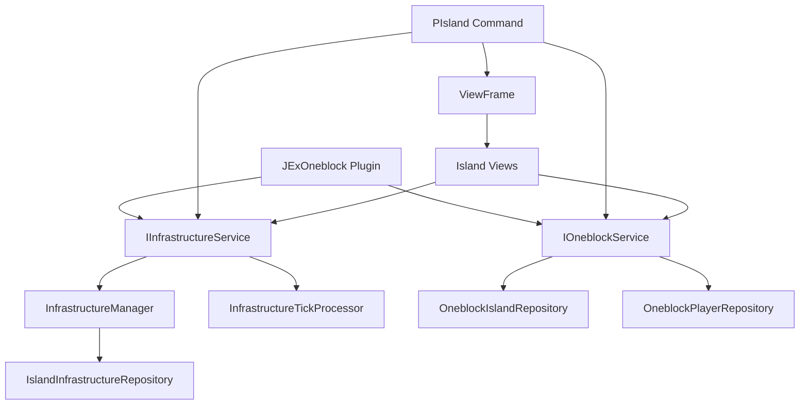

# Design Document

## Overview

This design implements a working `IInfrastructureService`, a comprehensive `PIsland` player command, and associated GUI views for the JExOneblock plugin. The implementation follows the existing project patterns using modern Java, Lombok, InventoryFramework views, and the established command structure.

## Architecture

### Component Structure

```
de.jexcellence.oneblock/
├── service/
│   ├── IInfrastructureService.java (existing interface)
│   ├── InfrastructureService.java (new implementation)
│   └── IOneblockService.java (existing - needs method additions)
├── command/player/
│   ├── infrastructure/ (existing)
│   └── island/
│       ├── PIsland.java
│       ├── PIslandSection.java
│       ├── EIslandAction.java
│       └── EIslandPermission.java
├── view/
│   ├── infrastructure/ (existing)
│   └── island/
│       ├── IslandMainView.java
│       ├── IslandInfoView.java
│       ├── IslandMembersView.java
│       ├── IslandSettingsView.java
│       ├── IslandUpgradesView.java
│       ├── BiomeSelectionView.java
│       ├── OneblockCoreView.java
│       ├── EvolutionBrowserView.java
│       ├── EvolutionDetailView.java
│       ├── PrestigeConfirmView.java
│       ├── RolePermissionsView.java
│       ├── RolePermissionEditView.java
│       ├── MemberManageView.java
│       ├── MemberPromoteDemoteView.java
│       ├── PlayerKickView.java
│       ├── PlayerBanView.java
│       ├── PlayerUnbanView.java
│       └── PlayerInviteView.java
└── manager/
    └── island/
        ├── BiomeManager.java
        └── IslandUpgradeManager.java
```

### Service Layer Integration



## Components and Interfaces

### InfrastructureService Implementation

```java
package de.jexcellence.oneblock.service;

public class InfrastructureService implements IInfrastructureService {
    
    private final InfrastructureManager manager;
    private final InfrastructureTickProcessor tickProcessor;
    private final IslandInfrastructureRepository repository;
    
    public InfrastructureService(
        @NotNull Plugin plugin,
        @NotNull IslandInfrastructureRepository repository
    ) {
        this.repository = repository;
        this.manager = new InfrastructureManager();
        this.tickProcessor = new InfrastructureTickProcessor(plugin, manager, repository);
    }
    
    @Override
    public @Nullable IslandInfrastructure getInfrastructure(@NotNull Long islandId, @NotNull UUID playerId) {
        return manager.getInfrastructure(
            UUID.nameUUIDFromBytes(islandId.toString().getBytes()), 
            playerId
        );
    }
    
    @Override
    public @NotNull CompletableFuture<Optional<IslandInfrastructure>> getInfrastructureAsync(@NotNull Long islandId) {
        return repository.findByIslandIdAsync(
            UUID.nameUUIDFromBytes(islandId.toString().getBytes())
        );
    }
    
    @Override
    public @NotNull InfrastructureManager getManager() {
        return new InfrastructureManagerAdapter(manager);
    }
    
    @Override
    public @NotNull InfrastructureTickProcessor getTickProcessor() {
        return new TickProcessorAdapter(tickProcessor);
    }
    
    public void start() {
        tickProcessor.start();
    }
    
    public void stop() {
        tickProcessor.stop();
    }
}
```

### PIsland Command Structure

```java
package de.jexcellence.oneblock.command.player.island;

@Command
public class PIsland extends PlayerCommand {
    
    private final JExOneblock plugin;
    
    public PIsland(@NotNull PIslandSection section, @NotNull JExOneblock plugin) {
        super(section);
        this.plugin = plugin;
    }
    
    @Override
    protected void onPlayerInvocation(@NotNull Player player, @NotNull String label, @NotNull String[] args) {
        if (hasNoPermission(player, EIslandPermission.COMMAND)) return;
        
        var action = enumParameterOrElse(args, 0, EIslandAction.class, EIslandAction.MAIN);
        
        // Check if player has island for most actions
        var island = plugin.getOneblockService().getPlayerIsland(player);
        if (island == null && action.requiresIsland()) {
            i18n("island.no_island", player).includePrefix().build().sendMessage();
            return;
        }
        
        switch (action) {
            case MAIN -> openMainView(player, island);
            case INFO -> openInfoView(player, island);
            case HOME, TP -> teleportToIsland(player, island);
            case SETHOME -> setIslandHome(player, island);
            case MEMBERS -> openMembersView(player, island);
            case SETTINGS -> openSettingsView(player, island);
            case UPGRADES -> openUpgradesView(player, island);
            case BIOME -> openBiomeView(player, island);
            case EVOLUTION -> openEvolutionBrowser(player, island);
            case ONEBLOCK -> openOneblockView(player, island);
            case PRESTIGE -> handlePrestige(player, island);
            case CREATE -> createIsland(player);
            case DELETE -> confirmDeleteIsland(player, island);
            case INVITE -> invitePlayer(player, island, args);
            case KICK -> kickPlayer(player, island, args);
            case BAN -> banPlayer(player, island, args);
            case UNBAN -> unbanPlayer(player, island, args);
            case TOP -> showTopIslands(player);
            case HELP -> sendHelp(player);
        }
    }
}
```

### EIslandAction Enum

```java
package de.jexcellence.oneblock.command.player.island;

public enum EIslandAction {
    MAIN(true),
    INFO(true),
    HOME(true),
    TP(true),
    SETHOME(true),
    MEMBERS(true),
    SETTINGS(true),
    UPGRADES(true),
    BIOME(true),
    EVOLUTION(true),
    ONEBLOCK(true),
    PRESTIGE(true),
    CREATE(false),
    DELETE(true),
    INVITE(true),
    KICK(true),
    BAN(true),
    UNBAN(true),
    TOP(false),
    HELP(false);
    
    private final boolean requiresIsland;
    
    EIslandAction(boolean requiresIsland) {
        this.requiresIsland = requiresIsland;
    }
    
    public boolean requiresIsland() {
        return requiresIsland;
    }
}
```

### EIslandPermission Enum

```java
package de.jexcellence.oneblock.command.player.island;

public enum EIslandPermission implements IPermission {
    COMMAND("jexoneblock.island.command"),
    INFO("jexoneblock.island.info"),
    HOME("jexoneblock.island.home"),
    SETHOME("jexoneblock.island.sethome"),
    MEMBERS("jexoneblock.island.members"),
    SETTINGS("jexoneblock.island.settings"),
    UPGRADES("jexoneblock.island.upgrades"),
    BIOME("jexoneblock.island.biome"),
    EVOLUTION("jexoneblock.island.evolution"),
    ONEBLOCK("jexoneblock.island.oneblock"),
    PRESTIGE("jexoneblock.island.prestige"),
    CREATE("jexoneblock.island.create"),
    DELETE("jexoneblock.island.delete"),
    INVITE("jexoneblock.island.invite"),
    KICK("jexoneblock.island.kick"),
    BAN("jexoneblock.island.ban"),
    TOP("jexoneblock.island.top");
    
    private final String permission;
    
    EIslandPermission(String permission) {
        this.permission = permission;
    }
    
    @Override
    public String getPermission() {
        return permission;
    }
}
```

## Data Models

### IOneblockService Extensions

```java
// Additional methods needed in IOneblockService
public interface IOneblockService {
    // Existing methods...
    
    /**
     * Gets the player's island entity.
     */
    @Nullable
    OneblockIsland getPlayerIsland(@NotNull Player player);
    
    /**
     * Gets the OneblockCore for an island.
     */
    @Nullable
    OneblockCore getIslandCore(@NotNull Long islandId);
    
    /**
     * Gets all evolutions for display.
     */
    @NotNull
    List<OneblockEvolution> getAllEvolutions();
    
    /**
     * Gets the current evolution for an island.
     */
    @Nullable
    OneblockEvolution getCurrentEvolution(@NotNull Long islandId);
    
    /**
     * Processes prestige for an island.
     */
    @NotNull
    CompletableFuture<PrestigeResult> prestigeIsland(@NotNull Long islandId);
}
```

### BiomeManager

```java
package de.jexcellence.oneblock.manager.island;

public class BiomeManager {
    
    private final DistributedBiomeChanger biomeChanger;
    private final Map<UUID, BiomeChangeTask> activeTasks = new ConcurrentHashMap<>();
    
    public BiomeManager(@NotNull DistributedWorkloadRunnable workloadRunnable) {
        this.biomeChanger = new DistributedBiomeChanger(workloadRunnable, 4, true);
    }
    
    public CompletableFuture<BiomeChangeResult> changeBiome(
        @NotNull OneblockIsland island,
        @NotNull Biome biome,
        @NotNull Consumer<Double> progressCallback
    ) {
        var region = island.getRegion();
        var world = region.getCurrentWorld();
        
        return biomeChanger.change(
            region,
            world,
            biome,
            progressCallback,
            () -> activeTasks.remove(island.getId())
        );
    }
    
    public boolean isChangingBiome(@NotNull Long islandId) {
        return activeTasks.containsKey(islandId);
    }
    
    public void cancelBiomeChange(@NotNull Long islandId) {
        var task = activeTasks.remove(islandId);
        if (task != null) {
            biomeChanger.clearPendingOperations();
        }
    }
}
```

### IslandUpgradeManager

```java
package de.jexcellence.oneblock.manager.island;

public class IslandUpgradeManager {
    
    public enum UpgradeType {
        SIZE(10, 200, 10),           // min, max, increment
        MEMBER_SLOTS(1, 50, 1),
        STORAGE_TIER(0, 5, 1),
        BIOME_TIER(0, 4, 1);
        
        private final int minLevel;
        private final int maxLevel;
        private final int increment;
        
        // Constructor and getters...
    }
    
    public UpgradeResult applyUpgrade(
        @NotNull OneblockIsland island,
        @NotNull UpgradeType type,
        @NotNull Player player
    ) {
        var currentLevel = getCurrentLevel(island, type);
        var nextLevel = currentLevel + type.getIncrement();
        
        if (nextLevel > type.getMaxLevel()) {
            return UpgradeResult.MAX_LEVEL;
        }
        
        var cost = calculateCost(type, nextLevel);
        if (!hasResources(player, island, cost)) {
            return UpgradeResult.INSUFFICIENT_RESOURCES;
        }
        
        consumeResources(player, island, cost);
        applyUpgradeEffect(island, type, nextLevel);
        
        return UpgradeResult.SUCCESS;
    }
    
    public UpgradeCost calculateCost(UpgradeType type, int level) {
        return switch (type) {
            case SIZE -> new UpgradeCost(level * 1000L, Map.of());
            case MEMBER_SLOTS -> new UpgradeCost(level * 500L, Map.of());
            case STORAGE_TIER -> new UpgradeCost(
                level * 5000L,
                Map.of(Material.CHEST, level * 8, Material.IRON_INGOT, level * 16)
            );
            case BIOME_TIER -> new UpgradeCost(
                level * 10000L,
                Map.of(Material.GRASS_BLOCK, level * 64)
            );
        };
    }
    
    public record UpgradeCost(long coins, Map<Material, Integer> materials) {}
    public enum UpgradeResult { SUCCESS, MAX_LEVEL, INSUFFICIENT_RESOURCES }
}
```

## View Designs

### IslandMainView

```java
public class IslandMainView extends BaseView {
    
    @Override
    protected String[] getLayout() {
        return new String[]{
            "XXXXXXXXX",
            "X I O E X",
            "X M S U X",
            "X B P H X",
            "XXXXXXXXX"
        };
    }
    
    // I = Info, O = OneBlock, E = Evolution
    // M = Members, S = Settings, U = Upgrades
    // B = Biome, P = Prestige, H = Home/Teleport
}
```

### BiomeSelectionView

```java
public class BiomeSelectionView extends BaseView {
    
    private static final Map<String, List<Biome>> BIOME_CATEGORIES = Map.of(
        "plains", List.of(Biome.PLAINS, Biome.SUNFLOWER_PLAINS, Biome.MEADOW),
        "forest", List.of(Biome.FOREST, Biome.BIRCH_FOREST, Biome.DARK_FOREST, Biome.FLOWER_FOREST),
        "desert", List.of(Biome.DESERT, Biome.BADLANDS, Biome.ERODED_BADLANDS),
        "ocean", List.of(Biome.OCEAN, Biome.DEEP_OCEAN, Biome.WARM_OCEAN, Biome.LUKEWARM_OCEAN),
        "snow", List.of(Biome.SNOWY_PLAINS, Biome.ICE_SPIKES, Biome.FROZEN_OCEAN),
        "nether", List.of(Biome.NETHER_WASTES, Biome.CRIMSON_FOREST, Biome.WARPED_FOREST, Biome.SOUL_SAND_VALLEY),
        "end", List.of(Biome.THE_END, Biome.END_HIGHLANDS, Biome.END_MIDLANDS)
    );
    
    @Override
    protected String[] getLayout() {
        return new String[]{
            "XXXXXXXXX",
            "XBBBBBBBX",
            "XBBBBBBBX",
            "XBBBBBBBX",
            "X < P > X",
            "XXXXCXXX"
        };
    }
    
    // B = Biome slots (paginated)
    // < > = Navigation
    // P = Page indicator
    // C = Cancel/Back
}
```

### EvolutionBrowserView

```java
public class EvolutionBrowserView extends BaseView {
    
    @Override
    protected String[] getLayout() {
        return new String[]{
            "XSXXXXXXX",
            "XEEEEEEE ",
            "XEEEEEEE ",
            "XEEEEEEE ",
            "X < P > X",
            "XXXXBXXX"
        };
    }
    
    // S = Search/Filter
    // E = Evolution slots (paginated, 21 per page)
    // < > = Navigation
    // P = Page indicator
    // B = Back
    
    private void renderEvolutionSlot(RenderContext render, OneblockEvolution evolution, int slot, Player player) {
        var island = getIsland(render);
        var currentLevel = island.getOneblock().getCurrentEvolutionAsInt();
        var isUnlocked = evolution.getLevel() <= currentLevel;
        var isCurrent = evolution.getLevel() == currentLevel;
        
        var item = UnifiedBuilderFactory.item(evolution.getShowcase())
            .setName(getEvolutionName(evolution, isUnlocked, isCurrent, player))
            .setLore(getEvolutionLore(evolution, isUnlocked, player))
            .build();
        
        if (!isUnlocked) {
            item = applyLockedEffect(item);
        }
        
        render.slot(slot, item).onClick(ctx -> {
            if (isUnlocked) {
                ctx.openForPlayer(EvolutionDetailView.class, Map.of(
                    "evolution", evolution,
                    "island", island
                ));
            }
        });
    }
}
```

### OneblockCoreView

```java
public class OneblockCoreView extends BaseView {
    
    @Override
    protected String[] getLayout() {
        return new String[]{
            "XXXXXXXXX",
            "X E L P X",
            "XBBBBBBBX",
            "XIIIIIIX",
            "XNNNNNNNX",
            "XXXXBXXX"
        };
    }
    
    // E = Evolution showcase
    // L = Level/Experience progress
    // P = Prestige info
    // B = Block drops by rarity
    // I = Item drops by rarity
    // N = Entity spawns by rarity
    
    private void renderProgressBar(RenderContext render, OneblockCore core, Player player) {
        var evolution = getCurrentEvolution(core);
        var progress = core.getCurrentExperience() / evolution.getExperienceToPass();
        var progressSlots = (int) (progress * 7);
        
        for (int i = 0; i < 7; i++) {
            var material = i < progressSlots ? Material.LIME_STAINED_GLASS_PANE : Material.GRAY_STAINED_GLASS_PANE;
            render.slot(19 + i, UnifiedBuilderFactory.item(material)
                .setName(i18n("oneblock.progress", player)
                    .withPlaceholder("percent", String.format("%.1f", progress * 100))
                    .build().component())
                .build());
        }
    }
}
```

### PrestigeConfirmView

```java
public class PrestigeConfirmView extends BaseView {
    
    @Override
    protected String[] getLayout() {
        return new String[]{
            "XXXXXXXXX",
            "X  I  R X",
            "X       X",
            "X C   A X",
            "XXXXXXXXX"
        };
    }
    
    // I = Info (what you'll lose)
    // R = Rewards (what you'll gain)
    // C = Cancel
    // A = Accept/Confirm
    
    private void renderRewards(RenderContext render, OneblockIsland island, Player player) {
        var prestigeLevel = island.getOneblock().getCurrentPrestige() + 1;
        var rewards = calculatePrestigeRewards(prestigeLevel);
        
        render.layoutSlot('R', UnifiedBuilderFactory.item(Material.NETHER_STAR)
            .setName(i18n("prestige.rewards.name", player).build().component())
            .setLore(i18n("prestige.rewards.lore", player)
                .withPlaceholder("xp_bonus", String.format("+%.0f%%", rewards.xpMultiplier() * 100))
                .withPlaceholder("drop_bonus", String.format("+%.0f%%", rewards.dropMultiplier() * 100))
                .withPlaceholder("prestige_points", String.valueOf(rewards.prestigePoints()))
                .build().children())
            .build());
    }
    
    public record PrestigeRewards(double xpMultiplier, double dropMultiplier, long prestigePoints) {}
}
```

## Error Handling

### Service Error Handling

```java
public class InfrastructureService implements IInfrastructureService {
    
    private static final Logger LOGGER = CentralLogger.getLogger("JExOneblock");
    
    @Override
    public @Nullable IslandInfrastructure getInfrastructure(@NotNull Long islandId, @NotNull UUID playerId) {
        try {
            return manager.getInfrastructure(
                UUID.nameUUIDFromBytes(islandId.toString().getBytes()),
                playerId
            );
        } catch (Exception e) {
            LOGGER.log(Level.WARNING, "Failed to get infrastructure for island " + islandId, e);
            return null;
        }
    }
    
    @Override
    public @NotNull CompletableFuture<Optional<IslandInfrastructure>> getInfrastructureAsync(@NotNull Long islandId) {
        return repository.findByIslandIdAsync(UUID.nameUUIDFromBytes(islandId.toString().getBytes()))
            .exceptionally(e -> {
                LOGGER.log(Level.WARNING, "Async infrastructure load failed for " + islandId, e);
                return Optional.empty();
            });
    }
}
```

### Command Error Handling

```java
public class PIsland extends PlayerCommand {
    
    private void handlePrestige(Player player, OneblockIsland island) {
        if (hasNoPermission(player, EIslandPermission.PRESTIGE)) return;
        
        var core = island.getOneblock();
        if (!canPrestige(core)) {
            i18n("prestige.requirements_not_met", player)
                .withPlaceholder("current_level", core.getCurrentEvolutionAsInt())
                .withPlaceholder("required_level", getMaxEvolutionLevel())
                .includePrefix()
                .build().sendMessage();
            return;
        }
        
        plugin.getViewFrame().open(PrestigeConfirmView.class, player, Map.of(
            "plugin", plugin,
            "island", island
        ));
    }
}
```

## Testing Strategy

### Service Tests

```java
@ExtendWith(MockitoExtension.class)
class InfrastructureServiceTest {
    
    @Mock Plugin plugin;
    @Mock IslandInfrastructureRepository repository;
    
    @InjectMocks
    InfrastructureService service;
    
    @Test
    void shouldReturnInfrastructureForValidIsland() {
        var islandId = 1L;
        var playerId = UUID.randomUUID();
        
        var result = service.getInfrastructure(islandId, playerId);
        
        assertThat(result).isNotNull();
        assertThat(result.getOwnerId()).isEqualTo(playerId);
    }
    
    @Test
    void shouldReturnEmptyOptionalOnAsyncFailure() {
        var islandId = 1L;
        when(repository.findByIslandIdAsync(any()))
            .thenReturn(CompletableFuture.failedFuture(new RuntimeException("DB error")));
        
        var result = service.getInfrastructureAsync(islandId).join();
        
        assertThat(result).isEmpty();
    }
}
```

### Command Tests

```java
@ExtendWith(MockitoExtension.class)
class PIslandTest {
    
    @Mock JExOneblock plugin;
    @Mock IOneblockService oneblockService;
    @Mock Player player;
    
    @Test
    void shouldOpenMainViewWhenPlayerHasIsland() {
        when(plugin.getOneblockService()).thenReturn(oneblockService);
        when(oneblockService.getPlayerIsland(player)).thenReturn(mockIsland());
        
        var command = new PIsland(mockSection(), plugin);
        command.onPlayerInvocation(player, "island", new String[]{});
        
        verify(plugin.getViewFrame()).open(eq(IslandMainView.class), eq(player), any());
    }
    
    @Test
    void shouldSendNoIslandMessageWhenPlayerHasNoIsland() {
        when(plugin.getOneblockService()).thenReturn(oneblockService);
        when(oneblockService.getPlayerIsland(player)).thenReturn(null);
        
        var command = new PIsland(mockSection(), plugin);
        command.onPlayerInvocation(player, "island", new String[]{});
        
        // Verify i18n message sent
    }
}
```

## Performance Considerations

### Biome Change Optimization

- Use `DistributedBiomeChanger` with step size of 4 for optimal performance
- Process biome changes asynchronously to prevent server lag
- Implement progress callbacks for user feedback
- Cache biome change results to prevent duplicate operations

### View Rendering Optimization

- Use pagination for evolution browser (21 items per page)
- Lazy-load evolution details only when clicked
- Cache evolution data in view state
- Use async item building for complex lore generation

### Service Caching

- Cache infrastructure data in `InfrastructureManager` with `ConcurrentHashMap`
- Use 5-minute auto-save intervals to reduce database writes
- Implement dirty-checking before saves
- Use async repository operations for non-blocking I/O

## Migration Notes

### Plugin Initialization Changes

```java
// In JExOneblock.onEnable()
private void initializeService() {
    this.oneblockService = createOneblockService();
    
    // New: Initialize infrastructure service
    var infraRepository = repositoryManager.getRepository(IslandInfrastructureRepository.class);
    var infraService = new InfrastructureService(plugin, infraRepository);
    setInfrastructureService(infraService);
    infraService.start();
    
    LOGGER.info("Services initialized");
}

// In JExOneblock.onDisable()
public void onDisable() {
    if (infrastructureService instanceof InfrastructureService service) {
        service.stop();
    }
    // ... existing shutdown
}
```

### Command Registration

The `PIsland` command should be registered alongside `PInfrastructure` in the command initialization phase, using the same pattern with `PIslandSection` for configuration.
