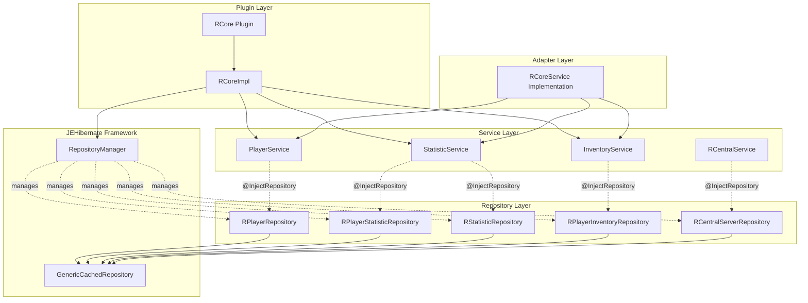
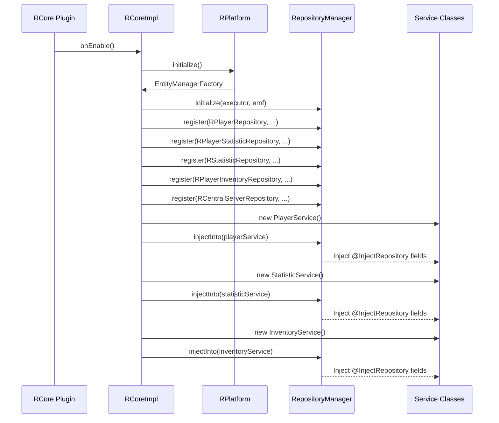
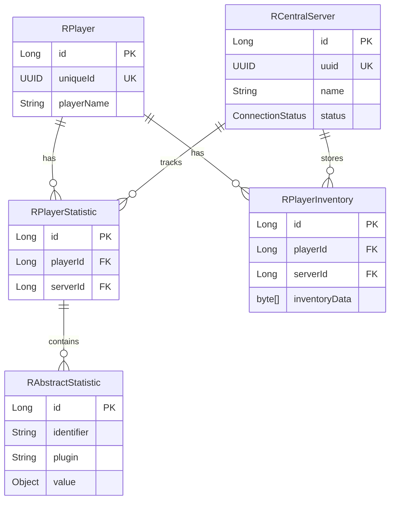

# Design Document

## Overview

This design document outlines the refactoring of RCore to leverage JEHibernate's dependency injection system for repositories and services. The refactoring will transform the current manual repository management approach into a clean, annotation-based dependency injection pattern that reduces code verbosity and improves maintainability.

### Current State

Currently, RCore manually manages repository instances in `RCoreImpl`:
- Repositories are stored as instance fields in `RCoreImpl`
- Manual instantiation occurs in `initializeRepositories()`
- Repositories are exposed through getter methods
- Service implementations receive repositories through constructor parameters or method calls
- The `RCoreService` adapter directly accesses repositories from `RCoreImpl`

### Target State

After refactoring:
- Repositories are registered once with `RepositoryManager` during initialization
- Service classes use `@InjectRepository` annotations for automatic dependency injection
- `RCoreImpl` no longer stores or exposes repository instances
- The `RCoreService` adapter delegates to service classes instead of accessing repositories directly
- Code is significantly more concise and follows modern dependency injection patterns

## Architecture

### Component Diagram



### Initialization Sequence



## Components and Interfaces

### 1. Service Classes

#### PlayerService

Handles all player-related operations including CRUD operations and player lookups.

**Responsibilities:**
- Find players by UUID or username
- Create new player records
- Update existing player records
- Check player existence

**Dependencies:**
- `RPlayerRepository` (injected via `@InjectRepository`)

**Key Methods:**
```java
CompletableFuture<Optional<RPlayer>> findByUuidAsync(UUID uniqueId)
CompletableFuture<Optional<RPlayer>> findByNameAsync(String playerName)
CompletableFuture<Boolean> existsByUuidAsync(UUID uniqueId)
CompletableFuture<RPlayer> createAsync(RPlayer player)
CompletableFuture<RPlayer> updateAsync(RPlayer player)
CompletableFuture<RPlayer> createOrUpdateAsync(RPlayer player)
```

#### StatisticService

Manages player statistics including CRUD operations, bulk operations, and statistic queries.

**Responsibilities:**
- Find player statistics by player UUID
- Add or replace individual statistics
- Remove statistics
- Count statistics by plugin
- Retrieve specific statistic values
- Manage statistic lifecycle

**Dependencies:**
- `RPlayerStatisticRepository` (injected via `@InjectRepository`)
- `RStatisticRepository` (injected via `@InjectRepository`)
- `RPlayerRepository` (injected via `@InjectRepository`)

**Key Methods:**
```java
CompletableFuture<Optional<RPlayerStatistic>> findByPlayerAsync(UUID uniqueId)
CompletableFuture<Optional<Object>> findStatisticValueAsync(UUID uniqueId, String identifier, String plugin)
CompletableFuture<Boolean> hasStatisticAsync(UUID uniqueId, String identifier, String plugin)
CompletableFuture<Boolean> addOrReplaceStatisticAsync(UUID uniqueId, RAbstractStatistic statistic)
CompletableFuture<Boolean> removeStatisticAsync(UUID uniqueId, String identifier, String plugin)
CompletableFuture<Long> getStatisticCountForPluginAsync(UUID uniqueId, String plugin)
```

#### InventoryService

Handles player inventory persistence and retrieval operations.

**Responsibilities:**
- Find inventories by player and server
- Find latest inventory snapshot
- Save inventory snapshots
- Delete inventory data
- Manage cross-server inventory synchronization

**Dependencies:**
- `RPlayerInventoryRepository` (injected via `@InjectRepository`)
- `RPlayerRepository` (injected via `@InjectRepository`)
- `RCentralServerRepository` (injected via `@InjectRepository`)

**Key Methods:**
```java
CompletableFuture<List<RPlayerInventory>> findByPlayerAndServerAsync(RPlayer player, RCentralServer server)
CompletableFuture<RPlayerInventory> findLatestByPlayerAndServerAsync(RPlayer player, RCentralServer server)
CompletableFuture<RPlayerInventory> saveInventoryAsync(RPlayerInventory inventory)
CompletableFuture<Void> deleteByPlayerAndServerAsync(RPlayer player, RCentralServer server)
```

### 2. RCoreImpl Refactoring

**Current Structure:**
```java
public class RCoreImpl {
    private RPlayerRepository rPlayerRepository;
    private RPlayerStatisticRepository rPlayerStatisticRepository;
    private RStatisticRepository rStatisticRepository;
    
    private void initializeRepositories() {
        // Manual instantiation
        this.rPlayerRepository = new RPlayerRepository(...);
        // ...
    }
    
    public RPlayerRepository getRPlayerRepository() {
        return rPlayerRepository;
    }
}
```

**Refactored Structure:**
```java
public class RCoreImpl {
    private PlayerService playerService;
    private StatisticService statisticService;
    private InventoryService inventoryService;
    
    private void initializeRepositories() {
        RepositoryManager.initialize(executor, emf);
        RepositoryManager manager = RepositoryManager.getInstance();
        
        // Register all repositories
        manager.register(RPlayerRepository.class, RPlayer.class, RPlayer::getUniqueId);
        manager.register(RPlayerStatisticRepository.class, RPlayerStatistic.class, RPlayerStatistic::getId);
        // ...
    }
    
    private void initializeServices() {
        this.playerService = new PlayerService();
        RepositoryManager.getInstance().injectInto(playerService);
        
        this.statisticService = new StatisticService();
        RepositoryManager.getInstance().injectInto(statisticService);
        
        this.inventoryService = new InventoryService();
        RepositoryManager.getInstance().injectInto(inventoryService);
    }
    
    public PlayerService getPlayerService() {
        return playerService;
    }
}
```

### 3. RCoreService Adapter Refactoring

**Current Pattern:**
```java
public CompletableFuture<Optional<RPlayer>> findPlayerAsync(UUID uniqueId) {
    return backend.findByUuidAsync(uniqueId);
}
```

**Refactored Pattern:**
```java
public CompletableFuture<Optional<RPlayer>> findPlayerAsync(UUID uniqueId) {
    return playerService.findByUuidAsync(uniqueId);
}
```

The adapter will hold references to service instances instead of accessing repositories through the backend.

### 4. Repository Registration Configuration

All repositories will be registered with appropriate cache keys:

| Repository | Entity | Cache Key | Key Extractor |
|------------|--------|-----------|---------------|
| RPlayerRepository | RPlayer | UUID | `RPlayer::getUniqueId` |
| RPlayerStatisticRepository | RPlayerStatistic | Long | `RPlayerStatistic::getId` |
| RStatisticRepository | RAbstractStatistic | Long | `RAbstractStatistic::getId` |
| RPlayerInventoryRepository | RPlayerInventory | Long | `RPlayerInventory::getId` |
| RCentralServerRepository | RCentralServer | Long | `RCentralServer::getId` |

## Data Models

No changes to existing entity models are required. The refactoring focuses on how repositories and services interact with these models.

### Entity Relationships



## Error Handling

### Initialization Errors

**Scenario:** RepositoryManager initialization fails
- **Detection:** `EntityManagerFactory` is null or initialization throws exception
- **Response:** Log error, disable plugin gracefully
- **Recovery:** None - requires server restart after fixing configuration

**Scenario:** Repository registration fails
- **Detection:** `RepositoryManager.register()` throws exception
- **Response:** Log error with repository class name, disable plugin
- **Recovery:** None - indicates programming error

**Scenario:** Service injection fails
- **Detection:** `injectInto()` throws `IllegalStateException`
- **Response:** Log error with service class name and missing repository, disable plugin
- **Recovery:** None - indicates missing repository registration

### Runtime Errors

**Scenario:** Repository operation fails
- **Detection:** `CompletableFuture` completes exceptionally
- **Response:** Service method propagates exception to caller
- **Recovery:** Caller handles via `exceptionally()` or `handle()` methods

**Scenario:** Null repository after injection
- **Detection:** Service method accesses null repository field
- **Response:** `NullPointerException` thrown
- **Recovery:** None - indicates injection failure during initialization

### Error Handling Pattern

All service methods follow this pattern:

```java
public CompletableFuture<Optional<RPlayer>> findByUuidAsync(UUID uniqueId) {
    Objects.requireNonNull(uniqueId, "uniqueId cannot be null");
    
    return rPlayerRepository.findByUuidAsync(uniqueId)
        .exceptionally(throwable -> {
            LOGGER.log(Level.SEVERE, "Failed to find player by UUID: " + uniqueId, throwable);
            return Optional.empty();
        });
}
```

## Testing Strategy

### Unit Testing

**PlayerService Tests:**
- Test each method with mocked `RPlayerRepository`
- Verify correct repository method calls
- Test null parameter handling
- Test exceptional completion handling

**StatisticService Tests:**
- Test with mocked repositories
- Verify multi-repository coordination
- Test statistic CRUD operations
- Test bulk operations

**InventoryService Tests:**
- Test with mocked repositories
- Verify inventory persistence
- Test cross-server operations

### Integration Testing

**Repository Injection Tests:**
- Verify `@InjectRepository` annotation works correctly
- Test injection with multiple repositories
- Test injection failure scenarios

**Service Integration Tests:**
- Test services with real repository instances
- Verify database operations complete successfully
- Test transaction boundaries

**End-to-End Tests:**
- Test complete flow from RCoreService adapter through services to repositories
- Verify asynchronous execution on correct executor
- Test error propagation through layers

### Testing Approach

1. **Phase 1:** Unit test each service class in isolation
2. **Phase 2:** Integration test repository injection mechanism
3. **Phase 3:** End-to-end test complete request flows
4. **Phase 4:** Performance test to ensure no regression

### Test Coverage Goals

- Service classes: 90% line coverage
- Repository registration: 100% coverage
- Error handling paths: 80% coverage
- Integration scenarios: Key workflows covered

## Migration Strategy

### Phase 1: Create Service Classes

1. Create `PlayerService` with `@InjectRepository` annotation
2. Create `StatisticService` with multiple `@InjectRepository` annotations
3. Create `InventoryService` with `@InjectRepository` annotations
4. Implement all service methods delegating to repositories

### Phase 2: Update RCoreImpl

1. Add service instance fields to `RCoreImpl`
2. Create `initializeServices()` method
3. Update `initializeRepositories()` to use `RepositoryManager.register()`
4. Remove repository instance fields
5. Remove repository getter methods
6. Add service getter methods

### Phase 3: Refactor RCoreService Adapter

1. Update adapter implementation to hold service references
2. Refactor each adapter method to delegate to appropriate service
3. Remove direct repository access
4. Update constructor to accept service instances

### Phase 4: Update RCentralService

1. Add `@InjectRepository` annotation for `RCentralServerRepository`
2. Update `RCoreImpl` to inject into `RCentralService`
3. Remove manual repository passing

### Phase 5: Update Commands and Listeners

1. Identify commands/listeners that need service access
2. Update to receive services through constructor injection
3. Remove direct repository access patterns

### Rollback Plan

If issues arise during migration:
1. Revert to previous commit
2. Service classes can coexist with old pattern temporarily
3. Gradual migration possible - old and new patterns can run side-by-side

## Performance Considerations

### Memory Impact

- **Reduction:** Removing repository fields from `RCoreImpl` reduces memory footprint
- **Addition:** Service instances add minimal overhead (3 additional objects)
- **Net Impact:** Negligible - approximately same memory usage

### Execution Performance

- **No Change:** Repository operations execute identically
- **Injection Overhead:** One-time cost during initialization only
- **Method Call Overhead:** Additional service layer adds one method call per operation (negligible)

### Caching Behavior

- **No Change:** Repository caching behavior remains identical
- **Cache Keys:** Same cache key extractors used
- **Cache Hit Rates:** Expected to remain the same

## Security Considerations

### Access Control

- Service classes are package-private by default
- Only expose through public API (`RCoreService`)
- Repository access restricted to service layer

### Dependency Injection Security

- `@InjectRepository` only works with registered repositories
- No reflection-based instantiation of arbitrary classes
- Type-safe injection prevents class confusion attacks

### Data Validation

- Services maintain same null-checking as current implementation
- `@NotNull` annotations preserved
- Input validation occurs at service boundary

## Documentation Updates

### JavaDoc Updates

- Add comprehensive JavaDoc to all service classes
- Document `@InjectRepository` usage patterns
- Update `RCoreImpl` JavaDoc to reflect new architecture
- Document initialization sequence

### Usage Examples

Create `REPOSITORY_INJECTION_USAGE.md` with:
- How to create new service classes
- How to inject repositories
- How to register new repositories
- Common patterns and anti-patterns
- Troubleshooting guide

### Architecture Documentation

Update existing architecture docs to reflect:
- New service layer
- Dependency injection pattern
- Initialization sequence
- Component relationships

## Benefits Summary

### Code Quality

- **Reduced Verbosity:** Eliminate repository boilerplate in `RCoreImpl`
- **Better Separation:** Clear service layer boundary
- **Improved Testability:** Services easily mocked for testing
- **Consistent Patterns:** Standard dependency injection throughout

### Maintainability

- **Easier to Extend:** Add new services without modifying `RCoreImpl`
- **Clear Dependencies:** `@InjectRepository` makes dependencies explicit
- **Reduced Coupling:** Services don't depend on `RCoreImpl`
- **Better Organization:** Business logic grouped by domain

### Development Velocity

- **Faster Feature Development:** Less boilerplate to write
- **Easier Refactoring:** Services can be refactored independently
- **Better IDE Support:** Annotations enable better code completion
- **Reduced Bugs:** Less manual wiring reduces human error
