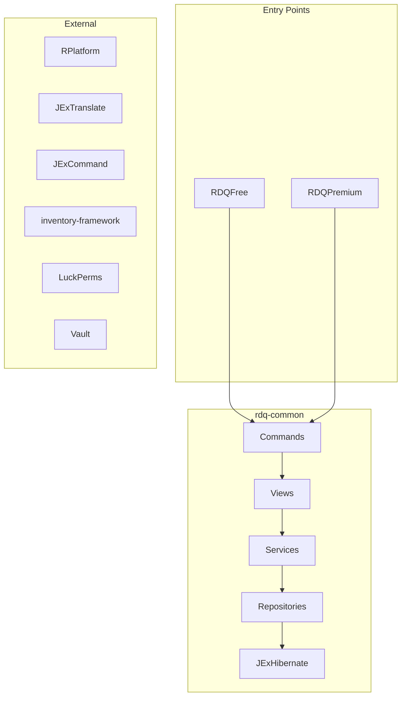
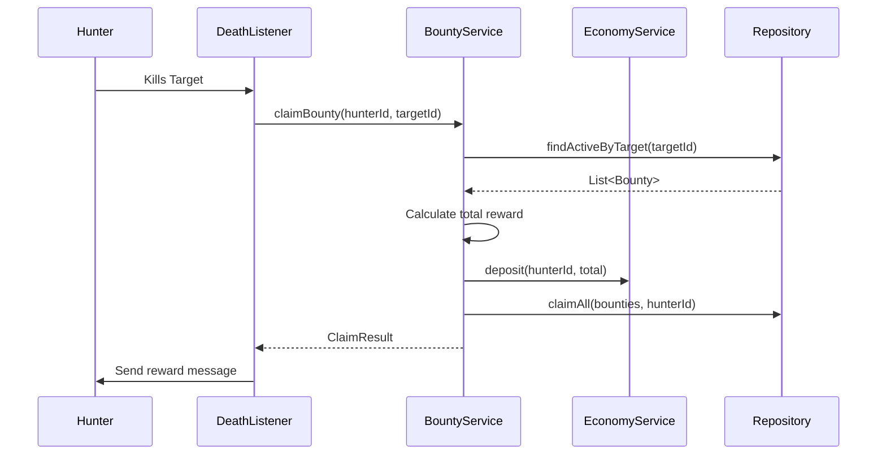
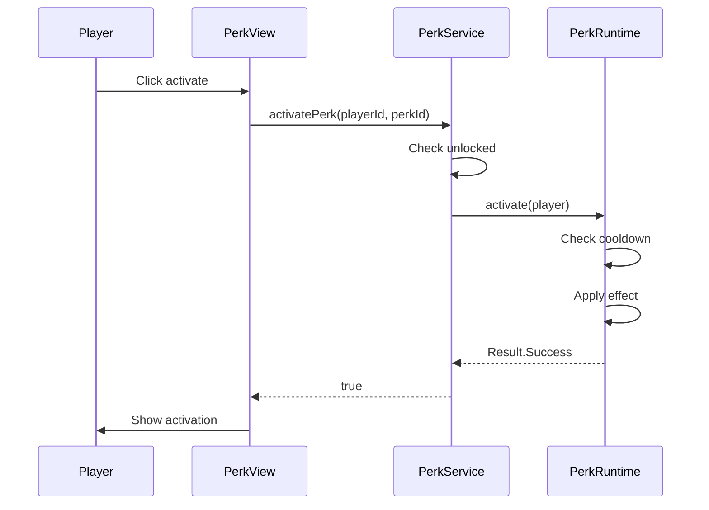

# Design Document: RDQ Rebuild

## Overview

Complete rebuild of RDQ using modern Java 21+ practices. No verbose boilerplate, no unnecessary abstractions, no legacy patterns. Records for data, sealed interfaces for type safety, var everywhere, pattern matching for control flow.

## Architecture



## Components and Interfaces

### Module Structure

```
RDQ/
├── build.gradle.kts
├── gradle/libs.versions.toml
├── rdq-common/
│   └── src/main/java/com/raindropcentral/rdq/
│       ├── RDQCore.java
│       ├── rank/
│       ├── bounty/
│       ├── perk/
│       ├── player/
│       └── shared/
├── rdq-free/
│   └── src/main/java/com/raindropcentral/rdq/
│       └── RDQFree.java
└── rdq-premium/
    └── src/main/java/com/raindropcentral/rdq/
        └── RDQPremium.java
```

### Core Interfaces - Modern Java Style

```java
public sealed interface RankService permits FreeRankService, PremiumRankService {
    CompletableFuture<Optional<PlayerRankData>> getPlayerRanks(UUID playerId);
    CompletableFuture<Boolean> unlockRank(UUID playerId, String rankId);
    CompletableFuture<Boolean> checkRequirements(UUID playerId, String rankId);
    CompletableFuture<List<RankTree>> getAvailableRankTrees();
}

public sealed interface BountyService permits FreeBountyService, PremiumBountyService {
    CompletableFuture<Bounty> createBounty(BountyRequest request);
    CompletableFuture<ClaimResult> claimBounty(UUID hunterId, UUID targetId);
    CompletableFuture<List<Bounty>> getActiveBounties();
    CompletableFuture<List<HunterStats>> getLeaderboard(int limit);
}

public sealed interface PerkService permits FreePerkService, PremiumPerkService {
    CompletableFuture<List<Perk>> getAvailablePerks(UUID playerId);
    CompletableFuture<Boolean> activatePerk(UUID playerId, String perkId);
    CompletableFuture<Boolean> deactivatePerk(UUID playerId, String perkId);
    CompletableFuture<Optional<Duration>> getCooldownRemaining(UUID playerId, String perkId);
}
```

### Service Results - Sealed Types

```java
public sealed interface Result<T> {
    record Success<T>(T value) implements Result<T> {}
    record Failure<T>(String errorKey, Map<String, Object> placeholders) implements Result<T> {}
    
    default T getOrThrow() {
        return switch (this) {
            case Success<T>(var v) -> v;
            case Failure<T>(var key, var ph) -> throw new RDQException(key, ph);
        };
    }
    
    default <R> Result<R> map(Function<T, R> mapper) {
        return switch (this) {
            case Success<T>(var v) -> new Success<>(mapper.apply(v));
            case Failure<T> f -> new Failure<>(f.errorKey(), f.placeholders());
        };
    }
}
```

## Data Models

### Entity Records - Zero Boilerplate

```java
@Entity
@Table(name = "rdq_players")
public record RDQPlayer(
    @Id UUID id,
    String name,
    Instant firstJoin,
    Instant lastSeen,
    @OneToMany(mappedBy = "player", cascade = CascadeType.ALL) List<PlayerRankPath> rankPaths,
    @OneToMany(mappedBy = "player", cascade = CascadeType.ALL) List<PlayerPerk> perks
) {
    public RDQPlayer {
        rankPaths = rankPaths != null ? rankPaths : new ArrayList<>();
        perks = perks != null ? perks : new ArrayList<>();
    }
    
    public static RDQPlayer create(UUID id, String name) {
        return new RDQPlayer(id, name, Instant.now(), Instant.now(), new ArrayList<>(), new ArrayList<>());
    }
}

@Entity
@Table(name = "rdq_bounties")
public record Bounty(
    @Id @GeneratedValue(strategy = GenerationType.IDENTITY) Long id,
    @ManyToOne @JoinColumn(name = "placer_id") RDQPlayer placer,
    @ManyToOne @JoinColumn(name = "target_id") RDQPlayer target,
    BigDecimal amount,
    @Enumerated(EnumType.STRING) BountyStatus status,
    Instant createdAt,
    Instant expiresAt,
    @ManyToOne @JoinColumn(name = "claimed_by") RDQPlayer claimedBy,
    Instant claimedAt
) {
    public boolean isExpired() {
        return expiresAt != null && Instant.now().isAfter(expiresAt);
    }
    
    public boolean isActive() {
        return status == BountyStatus.ACTIVE && !isExpired();
    }
}

public record BountyRequest(UUID placerId, UUID targetId, BigDecimal amount, String currency) {
    public BountyRequest {
        Objects.requireNonNull(placerId);
        Objects.requireNonNull(targetId);
        if (amount.compareTo(BigDecimal.ZERO) <= 0) throw new IllegalArgumentException("Amount must be positive");
        if (placerId.equals(targetId)) throw new SelfTargetingException();
    }
}

public record ClaimResult(Bounty bounty, BigDecimal reward, DistributionMode mode) {}

public record HunterStats(
    UUID playerId,
    String playerName,
    int bountiesPlaced,
    int bountiesClaimed,
    int deaths,
    BigDecimal totalEarned,
    BigDecimal totalSpent
) {
    public double getKDRatio() {
        return deaths == 0 ? bountiesClaimed : (double) bountiesClaimed / deaths;
    }
}
```

### Rank System Records

```java
public record RankTree(
    String id,
    String displayNameKey,
    String descriptionKey,
    String iconMaterial,
    int displayOrder,
    boolean enabled,
    List<Rank> ranks
) {}

public record Rank(
    String id,
    String treeId,
    String displayNameKey,
    int tier,
    int weight,
    String luckPermsGroup,
    String prefixKey,
    String iconMaterial,
    boolean enabled,
    List<RankRequirement> requirements
) {}

public sealed interface RankRequirement {
    record StatisticRequirement(String statisticType, int amount) implements RankRequirement {}
    record PermissionRequirement(String permission) implements RankRequirement {}
    record RankRequirement(String requiredRankId) implements RankRequirement {}
    record CurrencyRequirement(String currency, BigDecimal amount) implements RankRequirement {}
    record ItemRequirement(String material, int amount) implements RankRequirement {}
}

public record PlayerRankData(
    UUID playerId,
    List<ActivePath> activePaths,
    Map<String, Instant> unlockedRanks
) {
    public record ActivePath(String treeId, String currentRankId, Instant startedAt) {}
}
```

### Perk System Records

```java
public record Perk(
    String id,
    String displayNameKey,
    PerkType type,
    String category,
    int cooldownSeconds,
    int durationSeconds,
    boolean enabled,
    PerkEffect effect,
    List<PerkRequirement> requirements
) {}

public sealed interface PerkType {
    record Toggleable() implements PerkType {}
    record EventBased(String eventType) implements PerkType {}
    record Passive() implements PerkType {}
}

public sealed interface PerkEffect {
    record PotionEffect(String potionType, int amplifier) implements PerkEffect {}
    record AttributeModifier(String attribute, double value, String operation) implements PerkEffect {}
    record Flight(boolean allowInCombat) implements PerkEffect {}
    record ExperienceMultiplier(double multiplier) implements PerkEffect {}
    record DeathPrevention(int healthOnSave) implements PerkEffect {}
    record Custom(String handler, Map<String, Object> config) implements PerkEffect {}
}

public sealed interface PerkRequirement {
    record RankRequired(String rankId) implements PerkRequirement {}
    record PermissionRequired(String permission) implements PerkRequirement {}
    record CurrencyRequired(String currency, BigDecimal amount) implements PerkRequirement {}
    record LevelRequired(int level) implements PerkRequirement {}
}

public record PlayerPerkState(
    UUID playerId,
    String perkId,
    boolean unlocked,
    boolean active,
    Instant cooldownExpiry
) {
    public boolean isOnCooldown() {
        return cooldownExpiry != null && Instant.now().isBefore(cooldownExpiry);
    }
    
    public Optional<Duration> remainingCooldown() {
        if (!isOnCooldown()) return Optional.empty();
        return Optional.of(Duration.between(Instant.now(), cooldownExpiry));
    }
}
```

## Error Handling - Pattern Matching

```java
public sealed interface RDQError {
    record NotFound(String type, String id) implements RDQError {}
    record InsufficientFunds(BigDecimal required, BigDecimal available) implements RDQError {}
    record OnCooldown(Duration remaining) implements RDQError {}
    record RequirementsNotMet(List<String> missing) implements RDQError {}
    record SelfTargeting() implements RDQError {}
    record AlreadyExists(String type, String id) implements RDQError {}
    record Expired(String type, String id) implements RDQError {}
    record NotUnlocked(String type, String id) implements RDQError {}
}

public class ErrorHandler {
    public void sendError(Player player, RDQError error, TranslationService translations) {
        var message = switch (error) {
            case RDQError.NotFound(var type, var id) -> 
                translations.get("error.not_found", Map.of("type", type, "id", id));
            case RDQError.InsufficientFunds(var req, var avail) -> 
                translations.get("error.insufficient_funds", Map.of("required", req, "available", avail));
            case RDQError.OnCooldown(var remaining) -> 
                translations.get("error.on_cooldown", Map.of("remaining", formatDuration(remaining)));
            case RDQError.RequirementsNotMet(var missing) -> 
                translations.get("error.requirements_not_met", Map.of("missing", String.join(", ", missing)));
            case RDQError.SelfTargeting() -> 
                translations.get("error.self_targeting");
            case RDQError.AlreadyExists(var type, var id) -> 
                translations.get("error.already_exists", Map.of("type", type, "id", id));
            case RDQError.Expired(var type, var id) -> 
                translations.get("error.expired", Map.of("type", type, "id", id));
            case RDQError.NotUnlocked(var type, var id) -> 
                translations.get("error.not_unlocked", Map.of("type", type, "id", id));
        };
        player.sendMessage(message);
    }
}
```

## Service Implementations - Concise

```java
public final class DefaultBountyService implements BountyService {
    private final BountyRepository repo;
    private final PlayerService players;
    private final EconomyService economy;
    private final Cache<UUID, List<Bounty>> cache;
    
    public DefaultBountyService(BountyRepository repo, PlayerService players, EconomyService economy) {
        this.repo = repo;
        this.players = players;
        this.economy = economy;
        this.cache = Caffeine.newBuilder()
            .maximumSize(500)
            .expireAfterWrite(Duration.ofMinutes(5))
            .build();
    }
    
    @Override
    public CompletableFuture<Bounty> createBounty(BountyRequest request) {
        return economy.withdraw(request.placerId(), request.amount())
            .thenCompose(success -> {
                if (!success) return CompletableFuture.failedFuture(
                    new RDQException(new RDQError.InsufficientFunds(request.amount(), BigDecimal.ZERO))
                );
                
                var bounty = new Bounty(
                    null,
                    players.getPlayer(request.placerId()).join(),
                    players.getPlayer(request.targetId()).join(),
                    request.amount(),
                    BountyStatus.ACTIVE,
                    Instant.now(),
                    Instant.now().plus(Duration.ofDays(7)),
                    null,
                    null
                );
                
                cache.invalidate(request.targetId());
                return repo.save(bounty);
            });
    }
    
    @Override
    public CompletableFuture<ClaimResult> claimBounty(UUID hunterId, UUID targetId) {
        return repo.findActiveByTarget(targetId)
            .thenCompose(bounties -> {
                var total = bounties.stream()
                    .map(Bounty::amount)
                    .reduce(BigDecimal.ZERO, BigDecimal::add);
                
                return economy.deposit(hunterId, total)
                    .thenCompose(v -> repo.claimAll(bounties, hunterId))
                    .thenApply(claimed -> new ClaimResult(claimed.getFirst(), total, DistributionMode.INSTANT));
            });
    }
    
    @Override
    public CompletableFuture<List<Bounty>> getActiveBounties() {
        return repo.findAllActive();
    }
    
    @Override
    public CompletableFuture<List<HunterStats>> getLeaderboard(int limit) {
        return repo.getTopHunters(limit);
    }
}
```

### Perk Runtime - Clean Implementation

```java
public final class PerkRuntime {
    private final Perk perk;
    private final Map<UUID, Instant> cooldowns = new ConcurrentHashMap<>();
    private final Set<UUID> activeUsers = ConcurrentHashMap.newKeySet();
    
    public PerkRuntime(Perk perk) {
        this.perk = perk;
    }
    
    public Result<Void> activate(Player player) {
        var playerId = player.getUniqueId();
        
        if (isOnCooldown(playerId)) {
            return new Result.Failure<>("perk.on_cooldown", Map.of(
                "remaining", formatDuration(getRemainingCooldown(playerId).orElseThrow())
            ));
        }
        
        activeUsers.add(playerId);
        applyEffect(player);
        
        if (perk.durationSeconds() > 0) {
            scheduleDeactivation(player, Duration.ofSeconds(perk.durationSeconds()));
        }
        
        return new Result.Success<>(null);
    }
    
    public void deactivate(Player player) {
        var playerId = player.getUniqueId();
        if (activeUsers.remove(playerId)) {
            removeEffect(player);
            cooldowns.put(playerId, Instant.now().plusSeconds(perk.cooldownSeconds()));
        }
    }
    
    private void applyEffect(Player player) {
        switch (perk.effect()) {
            case PerkEffect.PotionEffect(var type, var amp) -> 
                player.addPotionEffect(new org.bukkit.potion.PotionEffect(
                    PotionEffectType.getByName(type), 
                    perk.durationSeconds() * 20, 
                    amp
                ));
            case PerkEffect.Flight(var allowCombat) -> 
                player.setAllowFlight(true);
            case PerkEffect.AttributeModifier(var attr, var val, var op) -> 
                applyAttribute(player, attr, val, op);
            case PerkEffect.ExperienceMultiplier m -> {} // Handled via event listener
            case PerkEffect.DeathPrevention d -> {} // Handled via event listener
            case PerkEffect.Custom(var handler, var config) -> 
                CustomPerkHandlers.get(handler).apply(player, config);
        }
    }
    
    private boolean isOnCooldown(UUID playerId) {
        var expiry = cooldowns.get(playerId);
        return expiry != null && Instant.now().isBefore(expiry);
    }
    
    private Optional<Duration> getRemainingCooldown(UUID playerId) {
        var expiry = cooldowns.get(playerId);
        if (expiry == null || Instant.now().isAfter(expiry)) return Optional.empty();
        return Optional.of(Duration.between(Instant.now(), expiry));
    }
    
    public void cleanup(UUID playerId) {
        activeUsers.remove(playerId);
        cooldowns.remove(playerId);
    }
}
```

## Testing Strategy

### Test Structure

```
rdq-common/src/test/java/com/raindropcentral/rdq/
├── bounty/BountyServiceTest.java
├── rank/RankServiceTest.java
├── perk/PerkRuntimeTest.java
└── fixtures/TestData.java
```

### Example Tests - Modern Style

```java
@ExtendWith(MockitoExtension.class)
class BountyServiceTest {
    @Mock BountyRepository repo;
    @Mock PlayerService players;
    @Mock EconomyService economy;
    @InjectMocks DefaultBountyService service;
    
    @Test
    void createBounty_validRequest_withdrawsAndSaves() {
        var placer = TestData.player("Hunter");
        var target = TestData.player("Target");
        var request = new BountyRequest(placer.id(), target.id(), BigDecimal.valueOf(1000), "coins");
        
        when(economy.withdraw(placer.id(), request.amount())).thenReturn(completedFuture(true));
        when(players.getPlayer(placer.id())).thenReturn(completedFuture(placer));
        when(players.getPlayer(target.id())).thenReturn(completedFuture(target));
        when(repo.save(any())).thenAnswer(inv -> completedFuture(inv.getArgument(0)));
        
        var result = service.createBounty(request).join();
        
        assertThat(result.amount()).isEqualTo(BigDecimal.valueOf(1000));
        assertThat(result.status()).isEqualTo(BountyStatus.ACTIVE);
        verify(economy).withdraw(placer.id(), request.amount());
    }
    
    @Test
    void createBounty_selfTarget_throwsImmediately() {
        var player = TestData.player("Player");
        
        assertThatThrownBy(() -> new BountyRequest(player.id(), player.id(), BigDecimal.TEN, "coins"))
            .isInstanceOf(SelfTargetingException.class);
    }
    
    @Test
    void createBounty_insufficientFunds_fails() {
        var request = new BountyRequest(UUID.randomUUID(), UUID.randomUUID(), BigDecimal.valueOf(1000), "coins");
        
        when(economy.withdraw(any(), any())).thenReturn(completedFuture(false));
        
        assertThatThrownBy(() -> service.createBounty(request).join())
            .hasCauseInstanceOf(RDQException.class);
    }
}

class TestData {
    static RDQPlayer player(String name) {
        return RDQPlayer.create(UUID.randomUUID(), name);
    }
    
    static Bounty activeBounty(RDQPlayer placer, RDQPlayer target, BigDecimal amount) {
        return new Bounty(1L, placer, target, amount, BountyStatus.ACTIVE, 
            Instant.now(), Instant.now().plus(Duration.ofDays(7)), null, null);
    }
}
```

## Configuration - YAML Examples

### bounty.yml

```yaml
enabled: true
minAmount: 100
maxAmount: 1000000
expirationHours: 168
selfTargetAllowed: false
distribution: INSTANT
announceOnCreate: true
announceOnClaim: true
```

### rank-system.yml

```yaml
enabled: true
linearProgression: true
allowSkipping: false
maxActiveTrees: 1
crossTreeSwitching: false
switchingCooldownSeconds: 1728000
```

### perks/speed.yml

```yaml
id: speed
type: TOGGLEABLE
displayNameKey: perk.speed.name
iconMaterial: SUGAR
cooldownSeconds: 300
durationSeconds: 60
effect:
  type: POTION_EFFECT
  potionType: SPEED
  amplifier: 1
requirements:
  - type: RANK
    value: warrior_3
```

## Sequence Diagrams

### Bounty Claim Flow



### Perk Activation Flow



## Performance

### Caching

```java
public class CacheManager {
    private final Cache<UUID, RDQPlayer> players = Caffeine.newBuilder()
        .maximumSize(1000)
        .expireAfterAccess(Duration.ofMinutes(30))
        .build();
    
    private final Cache<String, Rank> ranks = Caffeine.newBuilder()
        .maximumSize(500)
        .expireAfterWrite(Duration.ofHours(1))
        .build();
    
    private final Cache<UUID, List<Bounty>> bounties = Caffeine.newBuilder()
        .maximumSize(500)
        .expireAfterWrite(Duration.ofMinutes(5))
        .build();
}
```

### Async Execution

```java
public class AsyncExecutor {
    private final ExecutorService executor = createExecutor();
    
    private static ExecutorService createExecutor() {
        try {
            return Executors.newVirtualThreadPerTaskExecutor();
        } catch (Throwable ignored) {
            return Executors.newFixedThreadPool(Runtime.getRuntime().availableProcessors());
        }
    }
    
    public <T> CompletableFuture<T> async(Supplier<T> task) {
        return CompletableFuture.supplyAsync(task, executor);
    }
}
```

## Key Design Decisions

1. **Records everywhere** - All DTOs, value objects, and simple entities use records
2. **Sealed interfaces** - Type-safe hierarchies for services, errors, requirements, effects
3. **Pattern matching** - Switch expressions with record patterns for clean control flow
4. **var inference** - Local variable type inference where types are obvious
5. **CompletableFuture** - All service methods return futures for async operations
6. **Caffeine caching** - High-performance caching with automatic eviction
7. **Virtual threads** - Java 21 virtual threads with fallback to thread pools
8. **No migration** - Fresh start, old RDQ renamed to RDQ2 for reference only
9. **JExHibernate** - Leveraging existing database abstraction
10. **Minimal abstractions** - No unnecessary factories, builders, or managers
