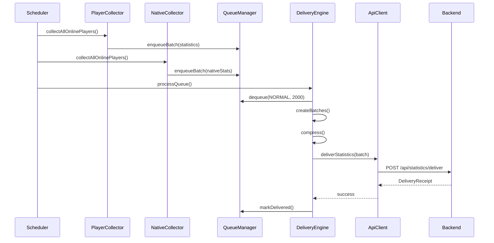
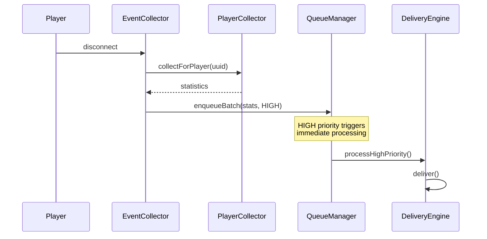
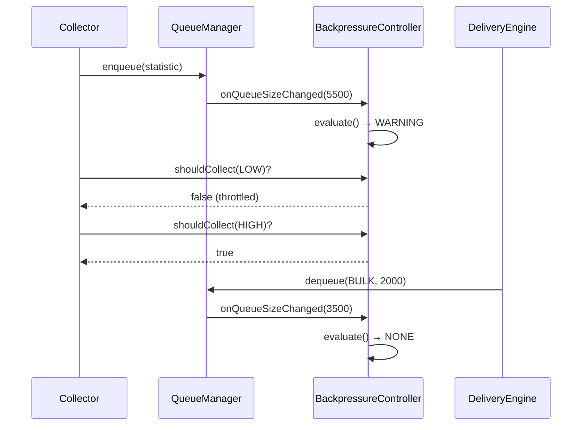

# Design Document: Enterprise Statistics Delivery System

## Overview

This design implements a high-throughput, enterprise-grade statistics delivery pipeline for transmitting player statistics, Minecraft native statistics, and server metrics from Minecraft servers to the RaindropCentral backend. The system is architected to handle 10,000+ statistics per server with multi-tier priority queuing, intelligent batching, compression, offline resilience, and cross-server synchronization.

The design integrates with the existing `RCentralApiClient` and `RCentralService` infrastructure while introducing new components for collection, queuing, batching, and delivery orchestration.

## Architecture

```
┌─────────────────────────────────────────────────────────────────────────────────┐
│                           Statistics Delivery System                             │
├─────────────────────────────────────────────────────────────────────────────────┤
│                                                                                  │
│  ┌──────────────────┐    ┌──────────────────┐    ┌──────────────────┐          │
│  │   Collectors     │    │   Queue Manager  │    │ Delivery Engine  │          │
│  ├──────────────────┤    ├──────────────────┤    ├──────────────────┤          │
│  │ PlayerStatistic  │───▶│ PriorityQueue    │───▶│ BatchProcessor   │          │
│  │ Collector        │    │ (5 tiers)        │    │                  │          │
│  ├──────────────────┤    ├──────────────────┤    ├──────────────────┤          │
│  │ NativeStatistic  │───▶│ Backpressure     │───▶│ Compressor       │          │
│  │ Collector        │    │ Controller       │    │                  │          │
│  ├──────────────────┤    ├──────────────────┤    ├──────────────────┤          │
│  │ ServerMetrics    │───▶│ Persistence      │───▶│ RateLimiter      │          │
│  │ Collector        │    │ Manager          │    │                  │          │
│  ├──────────────────┤    └──────────────────┘    ├──────────────────┤          │
│  │ EventDriven      │                            │ RetryHandler     │          │
│  │ Collector        │                            │                  │          │
│  └──────────────────┘                            └────────┬─────────┘          │
│                                                           │                     │
│  ┌──────────────────┐    ┌──────────────────┐            │                     │
│  │ Aggregation      │    │ Sync Manager     │            ▼                     │
│  │ Engine           │    │ (Cross-Server)   │    ┌──────────────────┐          │
│  └──────────────────┘    └──────────────────┘    │ RCentralApiClient│          │
│                                                   │ (Extended)       │          │
│                                                   └────────┬─────────┘          │
│                                                            │                    │
└────────────────────────────────────────────────────────────┼────────────────────┘
                                                             │
                                                             ▼
                                                   ┌──────────────────┐
                                                   │ RaindropCentral  │
                                                   │ Backend API      │
                                                   └──────────────────┘
```

## Components and Interfaces

### 1. StatisticsDeliveryService (Main Orchestrator)

The central service coordinating all statistics delivery operations.

```java
package com.raindropcentral.core.service.statistics;

public class StatisticsDeliveryService {
    
    private final Plugin plugin;
    private final StatisticsQueueManager queueManager;
    private final StatisticsDeliveryEngine deliveryEngine;
    private final PlayerStatisticCollector playerCollector;
    private final NativeStatisticCollector nativeCollector;
    private final ServerMetricsCollector serverCollector;
    private final EventDrivenCollector eventCollector;
    private final StatisticsAggregator aggregator;
    private final CrossServerSyncManager syncManager;
    private final StatisticsDeliveryConfig config;
    
    // Lifecycle
    void initialize();
    void shutdown();
    
    // Manual controls
    CompletableFuture<DeliveryResult> flushQueue();
    CompletableFuture<DeliveryResult> deliverPlayerStatistics(UUID playerUuid);
    void pauseDelivery();
    void resumeDelivery();
    
    // Status
    DeliveryStatus getStatus();
    QueueStatistics getQueueStatistics();
    DeliveryMetrics getDeliveryMetrics();
}
```

### 2. StatisticsQueueManager

Multi-tier priority queue with backpressure and persistence.

```java
package com.raindropcentral.core.service.statistics.queue;

public class StatisticsQueueManager {
    
    private final ConcurrentMap<DeliveryPriority, BlockingQueue<QueuedStatistic>> queues;
    private final BackpressureController backpressureController;
    private final QueuePersistenceManager persistenceManager;
    private final AtomicInteger totalQueueSize;
    
    // Queue operations
    void enqueue(QueuedStatistic statistic);
    void enqueueBatch(Collection<QueuedStatistic> statistics);
    List<QueuedStatistic> dequeue(DeliveryPriority priority, int maxCount);
    List<QueuedStatistic> dequeueByPlayer(UUID playerUuid, int maxCount);
    
    // Backpressure
    boolean isBackpressureActive();
    BackpressureLevel getBackpressureLevel();
    
    // Persistence
    void persistToDisk();
    void loadFromDisk();
    void validateAndRepair();
    
    // Statistics
    int getQueueSize(DeliveryPriority priority);
    int getTotalQueueSize();
    QueueStatistics getStatistics();
}

public enum DeliveryPriority {
    CRITICAL(0, 2_000),      // Process within 2 seconds
    HIGH(1, 10_000),         // Process within 10 seconds
    NORMAL(2, 300_000),      // Process within delivery interval
    LOW(3, 600_000),         // Process during low activity
    BULK(4, 3600_000);       // Process when queue permits
    
    private final int order;
    private final long maxDelayMs;
}

public record QueuedStatistic(
    UUID playerUuid,
    String statisticKey,
    Object value,
    StatisticDataType dataType,
    long collectionTimestamp,
    DeliveryPriority priority,
    boolean isDelta,
    String sourcePlugin
) {}
```

### 3. Collectors

#### PlayerStatisticCollector
Collects custom statistics from RPlayerStatistic entities.

```java
package com.raindropcentral.core.service.statistics.collector;

public class PlayerStatisticCollector {
    
    private final RPlayerStatisticRepository repository;
    private final StatisticsFilterConfig filterConfig;
    private final Map<UUID, Map<String, Long>> lastDeliveryTimestamps;
    
    // Collection
    List<QueuedStatistic> collectForPlayer(UUID playerUuid);
    List<QueuedStatistic> collectDeltaForPlayer(UUID playerUuid);
    List<QueuedStatistic> collectAllOnlinePlayers();
    List<QueuedStatistic> collectByCategory(StatisticCategory category);
    
    // Filtering
    boolean shouldCollect(EStatisticType type);
    boolean shouldCollect(String statisticKey);
    
    // Delta tracking
    void markDelivered(UUID playerUuid, String statisticKey, long timestamp);
    boolean hasChanged(UUID playerUuid, String statisticKey, Object currentValue);
}
```

#### NativeStatisticCollector
Collects Minecraft's built-in player statistics.

```java
package com.raindropcentral.core.service.statistics.collector;

public class NativeStatisticCollector {
    
    private final Map<UUID, NativeStatisticSnapshot> lastSnapshots;
    private final NativeStatisticFilterConfig filterConfig;
    
    // Collection
    List<QueuedStatistic> collectForPlayer(Player player);
    List<QueuedStatistic> collectDeltaForPlayer(Player player);
    List<QueuedStatistic> collectAllOnlinePlayers();
    
    // Minecraft statistic mapping
    List<QueuedStatistic> collectBlockStatistics(Player player);
    List<QueuedStatistic> collectItemStatistics(Player player);
    List<QueuedStatistic> collectMobStatistics(Player player);
    List<QueuedStatistic> collectTravelStatistics(Player player);
    List<QueuedStatistic> collectGeneralStatistics(Player player);
    
    // Aggregation
    QueuedStatistic aggregateTotalBlocksBroken(Player player);
    QueuedStatistic aggregateTotalDistanceTraveled(Player player);
    QueuedStatistic aggregateTotalMobKills(Player player);
}

public record NativeStatisticSnapshot(
    UUID playerUuid,
    long timestamp,
    Map<Statistic, Integer> generalStats,
    Map<Material, Integer> blocksBroken,
    Map<Material, Integer> blocksPlaced,
    Map<Material, Integer> itemsCrafted,
    Map<Material, Integer> itemsUsed,
    Map<EntityType, Integer> mobKills
) {}
```

#### ServerMetricsCollector
Collects server-level and plugin-specific metrics.

```java
package com.raindropcentral.core.service.statistics.collector;

public class ServerMetricsCollector {
    
    private final Plugin plugin;
    private final Map<String, MetricProvider> customMetricProviders;
    
    // Server metrics
    ServerMetrics collectServerMetrics();
    
    // Plugin metrics
    PluginMetrics collectPluginMetrics();
    RDQMetrics collectRDQMetrics();
    EconomyMetrics collectEconomyMetrics();
    
    // Custom metrics
    void registerMetricProvider(String name, MetricProvider provider);
    Map<String, Object> collectCustomMetrics();
}

public record ServerMetrics(
    double tps1m,
    double tps5m,
    double tps15m,
    long heapUsed,
    long heapMax,
    long nonHeapUsed,
    double cpuUsage,
    int onlinePlayers,
    int maxPlayers,
    long uptimeMs,
    int worldCount,
    int loadedChunks,
    int entityCount,
    int tileEntityCount
) {}

public record PluginMetrics(
    int activeQuestCount,
    int completedQuestsInPeriod,
    int economyTransactionCount,
    double economyTransactionVolume,
    int perkActivationCount,
    int activePerkCount
) {}

@FunctionalInterface
public interface MetricProvider {
    Object collect();
}
```

#### EventDrivenCollector
Handles event-triggered statistic collection.

```java
package com.raindropcentral.core.service.statistics.collector;

public class EventDrivenCollector implements Listener {
    
    private final StatisticsQueueManager queueManager;
    private final PlayerStatisticCollector playerCollector;
    private final NativeStatisticCollector nativeCollector;
    private final EventThresholdConfig thresholdConfig;
    
    // Event handlers
    @EventHandler
    void onPlayerQuit(PlayerQuitEvent event);
    
    @EventHandler
    void onPlayerJoin(PlayerJoinEvent event);
    
    // Custom event handlers (registered via RCore events)
    void onQuestComplete(UUID playerUuid, String questId);
    void onLevelUp(UUID playerUuid, int newLevel);
    void onEconomyTransaction(UUID playerUuid, double amount);
    void onPerkActivation(UUID playerUuid, String perkId);
    void onAchievementUnlock(UUID playerUuid, String achievementId);
    
    // Threshold checking
    boolean exceedsThreshold(String statisticKey, Object oldValue, Object newValue);
}
```

### 4. StatisticsDeliveryEngine

Handles batching, compression, and transmission.

```java
package com.raindropcentral.core.service.statistics.delivery;

public class StatisticsDeliveryEngine {
    
    private final RCentralApiClient apiClient;
    private final BatchProcessor batchProcessor;
    private final PayloadCompressor compressor;
    private final RateLimiter rateLimiter;
    private final RetryHandler retryHandler;
    private final DeliveryMetricsTracker metricsTracker;
    
    // Delivery
    CompletableFuture<DeliveryResult> deliver(List<QueuedStatistic> statistics);
    CompletableFuture<DeliveryResult> deliverWithPriority(List<QueuedStatistic> statistics, DeliveryPriority priority);
    
    // Batch processing
    List<BatchPayload> createBatches(List<QueuedStatistic> statistics, DeliveryPriority priority);
    
    // Status
    boolean isRateLimited();
    DeliveryMetrics getMetrics();
}

public class BatchProcessor {
    
    private final int maxBatchSizeHighPriority = 500;
    private final int maxBatchSizeNormal = 2000;
    
    List<BatchPayload> process(List<QueuedStatistic> statistics, DeliveryPriority priority);
    BatchPayload deduplicate(BatchPayload batch);
    List<BatchPayload> split(BatchPayload oversizedBatch);
}

public class PayloadCompressor {
    
    private final int compressionThresholdBytes = 5 * 1024;
    
    byte[] compress(BatchPayload payload);
    boolean shouldCompress(BatchPayload payload);
    CompressionResult compressIfNeeded(BatchPayload payload);
}

public record BatchPayload(
    String serverUuid,
    String batchId,
    long timestamp,
    boolean compressed,
    int entryCount,
    List<StatisticEntry> entries,
    ServerMetrics serverMetrics,
    String continuationToken,
    String checksum
) {}

public record StatisticEntry(
    UUID playerUuid,
    String statisticKey,
    Object value,
    StatisticDataType dataType,
    long collectionTimestamp,
    boolean isDelta,
    String sourcePlugin
) {}

public record DeliveryResult(
    boolean success,
    String batchId,
    int deliveredCount,
    int failedCount,
    String errorMessage,
    DeliveryReceipt receipt,
    long latencyMs
) {}
```

### 5. RateLimiter and RetryHandler

```java
package com.raindropcentral.core.service.statistics.delivery;

public class RateLimiter {
    
    private final int maxRequestsPerMinute;
    private final AtomicInteger requestCount;
    private final Deque<Long> requestTimestamps;
    private volatile long pauseUntil;
    
    boolean tryAcquire();
    void recordRequest();
    void handleRateLimitResponse(int retryAfterSeconds);
    void adaptToErrorRate(double errorRate);
    
    boolean isPaused();
    long getRemainingPauseMs();
    int getAvailablePermits();
}

public class RetryHandler {
    
    private final int maxRetries = 5;
    private final long initialBackoffMs = 2000;
    private final long maxBackoffMs = 60000;
    
    <T> CompletableFuture<T> executeWithRetry(Supplier<CompletableFuture<T>> operation);
    long calculateBackoff(int attemptNumber);
    boolean shouldRetry(Throwable error, int attemptNumber);
}
```

### 6. BackpressureController

```java
package com.raindropcentral.core.service.statistics.queue;

public class BackpressureController {
    
    private final int warningThreshold = 5000;
    private final int criticalThreshold = 7500;
    private final int maxCapacity = 10000;
    
    private volatile BackpressureLevel currentLevel;
    
    BackpressureLevel evaluate(int queueSize);
    boolean shouldCollect(DeliveryPriority priority);
    double getCollectionRateMultiplier();
    
    void onQueueSizeChanged(int newSize);
}

public enum BackpressureLevel {
    NONE(1.0),
    WARNING(0.5),
    CRITICAL(0.25),
    OVERFLOW(0.0);
    
    private final double collectionMultiplier;
}
```

### 7. QueuePersistenceManager

```java
package com.raindropcentral.core.service.statistics.queue;

public class QueuePersistenceManager {
    
    private final Path persistencePath;
    private final Gson gson;
    private final ScheduledExecutorService persistenceExecutor;
    
    void persist(Map<DeliveryPriority, Collection<QueuedStatistic>> queues);
    Map<DeliveryPriority, List<QueuedStatistic>> load();
    void validateAndRepair();
    
    // Write-ahead log for durability
    void appendToLog(QueuedStatistic statistic);
    void compactLog();
}
```

### 8. StatisticsAggregator

```java
package com.raindropcentral.core.service.statistics.aggregation;

public class StatisticsAggregator {
    
    private final Map<String, AggregateDefinition> aggregateDefinitions;
    private final TimeWindowedAccumulator hourlyAccumulator;
    private final TimeWindowedAccumulator dailyAccumulator;
    
    // Server-wide aggregates
    AggregatedStatistics computeServerAggregates();
    
    // Time-windowed aggregates
    AggregatedStatistics computeHourlyAggregates();
    AggregatedStatistics computeDailyAggregates();
    
    // Percentile statistics
    Map<String, Double> computePercentiles(String statisticKey, double... percentiles);
    
    // Rate statistics
    Map<String, Double> computeRates();
    
    // Custom aggregates
    void registerAggregate(String name, AggregateDefinition definition);
}

public record AggregatedStatistics(
    long timestamp,
    int totalPlayersTracked,
    double averagePlaytime,
    double totalEconomyVolume,
    int totalQuestCompletions,
    Map<String, Object> customAggregates
) {}
```

### 9. CrossServerSyncManager

```java
package com.raindropcentral.core.service.statistics.sync;

public class CrossServerSyncManager {
    
    private final RCentralApiClient apiClient;
    private final RPlayerStatisticRepository repository;
    private final ConflictResolver conflictResolver;
    private final Duration cacheValidityDuration;
    
    // Sync operations
    CompletableFuture<SyncResult> syncPlayerStatistics(UUID playerUuid);
    CompletableFuture<Void> requestLatestStatistics(UUID playerUuid);
    
    // Conflict resolution
    Object resolveConflict(String statisticKey, Object localValue, Object remoteValue, ConflictStrategy strategy);
    
    // Scoping
    StatisticScope getScope(String statisticKey);
}

public enum ConflictStrategy {
    LATEST_WINS,
    HIGHEST_WINS,
    LOWEST_WINS,
    SUM_MERGE,
    LOCAL_WINS,
    REMOTE_WINS
}

public enum StatisticScope {
    GLOBAL,
    SERVER_SPECIFIC,
    WORLD_SPECIFIC
}
```

### 10. Extended RCentralApiClient

New methods added to the existing API client:

```java
// Statistics delivery endpoints
CompletableFuture<ApiResponse> deliverStatistics(
    String apiKey,
    BatchPayload payload
);

CompletableFuture<ApiResponse> deliverStatisticsCompressed(
    String apiKey,
    byte[] compressedPayload,
    String batchId
);

CompletableFuture<ApiResponse> requestPlayerStatistics(
    String apiKey,
    UUID playerUuid
);

CompletableFuture<ApiResponse> acknowledgeDelivery(
    String apiKey,
    String batchId,
    DeliveryReceipt receipt
);
```

### 11. Configuration

```java
package com.raindropcentral.core.service.statistics.config;

public class StatisticsDeliveryConfig {
    
    // Delivery intervals
    private int deliveryIntervalSeconds = 300;
    private int nativeStatCollectionIntervalSeconds = 60;
    
    // Queue settings
    private int maxQueueSize = 50000;
    private int backpressureWarningThreshold = 5000;
    private int backpressureCriticalThreshold = 7500;
    private int persistenceIntervalSeconds = 60;
    
    // Batch settings
    private int maxBatchSizeHighPriority = 500;
    private int maxBatchSizeNormal = 2000;
    private int compressionThresholdBytes = 5120;
    
    // Rate limiting
    private int maxRequestsPerMinute = 60;
    private int maxRetries = 5;
    private long initialBackoffMs = 2000;
    
    // Filtering
    private Set<StatisticCategory> enabledCategories;
    private Set<String> excludedStatisticKeys;
    private Set<String> includedStatisticKeys;
    private boolean collectNativeStatistics = true;
    private boolean collectBlockStatistics = true;
    private boolean collectItemStatistics = true;
    private boolean collectMobStatistics = true;
    private boolean collectTravelStatistics = true;
    
    // Event thresholds
    private double significantChangeThresholdPercent = 10.0;
    private double economyTransactionThreshold = 1000.0;
    
    // Cross-server sync
    private boolean enableCrossServerSync = true;
    private long cacheValidityMs = 300000;
    private ConflictStrategy defaultConflictStrategy = ConflictStrategy.LATEST_WINS;
    
    // Security
    private boolean signPayloads = true;
    private boolean encryptSensitiveData = true;
}
```

## Data Models

### API Payload Structures

#### Statistics Delivery Request
```json
{
  "serverUuid": "550e8400-e29b-41d4-a716-446655440000",
  "batchId": "batch-2024-01-15-001",
  "timestamp": 1705312800000,
  "compressed": false,
  "entryCount": 150,
  "continuationToken": null,
  "checksum": "sha256:abc123...",
  "signature": "hmac-sha256:def456...",
  "serverMetrics": {
    "tps1m": 19.8,
    "tps5m": 19.5,
    "tps15m": 19.2,
    "heapUsed": 2147483648,
    "heapMax": 4294967296,
    "cpuUsage": 45.2,
    "onlinePlayers": 87,
    "maxPlayers": 100,
    "uptimeMs": 86400000,
    "loadedChunks": 12500,
    "entityCount": 8500
  },
  "pluginMetrics": {
    "activeQuestCount": 234,
    "completedQuestsInPeriod": 45,
    "economyTransactionCount": 1250,
    "economyTransactionVolume": 125000.50,
    "perkActivationCount": 89
  },
  "aggregates": {
    "totalPlayersTracked": 1250,
    "averagePlaytimeMs": 7200000,
    "totalEconomyVolume": 5000000.00
  },
  "entries": [
    {
      "playerUuid": "660e8400-e29b-41d4-a716-446655440001",
      "statisticKey": "total_kills",
      "value": 1523,
      "dataType": "NUMBER",
      "collectionTimestamp": 1705312795000,
      "isDelta": true,
      "sourcePlugin": "RCore"
    },
    {
      "playerUuid": "660e8400-e29b-41d4-a716-446655440001",
      "statisticKey": "blocks_broken_stone",
      "value": 5420,
      "dataType": "NUMBER",
      "collectionTimestamp": 1705312795000,
      "isDelta": true,
      "sourcePlugin": "minecraft"
    }
  ]
}
```

#### Delivery Receipt Response
```json
{
  "success": true,
  "batchId": "batch-2024-01-15-001",
  "receivedCount": 150,
  "processedCount": 150,
  "timestamp": 1705312801000,
  "signature": "hmac-sha256:ghi789..."
}
```

### Database Entities

No new database entities required. The system uses existing `RPlayerStatistic` and `RAbstractStatistic` entities for local storage. Queue persistence uses file-based storage.

## Error Handling

### Error Categories

| Category | Examples | Handling Strategy |
|----------|----------|-------------------|
| Network | Connection timeout, DNS failure | Retry with exponential backoff |
| Rate Limit | 429 response | Pause for Retry-After duration |
| Authentication | 401/403 response | Log error, notify admin, pause delivery |
| Validation | Malformed payload | Log error, discard batch, continue |
| Server Error | 500 response | Retry with backoff, escalate after max retries |
| Queue Overflow | Max capacity reached | Discard low-priority, log warning |

### Error Recovery Flow

```
┌─────────────┐     ┌─────────────┐     ┌─────────────┐
│   Attempt   │────▶│   Failed?   │────▶│   Retry?    │
│   Delivery  │     │             │     │             │
└─────────────┘     └──────┬──────┘     └──────┬──────┘
                          │ No                 │ Yes
                          ▼                    ▼
                   ┌─────────────┐     ┌─────────────┐
                   │   Success   │     │  Backoff    │
                   │   Receipt   │     │  & Retry    │
                   └─────────────┘     └──────┬──────┘
                                              │
                                              ▼
                                       ┌─────────────┐
                                       │ Max Retries │
                                       │  Exceeded?  │
                                       └──────┬──────┘
                                              │ Yes
                                              ▼
                                       ┌─────────────┐
                                       │ Re-queue or │
                                       │   Discard   │
                                       └─────────────┘
```

## Testing Strategy

### Unit Tests
- Queue operations (enqueue, dequeue, priority ordering)
- Batch processing (splitting, deduplication, size limits)
- Compression (threshold detection, GZIP encoding)
- Rate limiting (permit acquisition, pause handling)
- Backpressure (level transitions, collection throttling)
- Conflict resolution (all strategies)

### Integration Tests
- End-to-end delivery flow with mock backend
- Queue persistence and recovery
- Event-driven collection triggers
- Cross-server sync simulation

### Performance Tests
- Queue throughput under load (10k+ entries)
- Batch processing latency
- Memory usage under backpressure
- Compression ratio benchmarks

## Sequence Diagrams

### Periodic Delivery Flow



### Event-Driven Delivery Flow



### Backpressure Flow


