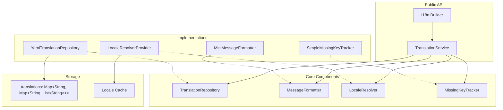
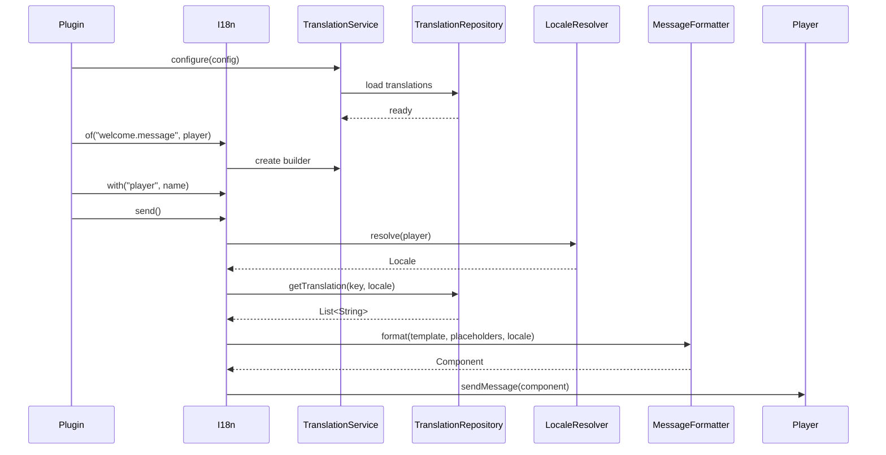

# Design Document: JExTranslate Refactoring

## Overview

This design document outlines the architecture for refactoring JExTranslate to restore the simplicity and reliability of the original JE18n project while preserving modern features. The refactoring focuses on:

1. **Simplified Translation Storage**: Adopting JE18n's proven `Map<String, Map<String, List<String>>>` structure
2. **Consistent API**: Fluent builder pattern with predictable behavior
3. **Performance**: In-memory caching with lazy initialization
4. **Extensibility**: Clean interfaces for custom implementations

## Architecture



## Components and Interfaces

### 1. Translation Storage Structure

The core change is adopting JE18n's storage structure:

```java
// New structure (from JE18n)
Map<String, Map<String, List<String>>> TRANSLATIONS
// Key: translation key (e.g., "welcome.message")
// Value: Map of locale code -> list of message lines

// Example:
// "welcome.message" -> {
//   "en" -> ["Welcome, {player}!"],
//   "de" -> ["Willkommen, {player}!"],
//   "ja" -> ["ようこそ、{player}さん！"]
// }
```

### 2. TranslationRepository Interface (Simplified)

```java
public interface TranslationRepository {
    
    /**
     * Gets translation lines for a key and locale with automatic fallback.
     */
    @NotNull
    List<String> getTranslation(@NotNull String key, @NotNull Locale locale);
    
    /**
     * Gets translation as single string (lines joined with newline).
     */
    @NotNull
    Optional<String> getTranslationString(@NotNull String key, @NotNull Locale locale);
    
    /**
     * Checks if a translation exists for the key in any locale.
     */
    boolean hasTranslation(@NotNull String key);
    
    /**
     * Gets all available locales.
     */
    @NotNull
    Set<Locale> getAvailableLocales();
    
    /**
     * Gets all translation keys.
     */
    @NotNull
    Set<String> getAllKeys();
    
    /**
     * Gets keys missing in a specific locale compared to default.
     */
    @NotNull
    Set<String> getMissingKeys(@NotNull Locale locale);
    
    /**
     * Reloads translations from source.
     */
    @NotNull
    CompletableFuture<Void> reload();
    
    /**
     * Gets the default locale.
     */
    @NotNull
    Locale getDefaultLocale();
}
```

### 3. I18n Builder (Simplified Entry Point)

Inspired by JE18n's simple builder:

```java
public final class I18n {
    
    /**
     * Creates a new translation builder.
     */
    public static Builder of(@NotNull String key, @NotNull Player player) {
        return new Builder(key, player);
    }
    
    /**
     * Creates a builder with explicit locale override.
     */
    public static Builder of(@NotNull String key, @NotNull Player player, @NotNull Locale locale) {
        return new Builder(key, player, locale);
    }
    
    public static final class Builder {
        private final String key;
        private final Player player;
        private final Locale locale;
        private final Map<String, String> placeholders = new LinkedHashMap<>();
        private boolean includePrefix = false;
        
        // Fluent placeholder methods
        public Builder with(@NotNull String key, @Nullable Object value);
        public Builder withAll(@NotNull Map<String, ?> placeholders);
        public Builder withPrefix();
        
        // Send methods
        public void send();
        public void sendActionBar();
        public void sendTitle();
        public void sendTitle(@Nullable Component subtitle, Duration fadeIn, Duration stay, Duration fadeOut);
        
        // Display methods (return without sending)
        public Component display();
        public List<Component> displayList();
        public String displayText();
        public List<String> displayTextList();
        public List<String> displayLore();
        public List<String> displayLore(int maxWidth);
        
        // Build raw message
        public TranslatedMessage build();
    }
}
```

### 4. MessageFormatter Interface

```java
public interface MessageFormatter {
    
    /**
     * Formats a template with placeholders into a Component.
     */
    @NotNull
    Component format(@NotNull String template, @NotNull Map<String, String> placeholders, @NotNull Locale locale);
    
    /**
     * Formats a template into plain text.
     */
    @NotNull
    String formatText(@NotNull String template, @NotNull Map<String, String> placeholders, @NotNull Locale locale);
    
    /**
     * Formats multiple lines into Components.
     */
    @NotNull
    List<Component> formatList(@NotNull List<String> templates, @NotNull Map<String, String> placeholders, @NotNull Locale locale);
}
```

### 5. LocaleResolver Interface

```java
public interface LocaleResolver {
    
    /**
     * Resolves the locale for a player.
     */
    @NotNull
    Locale resolve(@NotNull Player player);
    
    /**
     * Sets a manual locale override for a player.
     */
    void setOverride(@NotNull Player player, @NotNull Locale locale);
    
    /**
     * Clears any manual override for a player.
     */
    void clearOverride(@NotNull Player player);
    
    /**
     * Gets the default locale.
     */
    @NotNull
    Locale getDefaultLocale();
}
```

## Data Models

### TranslatedMessage

```java
public record TranslatedMessage(
    @NotNull String key,
    @NotNull Locale locale,
    @NotNull Component component,
    @NotNull List<Component> lines
) {
    // Convenience methods
    public void sendTo(@NotNull Player player);
    public void sendActionBar(@NotNull Player player);
    public void sendTitle(@NotNull Player player);
    public String asPlainText();
    public String asLegacyText();
    public List<String> asLoreList();
}
```

### Translation File Format (YAML)

```yaml
# translations/en_US.yml
prefix: "<gold>[Server]</gold> "

welcome:
  message: "<green>Welcome to the server, {player}!</green>"
  first-join:
    - "<gold>Welcome, {player}!</gold>"
    - "<gray>This is your first time here!</gray>"
    - "<yellow>Type /help to get started.</yellow>"

items:
  sword:
    name: "<red>Flame Sword</red>"
    lore:
      - "<gray>A legendary weapon</gray>"
      - "<gray>forged in dragon fire.</gray>"
      - ""
      - "<yellow>Damage: {damage}</yellow>"
      - "<yellow>Durability: {durability}</yellow>"

messages:
  coins:
    balance: "You have {amount, number} coins."
    earned: "You earned {amount, plural, one {# coin} other {# coins}}!"
```

## Error Handling

### Missing Translation Strategy

```java
public enum MissingKeyBehavior {
    RETURN_KEY,           // Return the key itself: "welcome.message"
    RETURN_FORMATTED_KEY, // Return formatted: "<red>[Missing: welcome.message]</red>"
    RETURN_EMPTY,         // Return empty string/component
    THROW_EXCEPTION       // Throw MissingTranslationException
}
```

Default behavior: `RETURN_FORMATTED_KEY` with tracking via MissingKeyTracker.

### Error Message Format

```java
// When key is missing
"<gold>Missing key: <red>'{key}'</red> for locale <yellow>{locale}</yellow></gold>"

// When formatting fails
"<red>[Format Error: {key}]</red>"
```

## Testing Strategy

### Unit Tests

1. **TranslationRepository Tests**
   - Loading YAML files with nested keys
   - Locale fallback behavior
   - Missing key detection
   - Reload functionality

2. **MessageFormatter Tests**
   - Placeholder replacement ({} and %% formats)
   - MiniMessage parsing
   - Legacy color code conversion
   - Plural/choice format handling

3. **LocaleResolver Tests**
   - Client locale detection
   - Override persistence
   - Fallback to default

4. **I18n Builder Tests**
   - Fluent API chaining
   - All display methods
   - All send methods

### Integration Tests

1. **Full Translation Flow**
   - Load translations → Resolve locale → Format message → Send to player

2. **Hot Reload**
   - Modify file → Reload → Verify new translations

3. **Multi-locale Support**
   - Test with 16+ locales including CJK characters

## Implementation Sequence



## Migration Path

### From Current JExTranslate

1. **API Compatibility**: Keep `TranslationService.create()` as alias to `I18n.of()`
2. **Storage Migration**: Automatic conversion of existing YAML files
3. **Deprecation**: Mark old complex APIs as deprecated with migration guides

### Breaking Changes

1. `TranslationKey` class replaced with simple `String` keys
2. `Placeholder` sealed interface simplified to `Map<String, String>`
3. `ServiceConfiguration` record simplified

## Performance Considerations

### Caching Strategy

```java
// Level 1: Translation storage (loaded once)
private final Map<String, Map<String, List<String>>> translations;

// Level 2: Locale resolution cache (per player, cleared on reload)
private final Map<UUID, Locale> localeCache;

// Level 3: Formatted message cache (LRU, optional)
private final Cache<CacheKey, Component> formatCache;
```

### Benchmarks Target

| Operation | Target | Notes |
|-----------|--------|-------|
| Translation lookup | < 0.1ms | Direct map access |
| Locale resolution | < 0.5ms | Cached after first call |
| Message formatting | < 1ms | Simple placeholder replacement |
| Full send() call | < 2ms | Including network |

## File Structure

```
src/main/java/de/jexcellence/jextranslate/
├── I18n.java                          # Main entry point (new)
├── api/
│   ├── TranslationRepository.java     # Simplified interface
│   ├── MessageFormatter.java          # Simplified interface
│   ├── LocaleResolver.java            # Simplified interface
│   ├── MissingKeyTracker.java         # Unchanged
│   └── TranslatedMessage.java         # Simplified record
├── impl/
│   ├── YamlTranslationRepository.java # Refactored storage
│   ├── MiniMessageFormatter.java      # Simplified formatting
│   ├── LocaleResolverProvider.java    # Unchanged
│   └── SimpleMissingKeyTracker.java   # Unchanged
├── command/
│   └── TranslationCommand.java        # Enhanced with scan/compare
└── util/
    ├── ColorUtil.java                 # Legacy color conversion (new)
    └── TranslationLogger.java         # Unchanged
```
