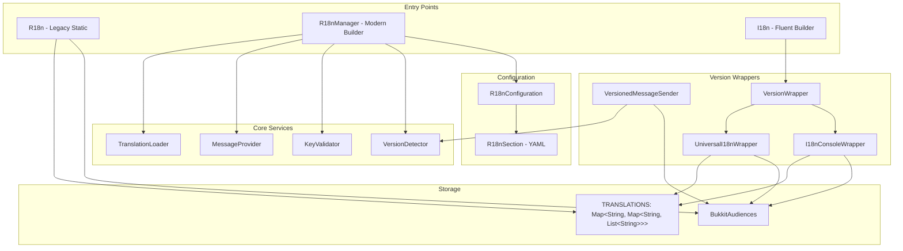

# Design Document: R18n Alignment

## Overview

This design document outlines the architecture for aligning JExTranslate with the original R18n project patterns. The alignment restores the proven simplicity of R18n while leveraging Java 17+ features and maintaining cross-version compatibility from Minecraft 1.8 to 1.21+.

Key design principles:
1. **Backward Compatibility**: Preserve existing JExTranslate API while adding R18n patterns
2. **Version Awareness**: Automatic detection and adaptation for different server types
3. **Simplicity**: Direct static access patterns from original R18n
4. **Modern Features**: MiniMessage gradients, async loading, immutable records

## Architecture



## Components and Interfaces

### 1. R18n Legacy Class (Static Entry Point)

Restores the original R18n static pattern for backward compatibility:

```java
@Deprecated
public class R18n {
    private static final String TRANSLATION_FOLDER = "translations";
    private static final Map<String, Map<String, List<String>>> TRANSLATIONS = new HashMap<>();
    
    public static R18n r18n;
    private static String DEFAULT_LOCALE;
    private static BukkitAudiences audiences;
    
    private final JavaPlugin loadedPlugin;
    
    @Deprecated
    public R18n(@NotNull JavaPlugin loadedPlugin, String message) {
        r18n = this;
        this.loadedPlugin = loadedPlugin;
        initializeAdventure();
        loadTranslations();
        logInitialization(message);
    }
    
    @Deprecated
    public static Map<String, Map<String, List<String>>> getTranslations() {
        return TRANSLATIONS;
    }
    
    @Deprecated
    public static String getDefaultLocale() {
        return DEFAULT_LOCALE;
    }
    
    @Deprecated
    public static BukkitAudiences getAudiences() {
        return audiences;
    }
    
    @Deprecated
    public void loadTranslations() throws Exception { ... }
    
    @Deprecated
    public void closeAdventure() { ... }
}
```

### 2. R18nManager Modern Builder

Modern entry point with builder pattern:

```java
public final class R18nManager {
    private final JavaPlugin plugin;
    private final R18nConfiguration configuration;
    private final TranslationLoader translationLoader;
    private final MessageProvider messageProvider;
    private final KeyValidator keyValidator;
    private final VersionDetector versionDetector;
    
    private BukkitAudiences audiences;
    private VersionedMessageSender messageSender;
    private boolean initialized = false;
    
    private R18nManager(Builder builder) { ... }
    
    @NotNull
    public static Builder builder(@NotNull JavaPlugin plugin) {
        return new Builder(plugin);
    }
    
    @NotNull
    public CompletableFuture<Void> initialize() { ... }
    
    @NotNull
    public MessageBuilder message(@NotNull String key) {
        return new MessageBuilder(this, key);
    }
    
    @NotNull
    public CompletableFuture<Void> reload() { ... }
    
    public void shutdown() { ... }
    
    // Getters for all components
    
    public static final class Builder {
        private final JavaPlugin plugin;
        private R18nConfiguration configuration;
        
        public Builder defaultLocale(@NotNull String locale) { ... }
        public Builder supportedLocales(@NotNull String... locales) { ... }
        public Builder enableKeyValidation(boolean enabled) { ... }
        public Builder enablePlaceholderAPI(boolean enabled) { ... }
        public Builder translationDirectory(@NotNull String directory) { ... }
        
        @NotNull
        public R18nManager build() { ... }
    }
}
```

### 3. I18n Fluent Builder

Simple entry point matching original R18n I18n class:

```java
public class I18n {
    private final II18nVersionWrapper<?> i18nVersionWrapper;
    
    private I18n(Builder builder) {
        if (builder.player == null) {
            this.i18nVersionWrapper = new I18nConsoleWrapper(
                builder.key, builder.placeholders, builder.includePrefix);
        } else {
            this.i18nVersionWrapper = new VersionWrapper(
                builder.player, builder.key, builder.placeholders, builder.includePrefix)
                .getI18nVersionWrapper();
        }
    }
    
    public void sendMessage() {
        this.i18nVersionWrapper.sendMessage();
    }
    
    public void sendMultiple() {
        this.i18nVersionWrapper.sendMessages();
    }
    
    @SuppressWarnings("unchecked")
    public <T> T component() {
        return (T) this.i18nVersionWrapper.displayMessage();
    }
    
    @SuppressWarnings("unchecked")
    public <T> List<T> children() {
        return (List<T>) this.i18nVersionWrapper.displayMessages();
    }
    
    public static class Builder {
        private final Map<String, String> placeholders = new HashMap<>();
        private final Player player;
        private final String key;
        private boolean includePrefix = false;
        
        public Builder(@NotNull String key, @NotNull Player player) { ... }
        public Builder(@NotNull String key) { ... } // Console
        
        public Builder withPlaceholders(@NotNull Map<String, Object> placeholders) { ... }
        public Builder includePrefix() { ... }
        public Builder withPlaceholder(@NotNull String key, @Nullable Object value) { ... }
        
        public I18n build() {
            return new I18n(this);
        }
    }
}
```

### 4. Version Detection System

```java
public final class VersionDetector {
    public enum ServerType {
        PAPER("Paper"),
        PURPUR("Purpur"),
        FOLIA("Folia"),
        SPIGOT("Spigot"),
        BUKKIT("Bukkit");
        
        private final String displayName;
        ServerType(String displayName) { this.displayName = displayName; }
        public String getDisplayName() { return displayName; }
    }
    
    private final boolean isPaper;
    private final boolean isPurpur;
    private final boolean isFolia;
    private final boolean isSpigot;
    private final boolean isBukkit;
    private final String serverVersion;
    private final String minecraftVersion;
    private final boolean isModern;
    private final ServerType serverType;
    
    public VersionDetector() {
        // Detection logic using Class.forName() checks
        this.isFolia = detectFolia();
        this.isPurpur = !isFolia && detectPurpur();
        this.isPaper = !isFolia && !isPurpur && detectPaper();
        this.isSpigot = !isPaper && !isPurpur && !isFolia && detectSpigot();
        this.isBukkit = !isPaper && !isPurpur && !isFolia && !isSpigot;
        // ... version parsing
    }
    
    public boolean hasNativeAdventure() {
        return isPaper || isPurpur || isFolia;
    }
    
    public boolean isModern() { return isModern; }
    public boolean isLegacy() { return !isModern; }
    
    @NotNull
    public String getEnvironmentSummary() {
        return String.format("%s %s (MC: %s, Modern: %s, Adventure: %s)",
            serverType.getDisplayName(), serverVersion, minecraftVersion,
            isModern ? "Yes" : "No", hasNativeAdventure() ? "Native" : "Platform");
    }
}
```

### 5. VersionedMessageSender

```java
public final class VersionedMessageSender {
    private static final LegacyComponentSerializer LEGACY_SERIALIZER = 
        LegacyComponentSerializer.legacySection();
    
    private final VersionDetector versionDetector;
    private final BukkitAudiences audiences;
    
    public VersionedMessageSender(@NotNull VersionDetector versionDetector, 
                                   @Nullable BukkitAudiences audiences) {
        this.versionDetector = versionDetector;
        this.audiences = audiences;
    }
    
    public void sendMessage(@NotNull Player player, @NotNull Component component) {
        if (supportsComponents()) {
            if (audiences != null) {
                audiences.player(player).sendMessage(component);
            } else {
                sendLegacyMessage(player, component);
            }
        } else {
            sendLegacyMessage(player, component);
        }
    }
    
    public void sendMessage(@NotNull CommandSender sender, @NotNull Component component) { ... }
    public void sendMessage(@NotNull Audience audience, @NotNull Component component) { ... }
    public void broadcast(@NotNull Component component) { ... }
    public void console(@NotNull Component component) { ... }
    
    private void sendLegacyMessage(@NotNull Player player, @NotNull Component component) {
        String legacyMessage = LEGACY_SERIALIZER.serialize(component);
        player.sendMessage(legacyMessage);
    }
    
    private boolean supportsComponents() {
        return versionDetector.hasNativeAdventure() || 
               (versionDetector.isModern() && audiences != null);
    }
}
```

### 6. II18nVersionWrapper Interface

```java
public interface II18nVersionWrapper<T> {
    String PREFIX_KEY = "prefix";
    
    void sendMessage();
    void sendMessages();
    
    @NotNull T getMessageType();
    @NotNull T displayMessage();
    @NotNull List<T> displayMessages();
    @NotNull T getPrefix();
    @NotNull List<T> getMessagesByKey();
    @NotNull List<T> getPrefixByKey();
    @NotNull List<T> getMessagesIncludingPlaceholdersAndPrefix();
    @NotNull List<T> getMessagesIncludingPlaceholders();
    @NotNull T getJoinedMessage();
    @NotNull T getMessage();
    @NotNull T getFormattedMessage();
    @NotNull List<T> getRawMessagesByKey(@NotNull String key);
    @NotNull List<T> replacePlaceholders();
    @NotNull String asPlaceholder();
    
    @SuppressWarnings("unchecked")
    @NotNull
    default Class<T> getType() {
        return (Class<T>) getFormattedMessage().getClass();
    }
}
```

### 7. UniversalI18nWrapper Implementation

```java
public class UniversalI18nWrapper implements II18nVersionWrapper<Component> {
    private static final MiniMessage MINI_MESSAGE = MiniMessage.miniMessage();
    
    private final Player player;
    private final String key;
    private final Map<String, String> placeholders;
    private final boolean includePrefix;
    
    public UniversalI18nWrapper(@NotNull Player player, @NotNull String key,
                                 @NotNull Map<String, String> placeholders,
                                 boolean includePrefix) { ... }
    
    @Override
    public void sendMessage() {
        R18n.getAudiences().player(this.player).sendMessage(this.getFormattedMessage());
    }
    
    @Override
    public void sendMessages() {
        this.getMessagesIncludingPlaceholdersAndPrefix().forEach(message ->
            R18n.getAudiences().player(this.player).sendMessage(message));
    }
    
    @Override
    @NotNull
    public List<Component> getRawMessagesByKey(@NotNull String key) {
        Map<String, Map<String, List<String>>> translations = R18n.getTranslations();
        String locale = this.getPlayerLocale();
        Map<String, List<String>> localeMap = translations.get(key);
        
        List<String> messages = localeMap != null ?
            localeMap.getOrDefault(locale, localeMap.get(R18n.getDefaultLocale())) : null;
        
        if (messages == null || messages.isEmpty()) {
            messages = List.of("<gold>Message key <red>'" + key + "'</red> is missing!</gold>");
        }
        
        List<Component> result = new ArrayList<>();
        for (String message : messages) {
            String processedMessage = message;
            for (Map.Entry<String, String> entry : this.placeholders.entrySet()) {
                String placeholderPercent = "%" + entry.getKey() + "%";
                String placeholderBracket = "{" + entry.getKey() + "}";
                String value = ColorUtil.convertLegacyColorsToMiniMessage(entry.getValue());
                processedMessage = processedMessage.replace(placeholderPercent, value);
                processedMessage = processedMessage.replace(placeholderBracket, value);
            }
            result.add(MINI_MESSAGE.deserialize(processedMessage));
        }
        return result;
    }
    
    private String getPlayerLocale() {
        try {
            return this.player.getLocale();
        } catch (NoSuchMethodError | UnsupportedOperationException e) {
            return R18n.getDefaultLocale();
        }
    }
    
    // ... other interface methods
}
```

### 8. VersionWrapper (Factory)

```java
public class VersionWrapper {
    private final II18nVersionWrapper<?> i18nVersionWrapper;
    
    public VersionWrapper(@NotNull Player player, @NotNull String key,
                          @NotNull Map<String, String> placeholders,
                          boolean includePrefix) {
        // Use universal wrapper for all versions - Adventure handles compatibility
        this.i18nVersionWrapper = new UniversalI18nWrapper(
            player, key, placeholders, includePrefix);
    }
    
    public II18nVersionWrapper<?> getI18nVersionWrapper() {
        return this.i18nVersionWrapper;
    }
}
```

## Data Models

### R18nConfiguration Record

```java
public record R18nConfiguration(
    @NotNull String defaultLocale,
    @NotNull Set<String> supportedLocales,
    @NotNull String translationDirectory,
    boolean keyValidationEnabled,
    boolean placeholderAPIEnabled,
    boolean legacyColorSupport,
    boolean debugMode
) {
    public R18nConfiguration {
        // Validation
        if (defaultLocale == null || defaultLocale.trim().isEmpty()) {
            throw new IllegalArgumentException("Default locale cannot be null or empty");
        }
        // Defensive copies
        supportedLocales = Collections.unmodifiableSet(new HashSet<>(supportedLocales));
    }
    
    @NotNull
    public static R18nConfiguration defaultConfiguration() {
        return new R18nConfiguration("en_GB", Set.of("en_GB"), "translations",
            true, false, true, false);
    }
    
    @NotNull
    public R18nConfiguration withDefaultLocale(@NotNull String defaultLocale) { ... }
    
    @NotNull
    public R18nConfiguration withSupportedLocales(@NotNull String... locales) { ... }
    
    public boolean isLocaleSupported(@NotNull String locale) {
        return supportedLocales.contains(locale);
    }
    
    @NotNull
    public String getBestMatchingLocale(@NotNull String locale) {
        if (supportedLocales.contains(locale)) return locale;
        String language = locale.split("_")[0];
        if (supportedLocales.contains(language)) return language;
        return defaultLocale;
    }
}
```

### ValidationReport Record

```java
public record ValidationReport(
    @NotNull Instant timestamp,
    @NotNull Set<String> missingKeys,
    @NotNull Set<String> unusedKeys,
    @NotNull Set<String> formatErrors,
    @NotNull Set<String> placeholderIssues,
    @NotNull Set<String> namingViolations,
    @NotNull ValidationStatistics statistics
) {
    public boolean hasIssues() {
        return !missingKeys.isEmpty() || !unusedKeys.isEmpty() || 
               !formatErrors.isEmpty() || !placeholderIssues.isEmpty() || 
               !namingViolations.isEmpty();
    }
    
    public double getValidationScore() {
        int totalKeys = statistics.totalKeys();
        if (totalKeys == 0) return 100.0;
        int issues = getTotalIssues();
        return Math.max(0.0, 100.0 - (issues * 100.0 / totalKeys));
    }
    
    @NotNull
    public String getSummary() { ... }
    
    @NotNull
    public static Builder builder() { return new Builder(); }
}
```

## Command UI Design

### PR18n Command with MiniMessage Gradients

```java
@Command
public class PR18n extends PlayerCommand {
    private static final MiniMessage MINI_MESSAGE = MiniMessage.miniMessage();
    private static final int KEYS_PER_PAGE = 12;
    
    private final JavaPlugin loadedPlugin;
    private final R18nManager r18nManager;
    private final VersionedMessageSender messageSender;
    
    // Header/Footer gradient line
    private Component createHeaderLine(String startColor, String endColor) {
        return MINI_MESSAGE.deserialize(
            "<gradient:" + startColor + ":" + endColor + ">" +
            "▬▬▬▬▬▬▬▬▬▬▬▬▬▬▬▬▬▬▬▬▬▬▬▬▬▬▬▬▬▬▬▬▬▬▬▬▬▬▬▬▬▬▬▬▬▬▬▬▬▬▬▬▬▬▬▬▬▬▬▬▬▬▬▬" +
            "</gradient>");
    }
    
    // Locale button with status indicator
    private Component createEnhancedLocaleButton(String locale, int missingCount) {
        String buttonColor = missingCount == 0 ? "#2ecc71" : 
                            missingCount < 10 ? "#f39c12" : "#e74c3c";
        String statusIcon = missingCount == 0 ? "✓" : 
                           missingCount < 10 ? "⚠" : "✗";
        
        Component button = MINI_MESSAGE.deserialize(
            "<gradient:" + buttonColor + ":" + getDarkerShade(buttonColor) + ">" +
            "[" + statusIcon + " " + locale.toUpperCase() + "]</gradient>");
        
        Component hoverText = MINI_MESSAGE.deserialize(
            "<gradient:#9b59b6:#8e44ad>Locale Information</gradient>\n\n" +
            "<dark_gray>▪ <gray>Language: <white>" + locale.toUpperCase() + "</white></gray>\n" +
            "<dark_gray>▪ <gray>Missing Keys: <" + getStatusColor(missingCount) + ">" + 
            missingCount + "</" + getStatusColor(missingCount) + "></gray>\n" +
            "<dark_gray>▪ <gray>Status: " + getStatusText(missingCount) + "</gray>\n\n" +
            "<gradient:#f1c40f:#f39c12>Click</gradient> <dark_gray>»</dark_gray> <gray>View missing keys</gray>");
        
        return button
            .hoverEvent(HoverEvent.showText(hoverText))
            .clickEvent(ClickEvent.runCommand("/r18n missing " + locale + " 1"));
    }
    
    // Navigation bar with Previous/Next/Back buttons
    private void sendEnhancedNavigationBar(Player player, String locale, 
                                            int currentPage, int totalPages) {
        Component navigation = Component.text(" ");
        
        // Previous button
        if (currentPage > 1) {
            Component prevButton = MINI_MESSAGE.deserialize("<gradient:#2ecc71:#27ae60>[← Previous]</gradient>")
                .hoverEvent(HoverEvent.showText(MINI_MESSAGE.deserialize(
                    "<gradient:#2ecc71:#27ae60>Go to page " + (currentPage - 1) + "</gradient>")))
                .clickEvent(ClickEvent.runCommand("/r18n missing " + locale + " " + (currentPage - 1)));
            navigation = navigation.append(prevButton);
        } else {
            navigation = navigation.append(MINI_MESSAGE.deserialize("<dark_gray>[← Previous]</dark_gray>"));
        }
        
        // Page indicator
        navigation = navigation.append(Component.text(" "))
            .append(MINI_MESSAGE.deserialize(
                "<gradient:#9b59b6:#8e44ad>[Page " + currentPage + "/" + totalPages + "]</gradient>"))
            .append(Component.text(" "));
        
        // Next button
        if (currentPage < totalPages) {
            Component nextButton = MINI_MESSAGE.deserialize("<gradient:#2ecc71:#27ae60>[Next →]</gradient>")
                .hoverEvent(HoverEvent.showText(MINI_MESSAGE.deserialize(
                    "<gradient:#2ecc71:#27ae60>Go to page " + (currentPage + 1) + "</gradient>")))
                .clickEvent(ClickEvent.runCommand("/r18n missing " + locale + " " + (currentPage + 1)));
            navigation = navigation.append(nextButton);
        } else {
            navigation = navigation.append(MINI_MESSAGE.deserialize("<dark_gray>[Next →]</dark_gray>"));
        }
        
        // Back to locales button
        navigation = navigation.append(Component.text(" "))
            .append(MINI_MESSAGE.deserialize("<gradient:#3498db:#2980b9>[← Back to Locales]</gradient>")
                .hoverEvent(HoverEvent.showText(MINI_MESSAGE.deserialize(
                    "<gradient:#3498db:#2980b9>Return to locale selection</gradient>")))
                .clickEvent(ClickEvent.runCommand("/r18n missing")));
        
        messageSender.sendMessage(player, navigation);
    }
}
```

## File Structure

```
src/main/java/de/jexcellence/jextranslate/
├── I18n.java                              # Fluent builder (aligned with R18n)
├── R18n.java                              # NEW: Legacy static class
├── R18nManager.java                       # NEW: Modern builder manager
├── MessageBuilder.java                    # NEW: Message builder for R18nManager
├── api/
│   ├── LocaleResolver.java
│   ├── MessageFormatter.java
│   ├── MissingKeyTracker.java
│   ├── Placeholder.java
│   ├── TranslatedMessage.java
│   ├── TranslationKey.java
│   ├── TranslationRepository.java
│   └── TranslationService.java
├── command/
│   ├── PR18n.java                         # NEW: Enhanced command with gradients
│   ├── PR18nSection.java                  # NEW: Command config section
│   ├── EPR18nAction.java                  # NEW: Action enum
│   ├── ER18nPermission.java               # NEW: Permission enum
│   └── TranslationCommand.java            # Existing command (kept for compatibility)
├── config/
│   ├── R18nConfiguration.java             # NEW: Immutable config record
│   └── R18nSection.java                   # NEW: YAML config section
├── core/
│   ├── MessageProvider.java               # NEW: MiniMessage + legacy support
│   ├── TranslationLoader.java             # NEW: Async YAML loading
│   ├── VersionDetector.java               # NEW: Server type detection
│   └── VersionedMessageSender.java        # NEW: Cross-version messaging
├── i18n/
│   ├── I18n.java                          # NEW: Alternative entry point
│   └── wrapper/
│       ├── I18nConsoleWrapper.java        # NEW: Console wrapper
│       ├── II18nVersionWrapper.java       # NEW: Version wrapper interface
│       ├── UniversalI18nWrapper.java      # NEW: Universal wrapper
│       └── VersionWrapper.java            # NEW: Wrapper factory
├── impl/
│   ├── LocaleResolverProvider.java
│   ├── MiniMessageFormatter.java
│   ├── SimpleMissingKeyTracker.java
│   └── YamlTranslationRepository.java
├── util/
│   ├── ColorUtil.java
│   ├── LoreFormatter.java
│   ├── MessageCache.java
│   ├── PlaceholderFormatter.java
│   ├── TranslationBackupService.java
│   └── TranslationLogger.java
└── validation/
    ├── KeyValidator.java                  # NEW: Key validation
    ├── KeyValidationResult.java           # NEW: Per-key result
    ├── ValidationIssue.java               # NEW: Issue types
    ├── ValidationReport.java              # NEW: Full report
    └── ValidationStatistics.java          # NEW: Statistics record
```

## Testing Strategy

### Unit Tests

1. **R18n Legacy Tests**
   - Static translations map population
   - BukkitAudiences initialization
   - Translation loading from YAML

2. **R18nManager Tests**
   - Builder pattern configuration
   - Async initialization
   - Reload functionality

3. **I18n Builder Tests**
   - Placeholder replacement
   - Prefix inclusion
   - Component generation

4. **VersionDetector Tests**
   - Server type detection
   - Version parsing
   - Modern/legacy detection

5. **VersionedMessageSender Tests**
   - Legacy message conversion
   - Modern message sending
   - Broadcast functionality

### Integration Tests

1. **Full Translation Flow**
   - Load → Resolve locale → Format → Send

2. **Cross-Version Compatibility**
   - Test on Paper, Spigot, legacy servers

3. **Command UI**
   - Pagination navigation
   - Click events
   - Hover events

## Error Handling

### Missing Translation Strategy

```java
// When key is missing, return formatted error message
"<gold>Message key <red>'" + key + "'</red> is missing!</gold>"
```

### Version Detection Fallback

```java
// If detection fails, assume modern Bukkit
if (detectionFailed) {
    return ServerType.BUKKIT;
    isModern = true; // Safe default
}
```

### Adventure Platform Fallback

```java
// If BukkitAudiences fails, use legacy string sending
if (audiences == null) {
    String legacy = LegacyComponentSerializer.legacySection().serialize(component);
    player.sendMessage(legacy);
}
```

## Migration Path

### From Current JExTranslate

1. **Keep existing API**: `TranslationService.create()` continues to work
2. **Add R18n patterns**: New classes alongside existing ones
3. **Gradual adoption**: Developers can migrate at their own pace

### Breaking Changes

None - all new classes are additions, not replacements.
